**Here you can find requirements to all components that you need to create in the scope of FINAL TASK**

:::info
You DO NOT HAVE TO create the following components, just modify existing one that you have in the template.
:::

## Init Preparation
1. Check if you have a forked template `rgp-final-task-template` in the [autocode.git.epam.com](https://autocode.git.epam.com/)
2. Clone the template repo and install dependencies
```npm
npm install
```
3. Run the application
```
npm run dev
```
4. Look through the project structure in the template:
```
|--src
  |
  |--common
  |  |--Button
  |  |--Modal
  |  |--Input
  |  |--PrivateRoute
  |
  |--components
  |  |--forms
  |  |  |--MovieForm
  |  |  |--UserForm
  |  |
  |  |--Header
  |  |
  |  |--MovieDetails
  |  |--MoviesList
  |  |  |--MovieTile
  |  |
  |  |--Panel
  |
  |--store
  |
  |--types
  |
  |--services
     |--createUser.ts
 ```

Below tou can find detailed description and requirements for each component.

:::warning
Since this task will be checked by Autocode you should follow next rules:
* keep the structure that we provided in the template
* do not install any additional dependencies
* do not commit with linter warnings and errors
:::

5. Clone [repo with backend](https://autocode.git.epam.com/ld-autocode-js-programs/react-global-program/api-react-global) and follow `README.md` instructions.


## Store
Template path:
```
src/store/index.ts
```
We are using `Redux Toolkit` and `Redux Thunk` for this application.  
1. Configure a store and connect it to the application by covering `App` component with `Provider` in the `main.ts` [example link](/module-5/redux-toolkit#simplified-store-setup);
2. Create `moviesSlice` and `userSlice` in the appropriate files:
   * `src/store/moviesSlice.ts`
   * `src/store/userSlice.ts`
   See [Create Slices topic](/module-5/redux-toolkit#creating-slices)
3. Create SELECTORS (`src/store/selectors.ts`):
   * `selectMovies` - return movies list to display in MoviesList
   Please, feel free to create any additional selectors you want.
4. Create THUNKS (`src/store/thunks.ts`):
    * `fetchMoviesThunk`
    * `addMovieThunk`
    * `updateMovieThunk`
    * `deleteMovieThunk`
    * `loginUserThunk`  
    * `getUserThunk`  
  See [Async Operation with createAsyncThunk topic.](/module-5/redux-toolkit#async-operations-with-createasyncthunk)  
  Please, feel free to create any additional thunks you want.
5. Find hooks in the `src/store/hooks`:
    * useAppSelector: [use instead of `useSelector`](/module-5/react-redux);
    * useAppDispatch: [use instead of `useDispatch`](/module-5/react-redux).

## Routing
Add Routing to your application
1. [Set Up the Routes Component](/module-4/react-router-basics#creating-basic-routes)
  To enable routing in your application, wrap it with the `Routes` component. This component will handle the definition of paths and the rendering of corresponding components based on the current route.

2. Define Routes
   Add the following routes to your application:

| Route                   | Components Rendered                                                                 |
|-------------------------|-------------------------------------------------------------------------------------|
| `/` and `/movies`       | Render the `MoviesList` component.                                                 |
| `/movies/:movieId`      | Render the `MovieDetails` component alongside the `MoviesList` component.          |
| `/movies/add`           | Render the `MoviesList` component and a required `Modal` containing the `MovieForm` component in 'ADD' mode ONLY for admin user. |
| `/movies/edit/:movieId` | Render the `MoviesList` component and a required `Modal` containing the `MovieForm` component in 'EDIT' mode INLY for admin user. |
| `/login`                | Render the `UserForm` component in Login mode. |
| `/registration`         | Render the `UserForm` component in Registration mode. |


3. Use the Modal Component
   For routes like `/movies/add`, `/movies/edit/:movieId` and `/movies/:movieId` the `Modal` component is required to wrap.

## User Types
* non authorized user: show only Login and Registration pages;
* authorized users: show movies with Search, filters, sort option, Login and Registration pages;
* ADMIN user: all pages are available. This user is able to delete, add and edit movies.

## Admin Credentials
We have already created an ADMIN user, please use these credentials to login as ADMIN.  
Email: 
```
admin@email.com
```
Password:
```
Admin123
```

## Styling
To add a creative touch to this task, the component styling is entirely up to you. While we have provided some initial styles in the `styles.module.scss` files for the components, you are free to use, modify, or remove them as you see fit. The only requirement is to ensure that all page elements are positioned according to the provided design specifications.

---

## App
This is a main component in your application. 

**Contains:**
  * `Routers` component with `Route`s components.

**Functional requirements:**
  * Get user info if `token` is present in the `localStorage`:
    * Put user token to the store (`state.user.token`);
    * Use `getUserThunk` to get user info by [GET] `/me/user` API.
  * Get movies list by [GET] `/movies` API and put data to the store (`state.movies.fetchedMovies`):
    * Use `fetchMoviesThunk`.

App component should be wrapped in `Provider` in the `src/main.ts`.


## Private route

**Use this component to render `MovieForm` component by routes `/movies/add` and `movies/edit/:movieId`.**

Path: 
```
src/common/PrivateRoute/PrivateRoute.tsx
```

**Props:**
  * `children` - any private component.

**Functional requirements:**
  * should render any component as a children;
  * checks user's role (store.user.role) and if it is admin returns component as children otherwise redirects to `/movies`.

## Button

Find the `Button` component at the following path:
```
src/common/Button/Button.tsx
```

Enhance the existing component to meet the specified requirements.

**The `Button` component is a functional component that renders a `button` HTML element.**

**Props:**
- `children`: Accepts any content to be displayed inside the button.
- `onClick`: A callback function executed when the button is clicked.

**Additional Notes:**
- Feel free to add any additional props as needed to enhance functionality.
- Reuse the `Button` component across all components where buttons are required in the design.

💡 **Tip**: Ensure consistency by using the `Button` component wherever a button is present in the application design.

Please, feel free to add any props you need.

___

## Input
Find the `Input` component at the following path:
```
src/common/Input/Input.tsx
```

Enhance the existing component to meet the specified requirements.


**Contains:**
  * `input` tag;
  * `label` tag.

:::note
Using a `label` tag for `input` is considered good practice.
[Usage and benefits of label tag.](https://www.w3schools.com/tags/tag_label.asp)
:::

**Props**:
  * `placeholderText` - to provide placeholder text for input field;
  * `onChange` - pass a callback function that will be executed upon a field content is changed;
  * `labelText` - text for input label to describe the input's purpose ;
  * `value` - pass the value for input field;

Please, feel free to add any props you need.

---

## MoviesList
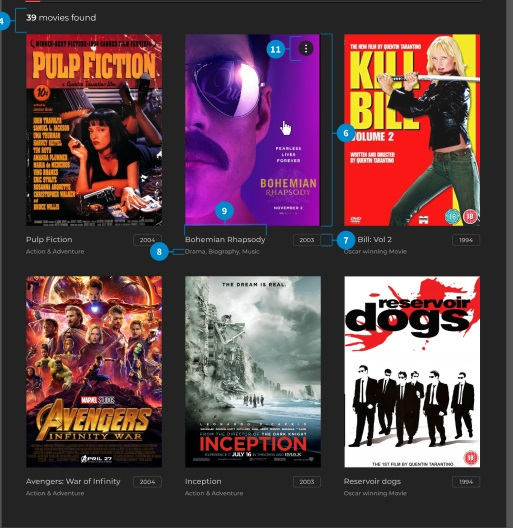

Template path:
```
src/components/MoviesList/MovieList.jsx
```
[Figma link.](https://www.figma.com/design/fKGjrOqR6nJe6LYJopGCZ8/%5BCDP%5D-Home-Task-%E2%80%93-React-v1?node-id=0-2&t=lfXtXgfBwBXDrN0r-0)

**Use this component to render the list of [`MovieTile` component](/HT/description-and-criteria#movietile).**

**Contains:**
  * Movies count information (number 4 in Figma);
  * `Panel` component;
  * List of `MovieTile` components.

**Functional requirements**
* Render component in `App` component by routes `/` and `/movies`;
* Fetch movies list: use `fetchMovies` thunk to fetch movies (`http://localhost:4000/movies`);
* Show a message "Loading movies..." instead of movies list while fetching;
* Show a message `Error: {fetch error}` instead of movies list if fetch is not success;
* Use `useAppDispatch` to put movies list to the store;
* Use `useAppSelector` and `selectMovies` selector to get movies list from store;
* Use `useSearchParams` react-router-dom hook to get `search`, `filter` and `sort` queries.


:::tip
For draft development you can use mocked movie list data, find these data in the `src/moviesMock.js`.

Use loop for `MovieTile` rendering.

Please, follow [this link](https://react.dev/learn/rendering-lists) to the **"Rendering Lists"** topic to see the example.
:::

### Mocked movies data
<details>
<summary>Mocked movies data</summary>
```js
export const mockedMoviesList = [
  {
    id: 269149,
    title: "Zootopia",
    tagline: "Welcome to the urban jungle.",
    vote_average: 7.7,
    vote_count: 6795,
    release_date: "2016-02-11",
    poster_path:
      "https://image.tmdb.org/t/p/w500/sM33SANp9z6rXW8Itn7NnG1GOEs.jpg",
    overview:
      "Determined to prove herself, Officer Judy Hopps, the first bunny on Zootopia's police force, jumps at the chance to crack her first case - even if it means partnering with scam-artist fox Nick Wilde to solve the mystery.",
    budget: 150000000,
    revenue: 1023784195,
    genres: ["Animation", "Adventure", "Family", "Comedy"],
    runtime: 108,
  },
  {
    id: 181808,
    title: "Star Wars: The Last Jedi",
    tagline: "The Saga Continues",
    vote_average: 7.1,
    vote_count: 4732,
    release_date: "2017-12-13",
    poster_path:
      "https://image.tmdb.org/t/p/w500/kOVEVeg59E0wsnXmF9nrh6OmWII.jpg",
    overview:
      "Rey develops her newly discovered abilities with the guidance of Luke Skywalker, who is unsettled by the strength of her powers. Meanwhile, the Resistance prepares to do battle with the First Order.",
    budget: 200000000,
    revenue: 1325937250,
    genres: ["Fantasy", "Adventure", "Science Fiction"],
    runtime: 152,
  },
  {
    id: 284054,
    title: "Black Panther",
    tagline: "Long live the king",
    vote_average: 7.3,
    vote_count: 3788,
    release_date: "2018-02-13",
    poster_path:
      "https://image.tmdb.org/t/p/w500/uxzzxijgPIY7slzFvMotPv8wjKA.jpg",
    overview:
      "King T'Challa returns home from America to the reclusive, technologically advanced African nation of Wakanda to serve as his country's new leader. However, T'Challa soon finds that he is challenged for the throne by factions within his own country as well as without.  Using powers reserved to Wakandan kings, T'Challa assumes the Black Panther mantel to join with girlfriend Nakia, the queen-mother, his princess-kid sister,  members of the Dora Milaje (the Wakandan \"special forces\"), and an American secret agent, to prevent Wakanda from being dragged into a world war.",
    budget: 200000000,
    revenue: 1245257672,
    genres: ["Action", "Adventure", "Fantasy", "Science Fiction"],
    runtime: 134,
  },
  {
    id: 354912,
    title: "Coco",
    tagline: "The celebration of a lifetime",
    vote_average: 7.8,
    vote_count: 3619,
    release_date: "2017-10-27",
    poster_path:
      "https://image.tmdb.org/t/p/w500/eKi8dIrr8voobbaGzDpe8w0PVbC.jpg",
    overview:
      "Despite his family’s baffling generations-old ban on music, Miguel dreams of becoming an accomplished musician like his idol, Ernesto de la Cruz. Desperate to prove his talent, Miguel finds himself in the stunning and colorful Land of the Dead following a mysterious chain of events. Along the way, he meets charming trickster Hector, and together, they set off on an extraordinary journey to unlock the real story behind Miguel's family history.",
    budget: 175000000,
    revenue: 700920729,
    genres: ["Adventure", "Comedy", "Family", "Animation"],
    runtime: 105,
  },
  {
    id: 333339,
    title: "Ready Player One",
    tagline: "A better reality awaits.",
    vote_average: 8.1,
    vote_count: 617,
    release_date: "2018-03-28",
    poster_path:
      "https://image.tmdb.org/t/p/w500/pU1ULUq8D3iRxl1fdX2lZIzdHuI.jpg",
    overview:
      "When the creator of a popular video game system dies, a virtual contest is created to compete for his fortune.",
    budget: 175000000,
    revenue: 0,
    genres: ["Adventure", "Science Fiction", "Action"],
    runtime: 140,
  },
  {
    id: 338970,
    title: "Tomb Raider",
    tagline: "Her legend begins",
    vote_average: 6.2,
    vote_count: 817,
    release_date: "2018-03-08",
    poster_path:
      "https://image.tmdb.org/t/p/w500/ePyN2nX9t8SOl70eRW47Q29zUFO.jpg",
    overview:
      "Lara Croft, the fiercely independent daughter of a missing adventurer, must push herself beyond her limits when she finds herself on the island where her father disappeared.",
    budget: 94000000,
    revenue: 126025000,
    genres: ["Action", "Adventure"],
    runtime: 118,
  },
];
 ```
</details>

___ 

### Movies count information
**Create an element to display the number of displayed movies.**

**Functional requirements:**
* Display message `{list.length} movies found` if movies number > 1 || = 0;
* Display message `{list.length} movie found` if movies number  = 1.

---

### Panel
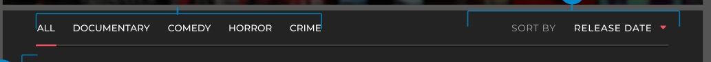
Template path:
```
src\components\MoviesList\Panel\Panel.tsx
```
[Figma link](https://www.figma.com/design/fKGjrOqR6nJe6LYJopGCZ8/%5BCDP%5D-Home-Task-%E2%80%93-React-v1?node-id=0-2&t=s8GVZCCmFmotWsrz-0)

**Use `Panel` to sort and filter movies list.**

Render `Panel` component in the `MoviesList` component above movies count information.

**Contains:**
  * `GenresFilter` element (number 10 in Figma)
  * `Sort` element (number 5 in Figma)

### - GenresFilter
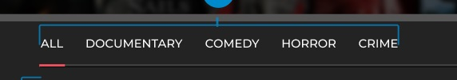


**Use this element to render a list of movie genres.**


**Contains:**
  * The list of button with genres: use common `Button` component for each genre button and `Array.map` to render a list of genres.

**Functional requirements**
  * Display only the genres that are associated with the movies currently shown on the page.
  * Clicking on a genre button should:
    * Use `useSearchParams` react-router-dom hook to pass `filter` query. Example 'http://localhost:5173/movies?filter=action'
    * Filter the displayed movies to show only those matching the selected genre.
  * Clicking the ALL button should:
    * Reset the filter and display all available movies.
---

### - SortControl
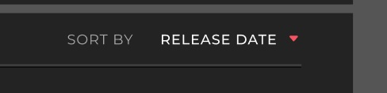  

Template path:

**Use `SortControl` element to sort movies by `Release Date` OR `Title`.**

**Contains:**
  * label "SORT BY" (to the left);
  * select control (to the right). This element should have the following options:
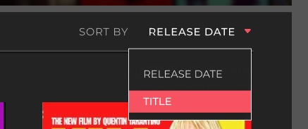
    * REALISE DATE (default value);
    * TITLE.

**Functional requirement**:
  * on select control click open dropdown menu with 2 options: 'RELEASE DATE' and 'TITLE';
  * on any option click:
    * the selected option should be shown in the select control;
    * use `useSearchParams` react-router-dom hook to pass `sortBy` query. Example 'http://localhost:5173/movies?sortBy=title';
    * update current movies list;
    * **filter the CURRENT movie list**: if the movie list was filtered by any genre the sorting should be done only for these filtered movies
---

### MovieTile
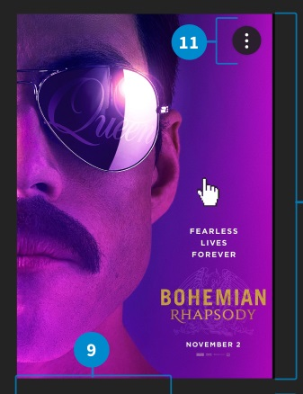
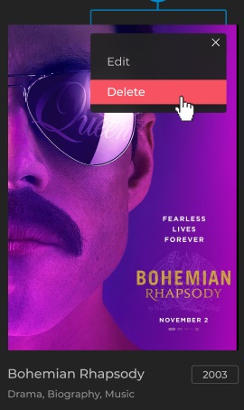  
Template path:
```
src\components\MoviesList\components\MovieTile\MovieTile.tsx
```

[Figma link](https://www.figma.com/design/fKGjrOqR6nJe6LYJopGCZ8/%5BCDP%5D-Home-Task-%E2%80%93-React-v1?node-id=0-1&node-type=canvas&t=3qab9fApk1C8RVpq-0).

**Use `MovieTile` component to display the movie info.**

**Contains:**
  * poster;
  * movie title;
  * genre / genres;
  * release year;
  * [ONLY admin user] context menu button (number 11 on the screenshot).

**Props:**
 * `poster_path` - The URL of the movie poster image.
 * `title` - The title of the movie.
 * `genres` - An array of genres associated with the movie.
 * `release_date` - The release date of the movie in ISO format.
 * `id` - The unique identifier of the movie.

**Functional requirements:**
  * On tile click: render `MovieDetails` component above the `MoviesList` component (use `useNavigate()` hook);
  * Render context menu button only for 'admin' user;
  * Use common component `Button` for context menu button.
---

### - ContextMenu
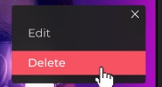


**Show element by context menu button click (11 in Figma).**

**Contains:**
  * Close `Cross` button (Use common/Button);
  * `Edit` button (Use common/Button);
  * `Delete` button (Use common/Button).

**Functional requirements:**
  * Menu should be available only for admin user;
  * On `Edit` button click navigate to the route `/movies/edit/:movieId`;
  * On `Delete` button click:
    * show the Modal window with DELETE MOVIE notification;
  * on `Cross` button click hide the context menu.

### - DELETE MOVIE Notification

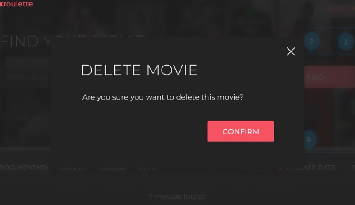  

[Figma link.](https://www.figma.com/design/fKGjrOqR6nJe6LYJopGCZ8/%5BCDP%5D-Home-Task-%E2%80%93-React-v1?node-id=0-1604&t=E7v7aLXgRaGjPmqA-0)

Use `Modal` component to render notification.

**Notification contains:**
  * title 'DELETE MOVIE';
  * message 'Are you sure you want to delete this movie?';
  * `CONFIRM` button: use `common/Button` for this button.

**Functional requirements**:
  * On CONFIRM button click:
      * delete movie and close then notification. To delete move:
        * delete movie from store;
        * delete movie from server (`http://localhost:4000/movies/{id}`);
        * use `deleteMovieThunk` and `useAppDispatch`.
    * do not delete movie on Modal **CLOSE** button click.
___

## UserForm
Use `UserForm` component for LOGIN and REGISTRATION.  
Template path:
```
src/components/forms/UserForm/UserForm.tsx
```

Render `UserForm` in `App` component, see [figma LOGIN](https://www.figma.com/design/ToWyyfVgSTczzx8i0NNWBq/ReactGlobalProgramDesigns?node-id=125-1084&t=ZJUlSgZyAtxFA2JF-0) and [figma REGISTRATION](https://www.figma.com/design/ToWyyfVgSTczzx8i0NNWBq/ReactGlobalProgramDesigns?node-id=124-534&t=ZJUlSgZyAtxFA2JF-0)
* User `common/Input` component for all field;
* Use `common/Button` component for all buttons;
* Use `form` tag.

**Props:**
* `mode`: 'login' or 'register' values according to the form role.

### Login form
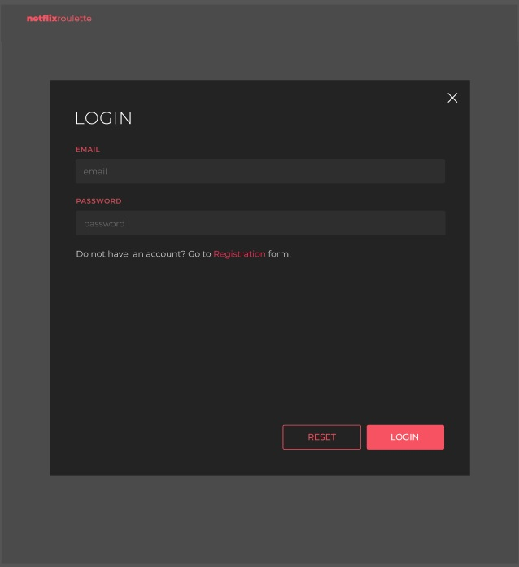  
Render `UserForm` components with prop `mode='login'` by route `/login`.

**Contains:**
* EMAIL label;
* email field with placeholder 'enter email';
* PASSWORD label;
* password field with placeholder 'enter password';
* text with link 'Do not have  an account? Go to <span style={{color: '#F65261'}}>Registration</span> form!';
* RESET button;
* LOGIN button.

**Functional requirements**
* Clean all fields on RESET button click;
* Navigate user to the `/registration` page on <span style={{color: '#F65261'}}>Registration</span> link click:
  * Use 'react-router-dom' `Link` component.
* On LOGIN button click:
  * Check if all fields are filled:
    * All fields are filled:
      * Sends request to API for getting token (see 'me/login' endpoint in API Swagger);
      * Save user data to the store;
      * Save token to the `localStorage` with a key `token`;
      * Navigate user to `/movies`.
    * Any of fields are nor filled:
      * Render validation message for empty field. See [figma](https://www.figma.com/design/ToWyyfVgSTczzx8i0NNWBq/ReactGlobalProgramDesigns?node-id=125-1306&t=ZJUlSgZyAtxFA2JF-0)

Login response example:
```json
{
  "data": {
    "id": 12345,
    "name": "johndoe",
    "email": "johndoe@example.com",
    "role": "user / admin",
    "token": "token"
  },
  "message": "Login successful"
}
```

Pay attention: there are two types of user's role: `admin` and `user`. To login as an admin use these credentials:
```json
  {
    "email": "admin@email.com",
    "password": "Admin123"
  }
```

### Registration form
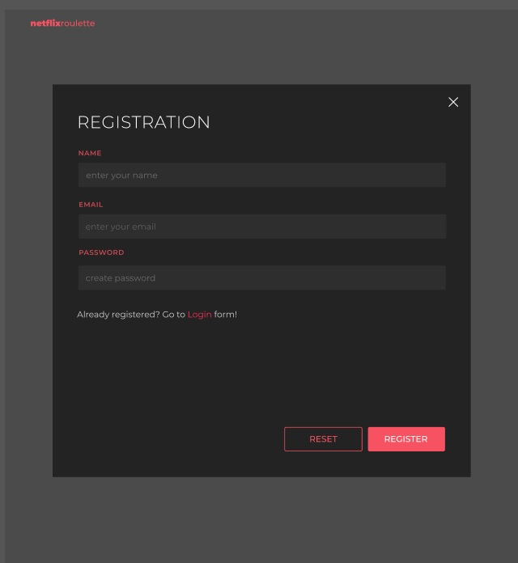  
Render `UserForm` components with prop `mode='registration'` by route `/registration`.

**Contains:**
* NAME label;
* name field with placeholder 'enter name';
* EMAIL label;
* email field with placeholder 'enter your email';
* PASSWORD label;
* password field with placeholder 'create password';
* text with link 'Already registered? Go to Login form!';
* RESET button;
* LOGIN button.

**Functional requirements**
* Clean all fields on RESET button click;
* Navigate user to the `/login` page on 'Login' link click:
  * Use 'react-router-dom' `Link` component.
* On REGISTER button click:
  * Check if all fields are filled:
    * All fields are filled:
      * Sends request to API for getting token (see 'me/register' endpoint in API Swagger);
      * Navigate user to the `/login`.
    * Any of fields are not filled:
      * Render validation message. See [figma](https://www.figma.com/design/ToWyyfVgSTczzx8i0NNWBq/ReactGlobalProgramDesigns?node-id=125-821&t=ZJUlSgZyAtxFA2JF-0)


## Header

Template path:
```plaintext
src/components/Hero/components/Header/Header.tsx
```

Render `Header` component in `App` component for each route.

**Contains:**
* Logo element: <span style={{color: 'red'}}>*netflixroulette*</span> text at the left;
* Search field with magnifying glass (render for route `/movies/:movieId`);
  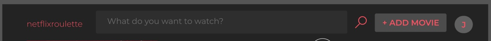  
* `+ ADD MOVIE` button for ADMIN users (render for route `/movies` or `/`);  
    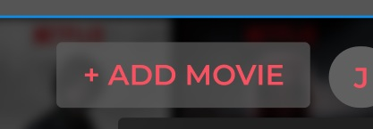  


* USER button with contextual menu for AUTHORIZED users.  
  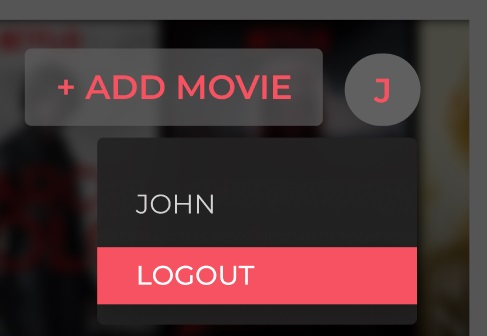  

* Search block (render for route `/movies` or `/`):
  * 'FIND YOUR MOVIE' text;
  * Search field;
  * `SEARCH` button.
    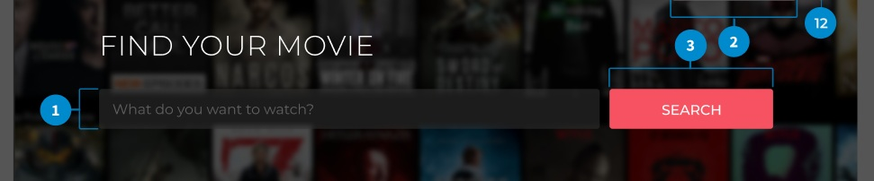

**Functional requirements:**
* Render `+ ADD MOVIE` button for ADMIN users:
  * on click navigate to the route `/movies/add`.  

* Render USER button for AUTHORIZED users:
  * display user's name first letter as button label;
  * on USER button click display menu with:
    * user's name (text);
    * `LOGOUT` button: on `LOGOUT` button click:
      * sent request to logout current user [POST] `/me/logout`;
      * remove `token` from the localStorage;
      * update store;
      * navigate to the Login page.
* On Logo click navigate to `/movies`.

### Search
*For `/` and `/movies` routes:*  
  

*For `/movies/:movieId` route:*  
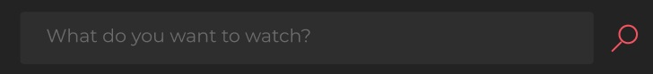  

Render `Search` element in the `Header` component.

**Contains:**
  * input field. Use common component `Input`:
    * field should have placeholder according to the provided [design](https://www.figma.com/design/fKGjrOqR6nJe6LYJopGCZ8/%5BCDP%5D-Home-Task-%E2%80%93-React-v1?node-id=0-2&node-type=frame&t=3qab9fApk1C8RVpq-0): *'What do you want to watch?'*
  * `SEARCH` button or button with magnifying glass icon (depends on route). Use common component `Button`.

**Functional requirements:**
  * update movies list according search query on `SEARCH` / magnifying glass button click OR `Enter`;
  * render all movie if search field is empty (track `onChange` event);
  * use `useSearchParams` react-router-dom hook to pass `search` query. Example 'http://localhost:5173/movies?search=star'
---

## MovieDetails
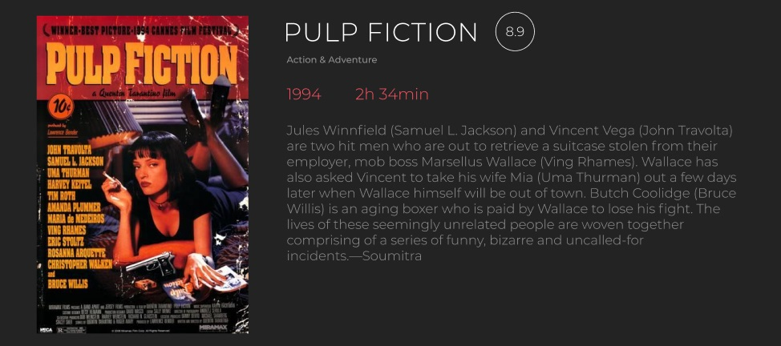
Template path:
```
src\components\MoviesList\components\MovieDetails\MovieDetails.tsx
```
[Figma link](https://www.figma.com/design/ToWyyfVgSTczzx8i0NNWBq/ReactGlobalProgramDesigns?node-id=2-408&t=aJzcLAHCUoKSITgY-0)


`MovieDetails` component should be rendered at the top of page above the movie list.  
**Contains:**
  * poster;
  * movie name;
  * genre;
  * release year;
  * rating;
  * duration;
  * description.

**Functional requirements**:
  * Render component by `movies/:movieId` route by clicking on the `MovieTile`.
  * Get movie from the store by `movieId`.
  * Get `movieId` from url using `useParams` hook.
---


## Modal
Path: `src\common\Modal\Modal.tsx`  

[Figma link.](https://www.figma.com/design/fKGjrOqR6nJe6LYJopGCZ8/%5BCDP%5D-Home-Task-%E2%80%93-React-v1?node-id=0-1005&node-type=frame&t=xlEPb58A74wSIXXD-0)

**Use `Modal ` component to render a modal window with custom content.**

Component should use the [Portals](/module-2/component-types/modal-component) functionality.
:::info
All needed dependencies were added to the package.json. DO NOT install any packages
:::

**Contains:**
  * close (x) button. Use common `Button` component;
  * body.

**Props:**
  * `children` - JSX for body content;
  * `onClose` - a callback function for handling clicks on close button (×) in the header.

**Functional requirements**:
  * Close the Modal window on close button click: navigate to the `/movies` route OR call `onClick` callback from props;
  * [OPTIONAL / does not covered with tests] Add `Escape` button click event handler to close the Modal window. 

---

## MovieForm
Use `MovieForm` component to render a form element to ADD or EDIT movie.
**Render ONLY for admin user. Use `PrivateRoute` component.**
Path:
```
src\component\MovieForm\MovieForm.tsx
```


* Render `MovieForm` component in the  `Modal` component.

### ADD movie form
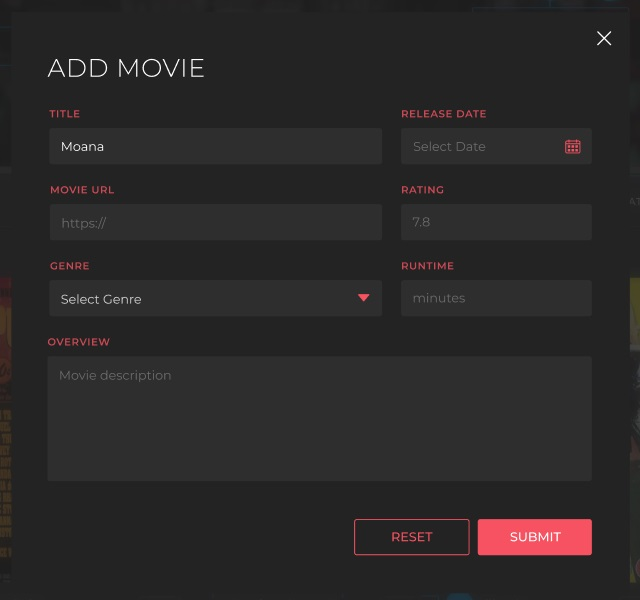
[Figma link](https://www.figma.com/design/fKGjrOqR6nJe6LYJopGCZ8/%5BCDP%5D-Home-Task-%E2%80%93-React-v1?node-id=0-1254&node-type=frame&t=xlEPb58A74wSIXXD-0)

* Contains:
  * form title: 'ADD MOVIE';
  * TITLE field with placeholder 'Movie Title' (use `Input` component);
  * RELEASE DATE field with placeholder 'Select Date' (use `Input` component);
  * POSTER URL field with placeholder 'https://' (use `Input` component);
  * RATING field with placeholder '7.8' (use `Input` component);
  * GENRE field;
  * RUNTIME field with placeholder 'minutes' (use `Input` component);
  * OVERVIEW field with placeholder 'Movie description';
  * RESET button (use `Button` component);
  * SUBMIT button (use `Button` component).


**Functional requirements**:
  * User should be able to enter new movie data and save it to the database and store.
  * render `add` mode for `/movies/add` route;
  * on SUBMIT button click:
    * validate form data: show [notification](https://www.figma.com/design/ToWyyfVgSTczzx8i0NNWBq/ReactGlobalProgramDesigns?node-id=259-243&t=BNza7LSgTUitlQo8-0) <span style={{color: '#F65261'}}>ALL FIELDS ARE REQUIRED</span> ;
    * Use API `/movies` [POST] to add movie on the server;
    * Add movie to the store after success API call.
    * show SUCCESS notification after successful adding;
  * navigate to the `/movies` route after on notification close button click => new movie should be in the Movies list on the page.
  * On RESET button click:
    * Clean all fields.


<details>
  <summary>Example Value | Schema:</summary>
  ```json
  {
    "title": "La La Land",
    "tagline": "Here's to the fools who dream.",
    "vote_average": 7.9,
    "vote_count": 6782,
    "release_date": "2016-12-29",
    "poster_path": "https://image.tmdb.org/t/p/w500/ylXCdC106IKiarftHkcacasaAcb.jpg",
    "overview": "Mia, an aspiring actress, serves lattes to movie stars in between auditions and Sebastian, a jazz musician, scrapes by playing cocktail party gigs in dingy bars, but as success mounts they are faced with decisions that begin to fray the fragile fabric of their love affair, and the dreams they worked so hard to maintain in each other threaten to rip them apart.",
    "budget": 30000000,
    "revenue": 445435700,
    "runtime": 128,
    "genres": [
      "Comedy",
      "Drama",
      "Romance"
    ],
    "id": 313369
  }
  ```
</details>
---

### EDIT movie form
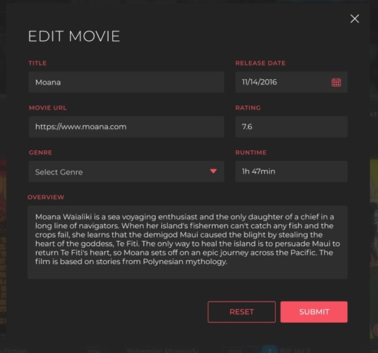
[Figma link](https://www.figma.com/design/fKGjrOqR6nJe6LYJopGCZ8/%5BCDP%5D-Home-Task-%E2%80%93-React-v1?node-id=0-1005&node-type=frame&t=o3OkzJZmYmO6TVua-0)

* Contains:
  * form title: 'ADD MOVIE' or 'EDIT MOVIE';
  * TITLE field with chosen movie title (use `Input` component);
  * RELEASE DATE field with with chosen movie release date (use `Input` component);
  * POSTER URL field with with chosen movie poster url (use `Input` component);
  * RATING field with with chosen movie rating info (use `Input` component);
  * GENRE field with with chosen movie checked genres;
  * RUNTIME field with with chosen movie runtime info (use `Input` component);
  * OVERVIEW field with with chosen movie description;
  * RESET button (use `Button` component);
  * SUBMIT button (use `Button` component).

**Functional requirements**:
  * User should be able to change movie data and save it to the database and store.  
  * render the `edit` mode for `/movies/edit/:movieId` route;
  * Use `useParams` react-router-dom hook to get movie id.  
  * Use `useAppSelector` custom hook to get movie from store by id.  
  * on SUBMIT button click:
    * validate form data: show [notification](https://www.figma.com/design/ToWyyfVgSTczzx8i0NNWBq/ReactGlobalProgramDesigns?node-id=259-243&t=BNza7LSgTUitlQo8-0) <span style={{color: '#F65261'}}>ALL FIELDS ARE REQUIRED</span> ;
    * Use API `/movies` [PUT] to update movie on the server;
    * Update movie to the store after success API call.
    * show SUCCESS notification after successful adding / update;
  * navigate to the `/movies` route after on notification close button click => new / updated movie should be in the Movies list on the page.
  * On RESET button click:
    * Clean all fields.

<details>
  <summary>Example Value | Schema:</summary>
  ```json
  {
    "title": "La La Land",
    "tagline": "Here's to the fools who dream.",
    "vote_average": 7.9,
    "vote_count": 6782,
    "release_date": "2016-12-29",
    "poster_path": "https://image.tmdb.org/t/p/w500/ylXCdC106IKiarftHkcacasaAcb.jpg",
    "overview": "Mia, an aspiring actress, serves lattes to movie stars in between auditions and Sebastian, a jazz musician, scrapes by playing cocktail party gigs in dingy bars, but as success mounts they are faced with decisions that begin to fray the fragile fabric of their love affair, and the dreams they worked so hard to maintain in each other threaten to rip them apart.",
    "budget": 30000000,
    "revenue": 445435700,
    "runtime": 128,
    "genres": [
      "Comedy",
      "Drama",
      "Romance"
    ],
    "id": 313369
  }
  ```
</details>

### SUCCESS Notification

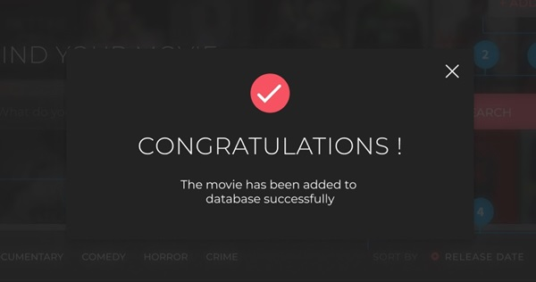  

[Figma link.](https://www.figma.com/design/fKGjrOqR6nJe6LYJopGCZ8/%5BCDP%5D-Home-Task-%E2%80%93-React-v1?node-id=0-1604&t=E7v7aLXgRaGjPmqA-0)

Use `Modal` component to render notification.

**Notification contains:**
  * title 'CONGRATULATIONS!;
  * message 'The movie has been added to database successfully ';

***Functional requirements**
* Navigate to `/movies` route on Close button click (default Modal onClick behavior)

---


## How to finish task and get a grade?

When you finish all tasks and your app follows all criteria you can test your app locally before pushing your changes to Autocode.

You can use the command below for a local test run. Tests will run in "watch" mode so that each code change will restart tests.
```http request
npm run test:local:final
```
Also, you can look at tests implementation for solving troubles in your code.

Tests for the current module are stored in the folder - `__/src/__tests__`

It is not necessary to check this part of App with Autocode. Please proceed with next state of final task.
