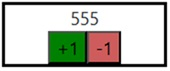

# Table of Contents

- [HW 1 – Core concepts (3 days)](#hw-1--core-concepts-3-days)
- [HW 1.5 – Updates](#hw15---updates)
- [HW 2 – Testing (1 week)](#hw-2--testing-1-week)
- [HW 3 – Components (1 week)](#hw-3--components-1-week)
- [HW 4 – Advanced Components (1 week)](#hw-4--advanced-components-1-week)
- [HW 5 – React Hooks (1 week)](#hw-5--react-hooks-1-week)
- [HW 6 – React Router (1 week)](#hw-6--react-router-1-week)
- [HW 7 – Forms](#hw-7--forms)
- [Additional materials – Redux](#additional-materials--redux)

    
# HW 1 – Core concepts (3 days)

_To understand more how components work it's recommended to create a few interactive components.\
Create the following three components and render them all on one page, so that you can play around with them and test their look and behavior._

**Set up the environment**. 

Create a git repository on Github, Gitlab, Bitbucket or any other platform. Discuss with your mentor which platform is better. Use Vite or create-react-app to bootstrap a new app. Commit the changes to repository. Install extensions mentioned in the lecture (react developer tools, etc.).

**Counter**

A component that renders a numeric value and two buttons: one to decrement the value by 1, another to increment the value by 1.\
The component should take an initial value in a property.\
The component should be written using EcmaScript classes syntax, the `render` method should use `React.createElement` API (without JSX).

**SearchForm**

Refer to the design prototype, implement a component that renders a search input and a button that triggers a new search. The component should accept properties:\
1.	Initial search query. Use the value to set the initial value for the input\
2.	A "onSearch" callback property. Call the callback property every time the user presses Enter when the input has focus or when the user clicks the Search button. Pass current input value in callback arguments.

Additional acceptance criterias:
- clean the input on submit
- submit input on pressing Enter

**GenreSelect**

Refer to the design prototype, implement a component that renders a list of movie genres with currently selected genre highlighted.\
The component should accept three properties:\
A list of genre names to display. Use the incoming list to render genre buttons.\
A name of currently selected genre. Use the name to identify which button to highlight.\
A "onSelect" callback property. Call the callback function when the user clicks on any genre button. Pass respective genre name to the callback arguments.

Additional acceptance criterias:
- the selected genre must be highlighted

**Q&A** 
- React components-based approach.
- JSX
- Virtual DOM
- Components
- Synthetic events
- What makes React so popular?

# HW1.5 - Updates

- Add ESLint (https://eslint.org/) to your project.
- Convert your code into TypeScript. Make sure everything works as before the changes!
- Rewrite GenreSelect and SearchForm component in a functional style (React.FC) 

# HW2 – Testing (1 week)

_Testing is an essential part of software development lifecycle (SDLC). When writing something using React, you will almost always want to cover your code with stable tests that you can rely on.\
This module will help you to review testing pyramid, blackbox and whitebox testing methodologies as well as will give you an overview of Jest and React Testing Library.\
A practical task will give you an opportunity to practice in writing component tests using these libraries._

**Unit and component testing**

Check that you have jest and @testing-library/react packages installed for unit and component tests.\
If you haven't created all components from the previous module, finish them now. Cover the logic for all three with tests using these libraries.

**Counter**

- Test that component renders initial value provided in props
- Test that a click event on "decrement" button decrements the displayed value
- Test that a click event on "increment" button increments the displayed value
- 
**SearchForm**
  
- Test that component renders an input with the value equal to initial value passed in props
- Test that after typing to the input and a "click" event on the Submit button, the "onChange" prop is called with proper value
- Test that after typing to the input and pressing Enter key, the "onChange" prop is called with proper value
- 
**GenreSelect**
  
- Test that component renders all genres passed in props
- Test that component highlights a selected genre passed in props
- Test that after a click event on a genre button component calls "onChange" callback and passes correct genre in arguments

**End-to-End Testing**

Install and setup Cypress or WebdriverIO for end-to-end tests.

Cover the logic for one of your components using the framework.

**Q&A**

- Types of tests?
- What is a testing pyramid? Testing trophy/diamond?
- Static code analysis tools (linters/prop-types/TypeScript).
- Blackbox vs whitebox.
- Snapshot testing.
- Mocks vs stubs. 
 
# HW3 – Components (1 week)
_This module will give you an overview of basic React component syntax and their types. You will learn how to create components, pass data between parent and child ones, define API boundaries and validate incoming properties. You will learn the most common recipes to apply styling to your components, as well as what folder structure to use.\
You will apply this knowledge in a practical task, where you will create more components for your future fully-functional app._

**Install Storybook**

Install and configure Storybook by following guide from the official website. In the end you should have a "storybook" npm script. When running "npm run storybook" it should start Storybook and open it in your browser.

**Write Storybook stories for existing components**

Create a story file for every component you created in previous modules. You should have at least one story for each of the following components (in total minimum 3):
- Counter
- SearchForm
- GenreSelect

You can write more stories to cover several states of GenreSelect or SearchForm, but this is optional.

**Implement other components**

Based on Figma prototype implement the following components:

**MovieTile**

This component should render a movie tile from the list of movies.\
It should take properties to receive image url, movie name, release year, and a list of relevant genres. Alternatively, you can define one component property to take an object with all movie info. Additionally, the component should receive a callback property to capture click event.\
Optionally, you can implement a context menu popup that opens when a user clicks on three dots button and contains "Edit" and "Delete" menu items.

**MovieDetails**

This component will render movie details when a movie is selected from the list (clicked). The details include movie poster image on the left and the rest of info on the right.\
The component should take properties to receive image url, movie name, release year, rating, duration and a description. Alternatively, you can specify a single property that accepts an object with all movie info.

**SortControl**

This component will render a label "Sort by" and a select control to the right. Select should have the following options: Release Date, Title. Think of having different sort orders 😊\
The component should take a property that specifies current selection. Additionally, it should take a callback property to handle selection changes. The callback should be called every time a user changes "Sort by" value. The new value should be passed in callback arguments.\
Use Storybook when implementing every individual component. Write a story for every component you create. It will help you to check the result and play around with some interactivity before you embed components into the app.

*Although, it's not required to implement high-fidelity design as per design prototype, it still makes sense to apply some styling to your components, so that you practice in styling React components and your final result looks good.*

**Write tests**

Cover new components with tests using jest and @testing-library/react. Verify necessary data is rendered as well as that behavior works correctly. You can write snapshot tests to cover the rendering. Although, remember that snapshot tests are fragile and will fail any time you change your component markup.

**Q&A**

- Types of components (smart/dumb, class/function, etc.)
- How react detects change?
- Props and state
- Higher-order components
- Render props
- Lists and keys
- Context
- Fragments and portals
- Performance optimizations
 
# HW4 – Advanced Components (1 week)

This module will help you learn built-in tools for state management and component composition.\
You will apply the composition in practice when will be doing the practical task.

**Implement new components**

Implement the following new components. Use Storybook to manually verify your components look and behavior during development. Remember to cover these new components with tests.

**Dialog**

The component should render a modal dialog with custom content. It should use the Portals functionality. You can install and use react-portal npm package. Additionally, you can also install focus-trap-react package for better UX. Use Figma prototype to get inspiration about the visual design.

The Dialog component should accept the following props:
- a string or JSX for title
- JSX for body content in "children" property
- a callback function for handling clicks on close button (×) in the header

**MovieForm**

The component should render a form element with form controls to add or edit a movie.

Use Add movie and Edit dialogs to get inspiration about form layout and inputs.

The MovieForm component should accept the following props:
- an optional object for initial movie info. Later, when we will implement "add movie" use case, we will not pass this property
- a callback function for handling form submit

To handle form events we recommend you to render HTML <form> element and add "onSubmit" event handler to it. 

This will keep inputs uncontrolled, which will dramatically simplify the logic of handling form state. 

You can collect form state on submit by using `Object.fromEntries(new FormData(event.target))`

**Apply composition**

Having implemented above components, now you can compose them to implement the following use cases. Write new Storybook stories to showcase them.
- Add movie. Render Dialog and put a MovieForm inside without passing initial movie info. This should render a dialog with the empty movie form.
- Edit movie. Render Dialog and put a MovieForm inside, pass some dumb data for initial movie info. This should render a dialog with prefilled form fields.
- Delete movie. Render Dialog with content from "delete movie" modal from Figma prototype.
 
# HW5 – React Hooks (1 week)

This module will explain the concept of hooks, their role in React architecture. It will give you an overview of built-in hooks as well as will learn how to create your own custom ones.\
Then you will get enough practice in the most common hooks, useState and useEffect, by building a functional web app.

**Prepare**

1.	Install and configure eslint-plugin-react-hooks. It will help you identify mistakes when using hooks.
2.	Clone the backend repository.
3.	Navigate to the cloned repository folder and run "npm install" to install dependencies.
4.	Run "npm start" command to start the backend server. It will start on https://localhost:4000.
5.	Open Swagger API docs: http://localhost:4000/api-docs.

**Implement movie list page**

Now it's time to wire our components up and build the real app.

Create a "MovieListPage" component. You will place all the markup and logic for the main page here. Using useState hook define several states for the component:

- search query
- sort criterion
- active genre
- movie list (array)
- selected movie (default to undefined or null)
- others if necessary
 
Render components that you've previously built to create the movie list page. It should look similar to the design prototype. Pixel-perfect design is not necessary, but overall composition and placement should look the same.
- Pass search query state to the SearchForm component. Modify the state when the search form is submitted.
- If selected movie is defined, instead of SearchForm render MovieDetails and pass the selected movie in props.
- Pass static genre list and an active genre to the GenreSelect component. Modify the active genre state when other genres are selected.
- Pass current sort criterion to SortControl. Modify sort criterion state when the user changes sorting.
- Render MovieTile for every movie in state. Pass movie info to the MovieTile. You can define a mock movie array for now, so that your array is not empty and you can test results. 

Handle click events on MovieTile and update the selected movie state when a movie is selected.

As a result of this step, you should have a movie list page, with all controls working but without backend integration.

**Implement effects**

By using useEffect hook and Fetch API or axios, implement the following effect:
When search query, sort criterion or active genre changes, make a request to the backend to get movies corresponding to the new parameters. On response, update movie list with response data. Don't forget to abort previous request in case the user quickly updates several parameters.
If you're feeling like this is too simple, you can instead integrate react-query or SWR for fetching data. This would better resemble a production-grade project
 All functionality of the app except forms should work now.

**Q&A**

- Rules of hooks
- Basic built-in hooks: useState, useReducer, useEffect, useRef
- Optimization hooks: useMemo, useCallback 
- Hook dependencies
- Custom hooks
- Common pitfalls: stale data, dependent state changes 
 
# HW6 – React Router (1 week)
*The module will make you familiar with one of the most powerful tools for React apps — React Router. You will dive deep into its rich functionality and build your own complex use-cases.*

**Install React Router**

Open react-router tutorial in a separate browser tab. You will find it handy when doing this practical task.

Install react-router-dom and define the root route to render your MovieListPage component. Use "/" value for route path. This will not change the app behavior. It should still load and work as before. But it will enable you to make further changes.

**Move search parameters to URL**

Currently you have several occurrences of useState in your component. You keep track of current search query, selected genre, sorting. All these parameters influence the list of movies to be displayed on the page. If you make changes and then refresh the page, all parameters will reset. Also, you can't share a link to specific search results with your friends. Let's fix it.

Change your component to read current search query, sorting and active genre from the URL by using the "useSearchParams" hook provided by React Router. Don't forget that params may not be specified. To handle this case, you need to default them to specific values when reading.
useSearchParams allows you to update search parameters similar to useState. Use this functionality to update URL every time the user updates search query, sorting or active genre. This way when you search movies, your URL search params will look something like "?query=abc". Similarly, when you specify sorting, it will add another parameter to the search part of the URL.

At the end of this step your search query, sorting and active genre state should be stored in URL. If you refresh the page, it shouldn't reset the state. And once you deploy your app somewhere, you will be able to share more specific URLs with your friends.

Cover this new functionality with end-to-end tests.

**Define a route for movie details**

Currently selected movie state is still handled internally by your MovieListPage component. When you select a movie and then refresh the page, the selected movie won't be preserved. And you can't share a link to a specific movie with your friends. Let's fix it.

Open the Nested Routes section of the tutorial. In your MovieListComponent instead of rendering either SearchForm or MovieDetails components based on component state, render <Outlet /> component from React Router. This will temporary remove the possibility to search for movies. Don't worry, we will bring it back in a moment.

In your root route define two child routes:
1.	The first one should have the same path as your root route: "/". It should render SearchForm component.
2.	The second one should add a new dynamic path segment with movie id: "/:movieId". And it should render MovieDetails component. Here you may need to wrap your MovieDetails with another component, because the router will now give you just a movie ID and you will be responsible for loading the movie from the backend API and rendering the result.

This way when your URL pathname is just "/", the app will render SearchForm at the top and the list of movies at the bottom. And when your URL pathname is "/:movieId", it will render movie details on top and the list of movies at the bottom of the page.

Use a route loader or useParams hook from React Router to load movie details. Route loader is more preferred, because it is optimized to load and cache your data before your component is rendered.

Update your logic to select a movie. When a movie card is clicked, navigate the user to "/:movieId" route. We recommend to preserve current search params upon navigation, so that your movie list is not reset.

Now you should be able to select a movie, refresh the page and still see the movie selected. Also, once you deploy your app somewhere, you will be able to share a link to a specific movie with your friends. Update your end-to-end tests to cover the newly written logic.

**Here's the complete description of desired behavior:**

- Navigating to "/" displays a search form and a list of movies.
- Entering a search query and submitting the search form, the URL updates with "query" search parameter containing the entered search query. The movie list is refreshed to reflect the entered search query.
- Navigating to "/?query=abc" displays a search form with entered text "abc" and a movie list relevant to the search query.
- Selecting a genre updates the URL with "genre" search parameter containing the selected genre. The movie list is refreshed to display movies of the selected genre.
- Navigating to "/?genre=comedy" displays "Comedy" genre as selected and movies of comedy genre.
- Selecting sorting by title updates the URL with "sortBy" search parameter with the respective value. The movie list is refreshed to display movies sorted by title.
- Navigating to "/?sortBy=title" displays the list of movies sorted by title.
- Navigating to "/?query=abc&genre=comedy&sortBy=title" displays the search form with entered value "abc", sort select has "Title" value and the movie list displays movies relevant to these search params.
- Clicking on a movie from the list changes URL pathname to "/:movieId", where :movieId is the ID of the selected movie. If the URL contained query parameters (query, sortBy, genre), they are preserved after navigating. The movie list stays the same.
- Navigating to "/:movieId" where :movieId is a random valid movie ID, the page displays movie details on top and a list of movies on the bottom of the page.

**Q&A**

- Defining routes
- Nested routes
- Dynamic segments
- Links
- Data loading
- Redirects
- Not found and error pages with routing

# HW7 – Forms

This module will give you an overview of solutions to handle forms.

You will pick one of the most popular solutions to create a fully functional form with input validation.

**Install a form library**

Currently the most popular form libraries for React are React Hook Form and Formik. We recommend you to review docs for each of them and then select one that you like better. Consult with your mentor when making the decision.

**Implement a possibility to add movies**

In Advanced Components module you should have created a Storybook story to showcase a composition of Dialog and MovieForm. In current module you will extend this logic to have a fully functioning form that will let you add new movies.

If you open the design prototype, you will see that a form there is placed in a dialog window on top of the movie list page. In order to achieve this behavior and don't loose context when we add a new movie, you need to define another child route to the route that renders <SeachForm /> element. Use "/new" as a value for path and render a new AddMovieForm component (you need to create it). As a result you should have two levels of nesting. Then add an <Outlet /> to the SearchForm component, so that the router can render nested routes together with the movie search form.

Now if you open the app and navigate to "/new", you should be able to see the movie list page with the movie search form on top and contents of your new AddMovieForm component. In the component render your composition of Dialog + MovieForm, so that your form appears in a dialog on top of existing screen.
Extend MovieForm component to use your form library of choice. Add form fields validation. In the AddMovieForm handle form submit and send a request to an API endpoint for adding new movies. When the request fulfills, close the modal by navigating the user to "/". Alternatively, you can navigate them to /:movieId, where :movieId is ID of newly created movie. You should get it from server response.

On design prototype there's a link to add a new movie. Implement it, so that when a user clicks it, the route changes to "/new". Optionally, you can preserve current search query parameters, so that movie list is not updated when you click on the link.

At the end of this step you should have a possibility to add new movies and then search for them in the list using previously built search functionality.

**Implement a possibility to edit a movie**

To edit an existing movie, you will need another route. According to the design prototype, editing also happens in a dialog window, similar to adding a new movie. Think about the best place to create your child route and create it similar to adding a new movie. Define the pathname yourself, although we recommend "/:movieId/edit".

Similar to adding a new movie, implement a functionality to edit an existing movie. The difference is that you will need to load movie details and then send them to the MovieForm, so that all form fields get populated with existing data.

In a MovieCard context menu there's a link to edit the movie. When a user clicks on the link, navigate them to "/:movieId/edit" or whatever pathname you have defined.
At the end of this step you should have a possibility to edit any movie from the list.

# Additional materials – Redux

Routing + built-in state management is enough for most of the cases. But sometimes you need to write data-intensive apps where a more complex state management is needed. This module is intended to give you an overview of Redux library for state management and its architecture.

You will be able to learn core principles of Redux as well as libraries that make it easier to use Redux.
