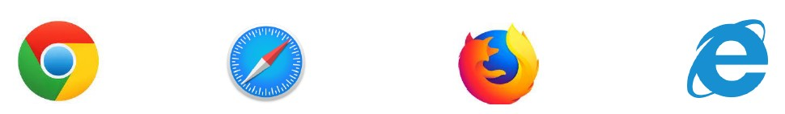
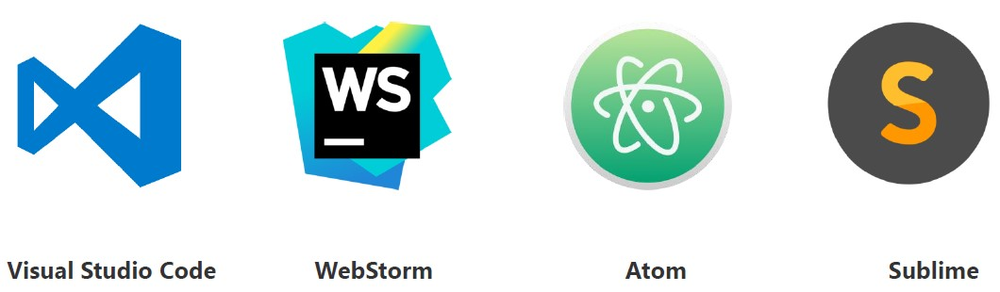
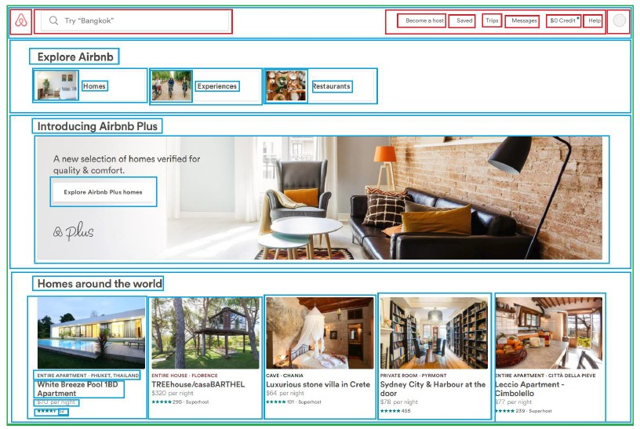

[Back to Contents](../../README.md#module-1)

# Advantages of React

## Convention over configuration

When we talk about React we also need to cover its competitors. Everyone agrees that Angular and Vue are popular as well. The key distinction here is that React is just a JavaScript library for building user interfaces. It is not a framework. You might think of frameworks like Angular as a swiss army knife. You can do a lot of things with it and you really need to think through the way you should use it. Alternatively, you can compare React to a hammer. It can do just one thing, but it is very effective at doing it. However, you'll have to find additional tools to build your application. You will have to find some additional libraries or frameworks to use for API calls, for routing, for testing, and so on and so forth. Because React is only about the **view layer**.

## Backward compatibility

Another advantage of React is its backward compatibility. It maintains the same public API as the previous versions. Which means if you learn its current version it won't be a problem to use a previous version if needed. React is an open source with more than a thousand contributors and currently it is rocking 229k stars on github. It has a very detailed change log with very few breaking changes. The biggest recent change was the introduction of hooks in React version 16.8.

## Supported Browsers

There are no issues with browser support for React. Out of the box, projects generated with React support all modern browsers. 

## IDE and code editor agnostic

You won't need a fancy or super pricey IDE or code editor to use React with. React is IDE and code editor agnostic. You can utilize Visual Studio Code or Webstorm, or Atom or Sublime or whatever you like.

Talking about VS code, you will find more than a thousand extensions for this editor, which might help with getting your editor very customized and robust. Once you install some of the most popular ones, you will feel like your IDE is on steroids.

## Components-Driven Approach or React Everywhere

You might have a question: who actually uses React these days? The answer is that a lot of very well known companies do.

These are nice websites with nice web applications and heavy traffic. As you can see Instagram, Netflix, BBC, Airbnb are very performant websites with tons of traffic and they all use React.

## Components

React components let you split the UI into independent, reusable pieces, and think about each piece in isolation, like Lego.

For example, here you can see how airbnb.com website is broken into individual components:

Splitting your application into a set of reusable components will provide a lot of benefits, which we will discuss later.
