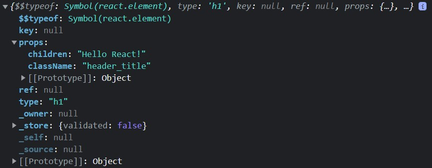
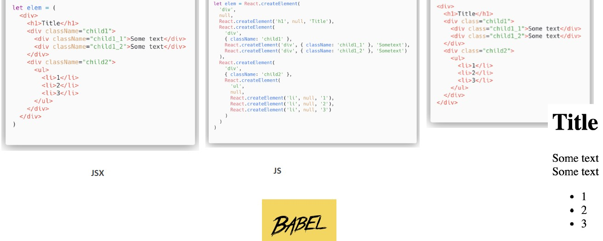
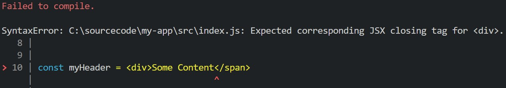

# Elements and JSX

## Element

Before we start coding, we need to introduce the building blocks of React applications - React elements. Do not confuse `elements` with another concept of `components`. **An element** describes what you want to see on the screen.
To illustrate this concept better, let's create our first app - "Hello React!":

```javascript
import React from "react";
import ReactDOM from "react-dom/client";

const myHeader = React.createElement(
  "H1",
  { className: "header_title" },
  "Hello React!"
);
const rootElement = document.getElementById("root");

ReactDOM.render(myHeader, rootElement);
```

Here `myHeader` is a React element. It is created using `createElement` method, which has 3 parameters:

- type (can be either a tag name string, `H1` in this case, or a React component)
- properties array (e.g attribute "className")
- children/content (string 'Hello React!' in our example)

Next, `rootElement` object is created which will be used as an anchor for `myHeader` React element, and it is rendered on the page by calling `ReactDOM.render` method.
If you check the generated HTML, you will see this line as a result

```javascript
<h1 class="header_title">Hello React!</h1>
```

It is important to note that a React element is nothing more than a simple object. If you output it to console via `console.log` you will be able to see its structure:



## JSX

Usually, elements are not created directly, but get returned from components. That is because the code required to generate even a single element is quite verbose. To reduce the amount of boilerplate code, the React development team introduced `JSX` (stands for JavaScript XML), which is a syntax extension to JavaScript. It is similar to a template language, but it has the full power of JavaScript. Using JSX we can rewrite `createElement()` with the following:

```javascript
const myHeader = <h1 className="header_title">Hello React!</h1>;
```

React projects use a JavaScript compiler, Babel, to transpile JSX into the series of `createElement()` calls. Consider the following example:



Babel transpiles JSX template shown on the left into the JavaScript code in the middle, which in turn produces HTML output shown on the right. If you compare HTML output to JSX template, you will find they both look quite similar, which is very convenient. The biggest difference you may notice is JSX uses "className" instead of "class" for specifying class attribute. That is because "class" is a reserved word in JavaScript, so React uses a substitute in this case. Additionally, React DOM uses camelCase property naming convention so attributes like tabindex become tabIndex in JSX.
Technically, React doesn’t require using JSX. However, JSX has many advantages and therefore almost 100% React projects utilize it. For example, JSX allows React to show more useful error and warning messages, like this one:



Additionally, JSX prevents injection attacks, so it is safe to embed user input in JSX. That is because React DOM escapes any values embedded in JSX before rendering them.

Now, let's go through JSX features.

### JSX is an Expression

After compilation, JSX expressions become regular JavaScript function calls and evaluate to JavaScript objects.
This means that you can use JSX inside of if statements and for loops, assign it to variables, accept it as arguments, and return it from functions:

```javascript
function getGreeting (admin) {
  if (admin) {
    return <h1>Hello, Admin</h1>;
  }
  return <h1>Hello, User</h1>;
}
```

### You can embed expressions in JSX

You can use variables or any valid JavaScript expression in JSX by wrapping it inside the curly braces.

```jsx
const planet = 'Earth';

<div>Hello, {planet}!</div>
```

### JSX children

JSX tags may contain children, so you can nest them:

```javascript
const element = (
  <div>
    <h1>Hello!</h1>
    <h2>Good to see you here.</h2>
  </div>
);
```
