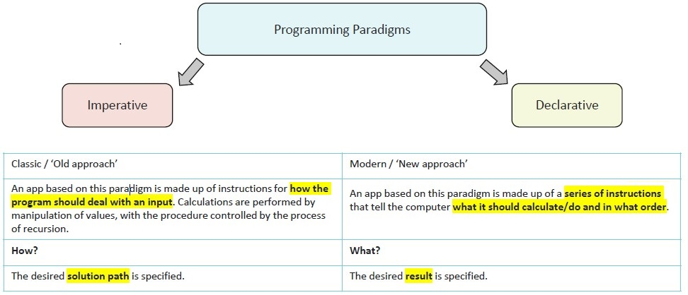

# Functional Paradigm and Principles

## Imperative vs Declarative programming

One of the core fundamental principles of React is declarative programming paradigm. But what is declarative programming and how does it differ from the imperative one?

Basically, imperative programming focuses on how to execute, and defines control flow as statements that change a program state.
On the other hand, declarative programming focuses on what to execute, and defines program logic, but not detailed control flow.



To better illustrate the difference, please consider the following task: you have a list(array) of movies and you need to make a list of the best movies based on movie rating.

In imperative programming, the code could look like this:

```javascript
const bestMovies = [];

for (let i = 0; i < movies.length; i++) {
  let movie = movies[i];
  
  if (movie.rating >= 5) {
    bestMovies.push(movie);
  }
}
```

On the other hand, the code following declarative programming, could look this way:

```javascript
const bestMovies = movies.filter(movie => movie.rating >= 5);
```

Based on these examples, you can see that the imperative one provides specific instructions on HOW the program should complete the task, or says "This is what you should do". The declarative example just describes WHAT the program does, or says "It should look like this".

Now, both approaches obviously have their pros and cons.


Based on these details most developers in the javascript community consider the declarative approach as a better one.

## Functional programming

Another key aspect of the React development mindset is functional programming. Functional programming is a style of programming that emphasizes the evaluation of expressions rather than the execution of commands. It is basically a subset of declarative programming, and is sometimes defined in opposition to object-oriented programming (OOP) and procedural programming. That is misleading as these approaches are not mutually exclusive and some systems tend to use all three.


Following the functional programming paradigm we can update our implementation of "the best movies" task this way:

```javascript
const bestMovies = getBestMovies(movies);
```

There are several aspects to functional programming, so let's talk about the most important ones for React development.

### Pure functions

In functional programming, the ideal is known as a pure function. A pure function is defined as one that:

* Depends solely on its input arguments and has no interaction with external systems (e.g., logging or modifying a global variable).
* Always produces the same output for the same input.
* Does not rely on or modify external state.
* Does not produce any side effects.
* Should not call impure functions, as that would render the function impure.


These rules ensure that pure functions are predictable and easier to test, compose, and reason about. Common example: 

```javascript
let pureSum = (a, b) => a + b;
```

On the other hand, impure functions are:

- might take no arguments.
- the same input (arguments) will not produce the same output (return).
- might mutate the external state.
- might call impure functions.
- might produce side effects.

```javascript
// impure function taking no arguments and producing a side effect
function showAlert() {
  alert("This is a side effect");
}

// impure function that resembles a pure one, but returns different result given the same inputs
function getRandomRange(min, max) {
  return Math.random() * (max - min) + min;
}

// some variable that is mutated
let someNum = 8;
// this is not a pure function
function impureHalf() {
  return someNum / 2;
}
```

A side effect is when a function relies on, or modifies, something outside its parameters to do something. Examples of side effects:

- Making a HTTP request
- Mutating data
- Printing to a screen or console
- DOM Query/Manipulation
- Math.random()
- Getting the current time


### Higher-order functions

Another functional programming concept which is frequently used in React applications is higher-order function.
A function that accepts a function as an argument, or returns a function, is known as a higher-order function — a function that operates upon a function.
The most frequently used example of a higher-order function is a callback function:

```javascript
const myBtn = document.getElementById("myButton");

// anonymous callback function
myBtn.AddEventListener("click", function (e) {
  console.log(`Click event: ${e}`);
});

// named callback function
function btnHandler(e) {
  console.log(`Click event: ${e}`);
}
myBtn.addEventListener("click", btnHandler);
```

More about HOC you will learn in the [Module 3](/react-components/higher-order-components).


## Sum up
1. **Imperative vs Declarative**: Imperative tells **how** to do something step-by-step; Declarative focuses on **what** the outcome should be.
2. **Functional Programming**: A subset of declarative programming that emphasizes **pure functions**—functions without side effects that rely only on input arguments.
3. **Pure Functions**: Must have consistent outputs for the same inputs, no external state mutations, and should avoid calling impure functions.
4. **Side Effects**: Any interaction with external systems (e.g., logging, HTTP requests) is considered a side effect, making functions impure.
5. **Higher-order Functions**: Functions that take or return other functions, commonly used in React (e.g., callbacks).
