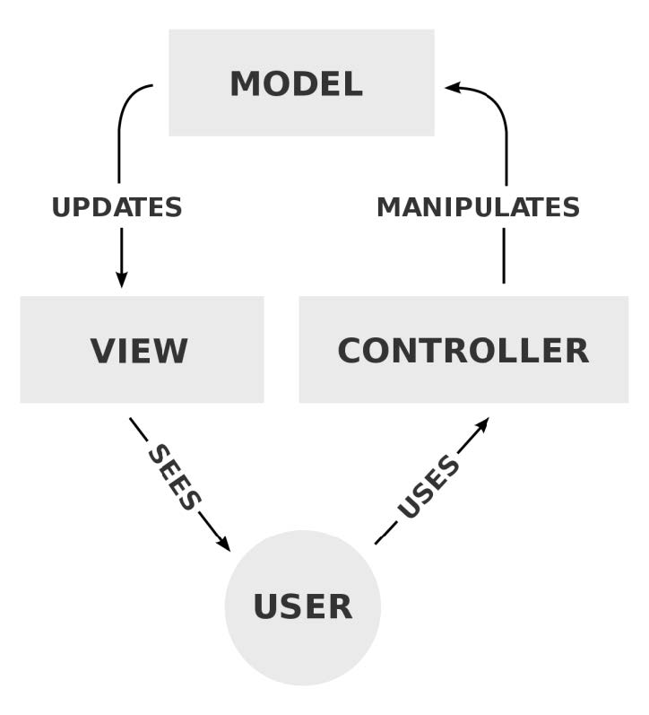
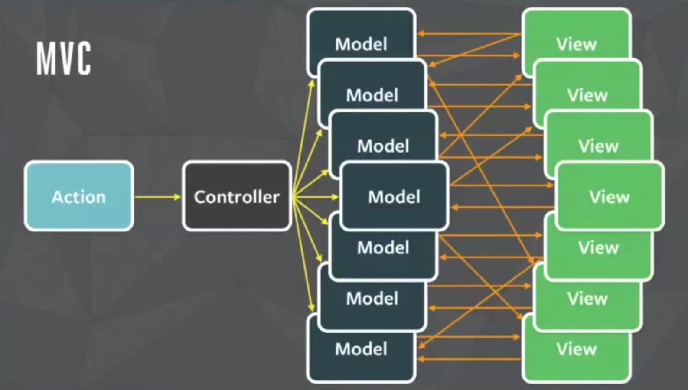
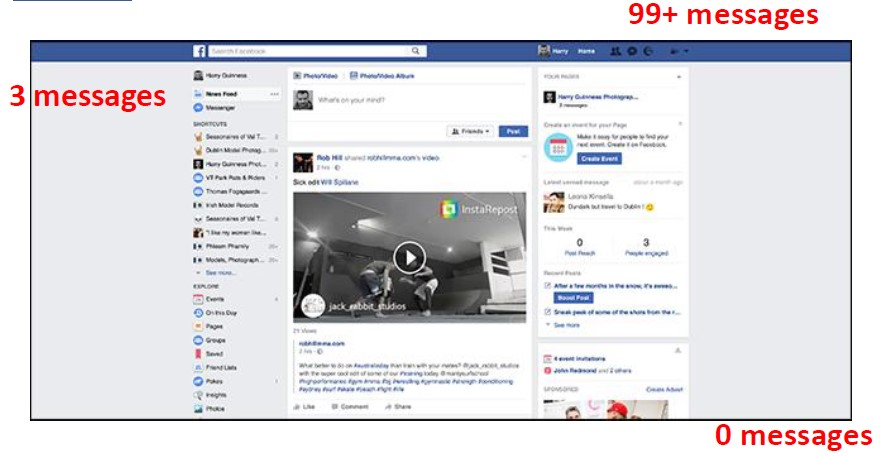
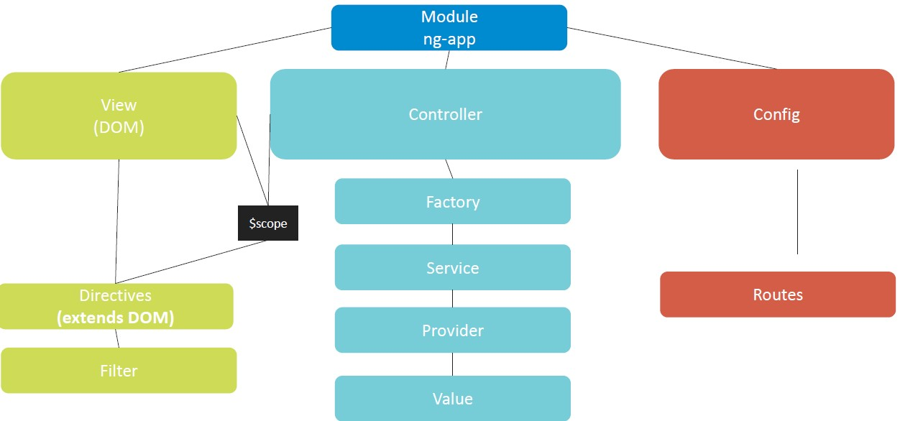
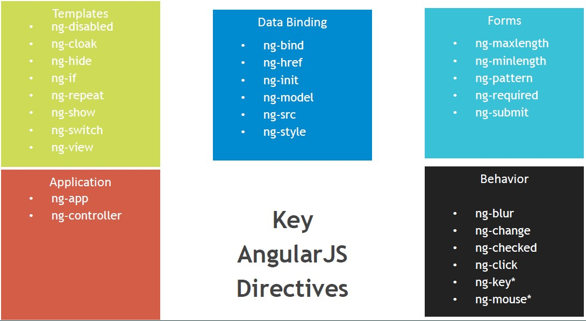
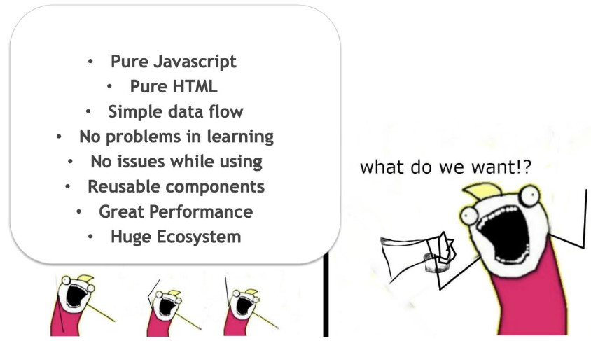
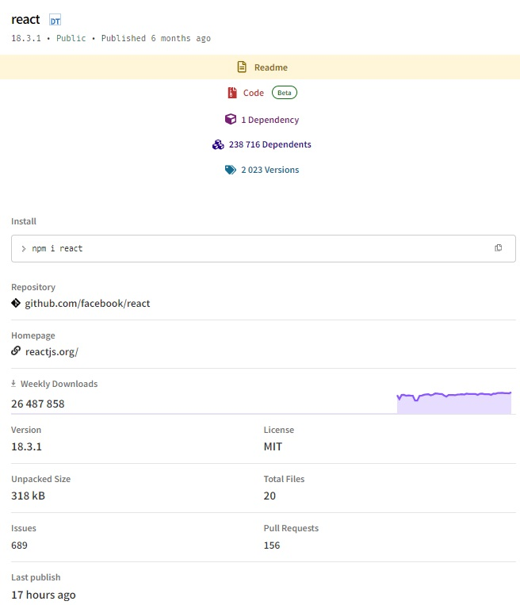

# History of React

So, why React? I mean, it's obvious why you chose this program, because React is really popular. Everyone is talking about React, but why? We need to understand the real cause of this popularity. Because not only the number of GitHub stars or Medium.com posts really corresponds to the popularity. The main idea here is that the tool itself might be popular or might be not because of the way it resolves the problem it should. So let's dive deep into it.
Let's go back to the 2011-2012 aka the era of MVC (model-view-controller) design pattern. At that time JQuery, Angular JS and backbone JS were quite popular. Good old web times, right? And the MVC pattern was quite OK. A user uses a controller -> controller manipulates model -> model updates view -> users sees the updated view, that's it.

Quite simple, quite straightforward. But actually, it wasn't that good. Once you have a really difficult and really challenging application, your MVC will start looking like this:

It is really hard to scale, hard to find the solution, hard to find the way the data flows and so on and so forth. It's really a nightmare, so that's why.

Approximately at that time as well, Facebook was facing another issue with their application. They had this bug: *When a user opens their own facebook page they see a messages counter at the very top showing, for example, 99+ unread messages. But the menu on the left was showing only 3 unread messages and the counter at the bottom was showing zero messages:*

Very confusing scenario, isn't it? Facebook team struggled fixing bugs like this one, so they decided to create the so-called wishlist:

👉 Unified state of the app  
👉 Components reuse  
👉 Parallel development  
👉 Declarative approach  
👉 Modularity  
👉 Secure app  
👉 Performant app  

They wanted to have a unified state of the app and reusable components. And parallel development so development teams won't block each other. They wanted to implement a declarative approach and modularity. Make the app more secure and, moreover, a more performant. Because at this time the web was really, really slow. That was a result of jQuery, Backbone, heavy DOM manipulations, and slow network. Really, it was a challenging time and Facebook wanted some changes.

But what about AngularJS, which was already available at that time? Look at this scheme, it demonstrates the complexity of AngularJS:

It's really hard to use and it has a steep learning curve. For example, check these angular directives for templates for data binding:

AngularJS was a challenging thing to navigate, so Facebook decided to hear developers' opinions as well. And developers just wanted pure JavaScript, pure HTML, simple dataflow, easy to learn, reusable components, great performance and ecosystem.

So Facebook decided to act on these points and build this new thing. The new hot thing. And soon, ReactJS was released to the public on May 29th, 2013. Its features are:

🌟 Virtual DOM  
🌟 One-direction data flow  
🌟 Reusable components  
🌟 Great Developer Tools  
🌟 Huge and growing ecosystem  
🌟 Easy to learn, easy to use  
🌟 Big Development Community

Now, go and check ReactJS stats on npmjs.com. Because it's really crucial to understand the tool we are using. At the time of this writing, the latest React version is 18.2.0 and it looks like this:

Look at the number of packages dependent on React, it's approaching 200k. That's really a lot, and what even more impressive is 26 million downloads weekly. And with all this popularity, react itself has a single dependency. Another metric to consider is how lightweight React library is. It's only 300 kilobytes, while Angular or vueJS are more than 2 megabytes. That's a huge difference. So what that says is that almost any new module these days will initially support React and only afterwards might support other frameworks. Basically, if there is a library on NPM or a framework or a tool, it won't be much of a trouble to use it with React.
