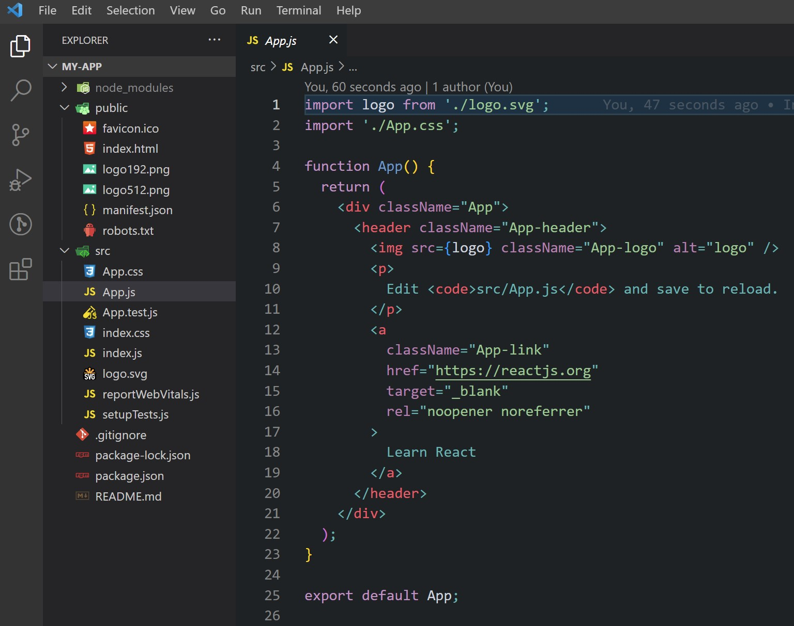

[⬅️ Prerequisites](prerequisites.md)  
[Elements and JSX ➡️](elements-and-jsx.md)

[Back to Contents 📑](../../README.md#module-1)

The recommended way to set up a React project is to use a modern tooling method. There are multiple tools available to streamline your project setup and enhance development efficiency. Below, we will cover **Create React App (CRA)**, **Vite**, and how **webpack eject** works.

### Install NodeJS
https://nodejs.org/en/download

### Using Vite for React

**Vite** (pronounced "veet") is a modern alternative to CRA that focuses on speed and simplicity. It uses **ES Modules** during development for faster builds and a more efficient workflow.

**Why Use Vite?**
- Lightning-fast startup and HMR (Hot Module Replacement).
- Smaller, cleaner configurations compared to CRA.
- Built-in support for React and TypeScript.
- Optimized for modern JavaScript with tools like **esbuild** and **Rollup**.

**Setting up a React Project with Vite:**

Open CMD in the specific folder and execute following commands:
1. Install Vite via npm:
   ```bash
   npm create vite@latest my-app --template react
   cd my-app
   npm install
   npm run dev
   ```

:::info
We are using a CRA for this course hometask. Do not run this command for your template.
:::

2. Vite starts a development server almost instantly, even for larger projects.

**Comparison with CRA:**
- CRA focuses on providing a comprehensive setup out of the box but can feel heavy for smaller projects.
- Vite provides a more modular and faster setup with fewer abstractions, making it ideal for modern development.

### Understanding webpack eject

**What Does Eject Do?**
Ejecting a CRA project exposes the underlying webpack and Babel configurations, allowing you to customize them. This is useful if you need to:
- Add a specific loader or plugin.
- Customize optimization settings.
- Adjust how assets are processed.

However, ejecting removes the convenience of CRA's built-in scripts. You'll need to:
- Manually maintain the configuration files.
- Update dependencies when needed.

**How webpack Works in CRA:**
CRA uses webpack internally to:
- Bundle JavaScript, CSS, and images.
- Apply environment-specific optimizations (e.g., minification for production).
- Provide plugins like HTMLWebpackPlugin for generating the `index.html`.

After ejecting, you can modify files like `webpack.config.js` directly to suit your project needs.

### Summary
- **CRA** is great for beginners or those who want a ready-to-go environment.
- **Vite** offers speed, simplicity, and modern tooling for advanced and lightweight projects.
- **Eject** from CRA only if you require deep customization and are prepared for added complexity.

Each approach has its pros and cons. Choose based on your project size, complexity, and development preferences. For small, fast projects, **Vite** might be the way to go. For larger, well-supported setups, **CRA** remains a solid choice.

===

Old approach:


### Using Create React App (CRA)

Create React App is an officially supported way to set up a React project with minimal effort. Assuming you already have **Node.js** installed on your machine, you can create a new React app by running the following commands:

Open CMD in the specific folder and execute following commands:
```bash
npx create-react-app my-app
cd my-app
npm start
```

Once installed, your project folder will look similar to this:



[//]: # (:::warning)

[//]: # (Do not install additional libraries for your homework, you already have all needed dependencies.)

[//]: # (:::)

**What CRA Does:**
CRA provides a fully configured environment with:
- Babel and webpack for modern JavaScript bundling.
- Support for React, JSX, ES6, TypeScript, and Flow syntax.
- Pre-configured tools for CSS auto-prefixing and resetting/normalization.
- A live development server for rapid feedback.
- A build script to prepare your app for production with optimizations like minification, hashed filenames, and sourcemaps.
- Built-in support for Progressive Web Apps (PWA) with service workers.

**Ejecting from CRA:**
If you need to customize the webpack configuration, CRA provides an `eject` command. Running this command extracts the configuration files, making them editable. However:
- **Once ejected, it cannot be undone.**
- Your project will lose the pre-configured simplicity of CRA.
- You’ll need to manually manage dependencies and configurations like webpack, Babel, and ESLint.

Run the command with caution:
```bash
npm run eject
```

[//]: # (:::warning)

[//]: # (Do not run this command for your homework, you already have all needed dependencies.)

[//]: # (:::)
