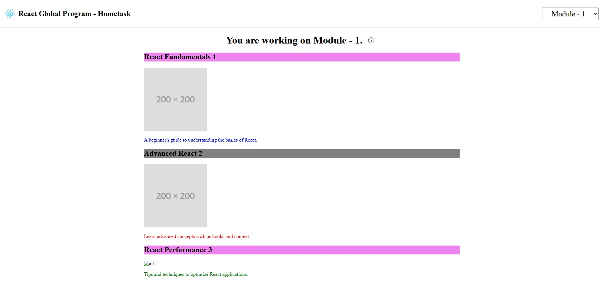

**Practical Task: Creating a React Component to Render a List of Items with Composition**

## Task Description
In this task, you will create a React component that displays a list of items.  
Each item should be rendered using a separate child component, demonstrating the concept of component composition. 
This will help you understand how to structure React components for better reusability and maintainability.

You will use a mock array of data provided in the template to build your components.

## Preperation:
1. Check if the `react-global-tasks` repo was forked to your [https://autocode.git.epam.com/](https://autocode.git.epam.com/) git account (if no: go to the Learn React Global Program course Module 1 task and click `Learn` button).
2. Clone `react-global-tasks` repo.
3. Install dependencies
```json
npm install
```
4. Run the project
```
npm run dev
```
By default the project should be run on [localhost:5173](localhost:5173).  
The Home page of task app  
  

5. Select the needed module in the top right conner dropdown (Module - 1).

6. Go to the folder with Module 1 task template and start work with the task.
```
src\module-1
```


## Requirements
**Component Structure:**
1. Component named `ItemList` that receives the list of items as a prop (`items`).
2. A child component named `Item` to render each individual item.

## Props:
**The `ItemList` component should:**
* Receive an array of items as a prop named items - `items`prop.

**The Item component should:**
* Receive a single item as a prop named `item` and `isEven` prop that based on item id.

## Rendering:
**In the ItemList component:**
1. Use the `map` method to loop through the `items` array and render an `Item` component for each item in the list.
2. Pass the individual `item` and `isEven` as a prop to the `Item` component.
3. Use the `key` prop when rendering the `Item` components.

## Fallback Behavior:
**In the ItemList component:**
If the `items` prop is an empty array, render a message like **"No items to display."**

**In the Item component:**
Display:
* The item's `name` and `id` (as a heading `h2`) with a class name `even` or `odd` bassed on `isEvent` prop.
* The item's `description` (as a paragraph) with inline `color` styles (`red` by default).
* An `image` if the image property is provided (with a fallback alt text if the image fails to load).

## Styling:
Find styles for `odd` and `even` classed in the `module1/styles.less` file.  
Add basic styling to visually distinguish each item (e.g., borders, margins, etc.).

## Code Structure:
Ensure the code is clean, well-organized, and follows best practices (e.g., using ES6 syntax).

## Expected Output
When you pass the `mockItems` array to the `ItemList` component, it should render:

* Each item's name and id as a heading with `odd` or `even` className.
* The description below the name with correct color in inline styles.
* An image (if available) above the name.
* A fallback message when no items are provided.


## Local home task check

1. Run command in terminal to run tests:
```
npm run test:local:m1`
```


2. Run command in terminal to check if build is success:
```
npm run build
``` 
