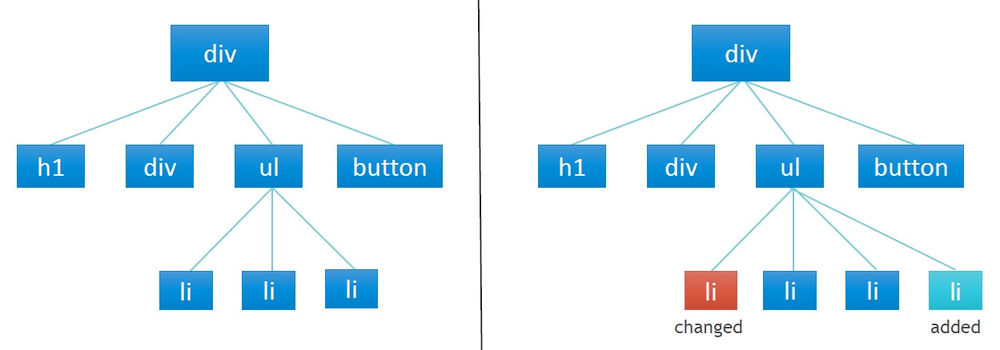
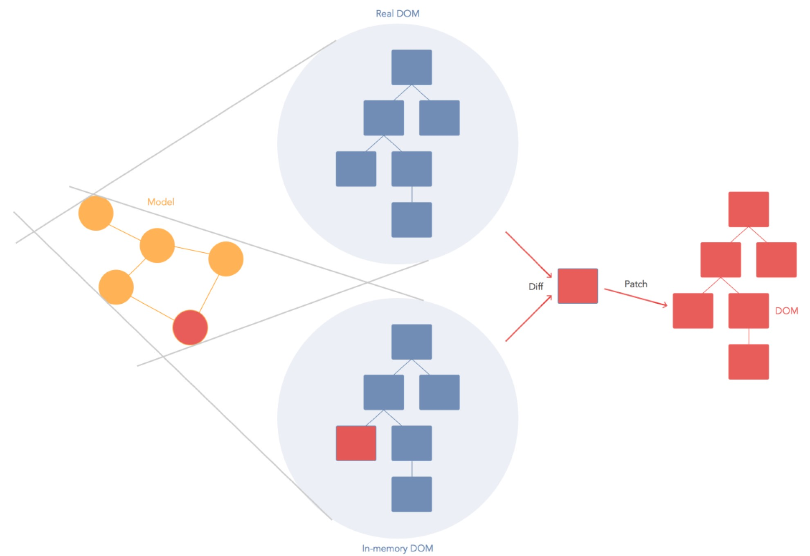

[⬅️ Components](components.md)  
[💻 TASK ➡️](task.md)

[Back to Contents 📑](../../README.md#module-1)

The **Virtual DOM (Document Object Model)** is a lightweight, in-memory representation of the actual DOM. React creates this virtual copy of the DOM to optimize updates and improve performance.

Instead of directly modifying the real DOM when changes occur, React updates the Virtual DOM first. After that, it calculates the differences between the current Virtual DOM and the new one, determines the minimal changes needed, and applies only those updates to the real DOM. This process is known as **reconciliation**.

  


## Why Use the Virtual DOM?

Traditional DOM manipulation can be slow. Every change to the DOM requires the browser to:
1. Combine the DOM with CSS styles.
2. Recalculate the layout based on window size.
3. Determine which parts of the UI are affected.
4. Repaint the screen.

For large applications, this process can become a bottleneck. The Virtual DOM solves this by reducing the number of operations on the real DOM, making updates faster and more efficient.


## How the Virtual DOM Works

1. React creates a **Virtual DOM tree** (a lightweight JavaScript object representation of the UI).
2. When changes occur (e.g., state or props updates), React:
  - Generates a new Virtual DOM tree.
  - Compares it with the old Virtual DOM tree using a **diffing algorithm**.
  - Calculates the minimal set of changes (additions, updates, deletions).
3. Only the calculated changes are applied to the real DOM.


### Reconciliation in Detail

The process of updating the real DOM based on changes in the Virtual DOM is called **reconciliation**. Key features of this process include:

#### 1. Batch Updates
React groups multiple updates together and applies them all at once to reduce the number of real DOM updates. This minimizes repaints and improves performance.

#### 2. Diffing Algorithm
React uses an efficient algorithm to compare two Virtual DOM trees:
- If the root elements are of different types, the old tree is completely replaced.
- If the elements have the same type, React updates only the changed attributes and content.

#### 3. Keys for Efficient Updates
When working with lists, React uses the `key` prop to identify elements. This helps React match elements between renders more efficiently:
- Without a `key`, React might unnecessarily re-render unchanged elements.
- With a `key`, React knows which elements have moved, been added, or been removed.

Example of efficient updates with `key`:

```jsx
<ul>
  <li key="1">Item 1</li>
  <li key="2">Item 2</li>
</ul>

<ul>
  <li key="3">New Item</li>
  <li key="1">Item 1</li>
  <li key="2">Item 2</li>
</ul>
```

Here, React only adds "New Item" and keeps "Item 1" and "Item 2" intact instead of rebuilding the entire list.

---

## Benefits of the Virtual DOM

- **Performance:** Faster updates by minimizing real DOM manipulations.
- **Abstraction:** Developers work with a declarative syntax, leaving DOM optimizations to React.
- **Efficiency:** Handles complex UI changes effectively, even in large applications.

In summary, the Virtual DOM allows React to offer a seamless user experience by efficiently managing changes and updates to the real DOM.
