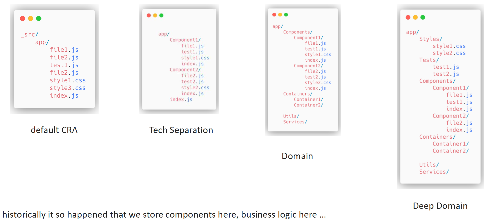

# Application Structure

So we have a lot of components, a lot of wrappers, a lot of patterns.
So right now we have to structure our application somehow.
Keep in mind that there is no strict or golden rule for React application.
Let's have a look at the most popular.

So here we have a few options.

**Default CRA**.
The source folder and app folder and then just a mixture of JS files, some styles and so on and so forth.
This approach won't be great for a big application, for huge team.
However, it is good for the small project, any project where you are just starting your exploration with the React Library.
Otherwise, I will not recommend you to use this structure, because you will probably get mixed up with this structure, and you will have to divide it.
And then go to the next option.

**Tech Separation**.
So as you can see here, we split our components into the subfolders, and it's quite better option here.
So we have all these styles, tests and all the related items to the one component folder and for the next one and the another.

**Domain**.
Also, we might go deeper and use the main approach where we separate components from the containers, some utils and services.
Actually, the recommendation here is basically to use this approach.

**Deep Domain**.
This one if you have a really big project with the number of tasks, a lot of challenges, so on and so forth.
Probably you will have some deep domain structures with nesting, so on and so forth.

You can create separate folders for Hook, Utils, Assets, Services and so on and so forth, and put them on the components folder
or in the project's root folder if they are commonly used.
React is really agile to the app structure, so no matter which option you chose here.

:::tip
DO NOT CHANGE folder structure in your home task application.
:::
