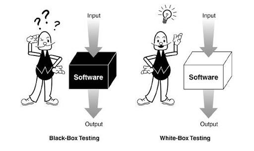

[⬅️ Testing Pyramid](testing-pyramid.md)  
[Jest ➡️](jest.md)

[Back to Contents 📑](../../README.md#module-2)

# Blackbox and Whitebox testing

**Black box** testing is when we don't know how the system works internally.
We don't need.
We don't have access to the code, or we can't read it.
Therefore, we focus only on external behavior or technical task.
The advantage of this approach is that since you don't know the code, you don't take a word for anything, and you check every word in the requirements.
It happened that the developer missed some condition in the requirements, and simply didn't do it or did it, but not in the right way.
If you read the code itself, then everything works correctly, but this is not quite what was needed.

**White box** testing is when we have access to the code, and we're testing it.
Let's just say we read the code itself, run it, debug or write out a test.
The advantage of this approach is that you can write fewer tests.
After all, we know that it will work.
Same here, we see it from the code, but sometimes we delve into the code so deeply that we read it, and we can miss some bugs.

And in addition to all this, we can also highlight **Gray box** testing.
This is combination.
We look at the code and understand how it works, and then we open application itself, and check how this code is already displayed in it, but we focus more on the requirements.
If you talk about testing, then this is any testing of the system through the interface, when you have access to the code, but not developer knowledge.
Yes, you can spy on some simple things in the code, for example, type of data does this really have, what settings do the fields have etc.
And as a result, we partly know how it works.
Therefore, we will double-check on the black box somewhere, we will write a little more test for insurance.
In general this is most optimal testing method.
You can find bugs in the code, and check it accordingly to the requirements.
