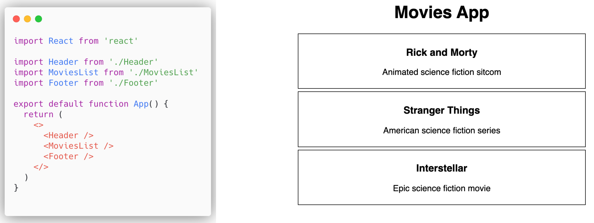
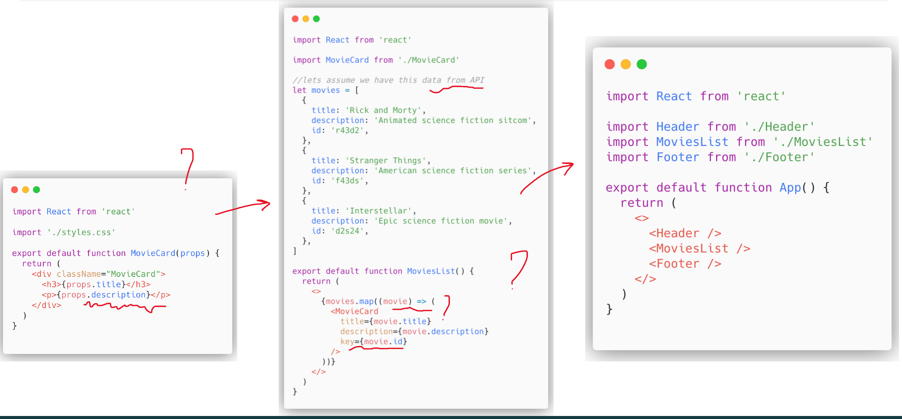
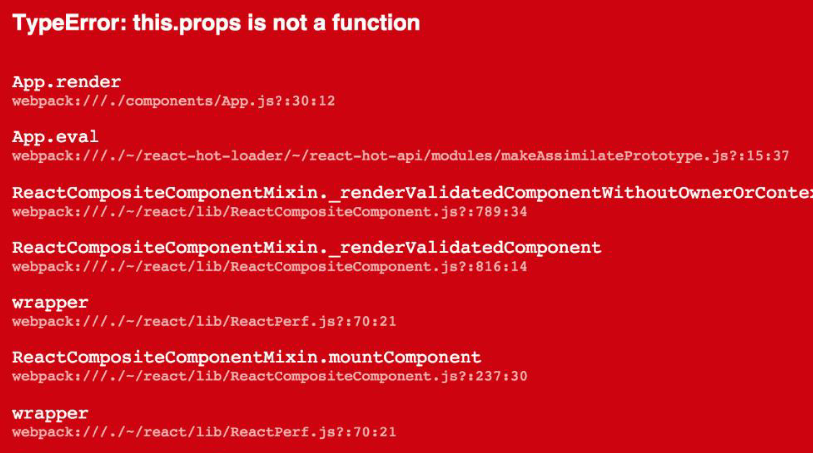
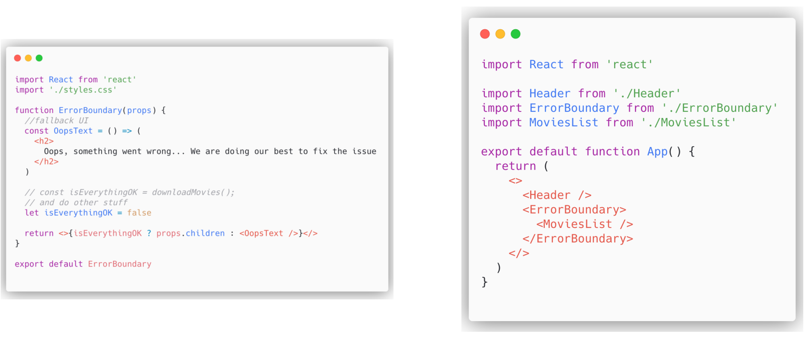
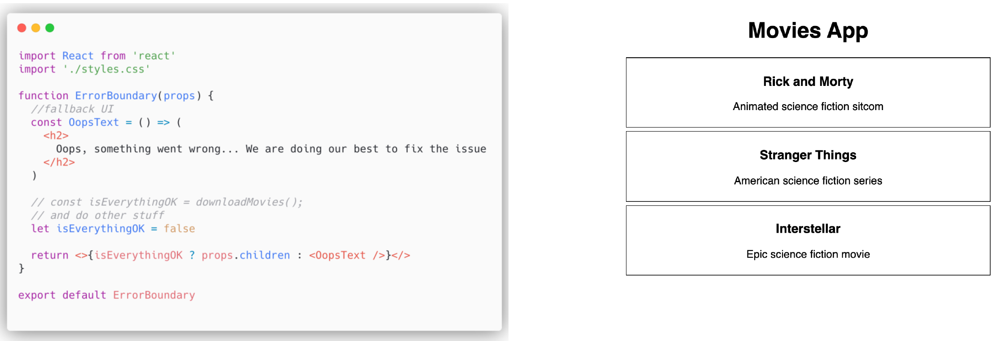
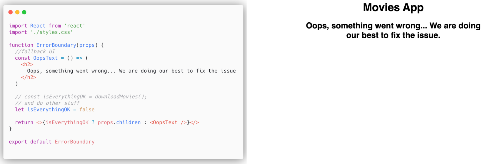

[⬅️ Layout Component](layout-component.md)  
[Higher-Order Components ➡️](higher-order-components.md)

[Back to Contents 📑](../../../README.md#module-2)

# Error Boundaries



Imagine we have this application.
We have some styles being applied, all the components are centrally aligned.
We have `Header`, `MovieList`, and `Footer`, which is currently empty.
What might go wrong here?
Where can we find some bugs?
As you can see here we have no Error Boundaries.
Let's dive deep, and understand why we need this Error Boundaries.

In the past, JavaScript error inside components used to corrupt React internal state, and caused it to emit critical error on next renders.
And React did not provide any way to handle them gracefully in components, and could not recover from them.



While talking about our application, imagine that we have `MovieCard`, and something went wrong in this particular component.
For example, some API fields were changed, and now we have no description, but shor word like desc.
Or we are not using title anymore, instead we are using image.
Or something wrong with API, probably authentication failed.
Or there is changes in general structure of our array.
Or some props are being missed...
And all these errors, all these unknowns issues are passed from a child to a parent.
And it's really hard to understand what went wrong.



And now our app, what worked like 10 minutes ago, once when API was changed, shows this red screen of death.
And we don't know what went wrong.
We have some errors, warnings, webpack issues.
It is not the best user experience at all.

So let's use Error Boundaries to be on the safe side here.

```jsx
<ErrorBoundary>
  <YourComponent />
</ErrorBoundary>
```

**Error Boundaries** are components that catch JavaScript errors everywhere in their child components tree, they log those errors and display a fallback UI instead of the component tree that crashed.
Also make sure, that a class component becomes an error boundary if it defines new lifecycle methods: `componentDidCatch(error, info)` or static `getDerivedStateFromError()`.
Let's keep in mind that we have some sort of representation of error boundary via functional component.
So as you can see our boundary is nothing more than just a wrapper, and we can pass into this wrapper our component.

But there are some cases where error boundary won't help us:

- Inside Event handlers.
- Asynchronous code using `setTimeout` or `requestAnimationFrame` callbacks.
- During Server side rendering.
- When errors thrown in the error boundary code itself.


So let take a look again on our app.
We have `Header`, `MovieList`, and `Footer`.
I am not sure, we need error boundary for our `Header`, because it's really just a static header.
And we are quite confident about our `Footer` as well.
But we are not sure that `MovieList` will be in a good shape always.
That's why we are using error boundary



So this is a functional component representation of error boundary.
This is example of implementation of error boundary, which will give you the basic and the fundamental understanding of error boundary concept.
Error boundary in this case is function, which takes some props.
It has fallback UI, which will be output of this function, if some props correspond some result.
For example, we have somewhere some checks like loading, authentication, movies downloading, and we pass the result of it through `isEverythingOk`.
If `isEverythingOk = true`, we will proceed `props.children`, the same approach, what we are using in layout component.



But if `isEverythingOk = false`, in this case we will have a fallback UI.



There will be no red screen of death, no broken functionality, at least some elements are still visible, at least there is an explanation, what is going on.

It is not strict rule to call this error boundary in this way.
You might use additional or separate error boundary for different components.
For example, you want to check something specifically for Header, use specific custom error boundary.
Or just want to wrap the whole application with one generic error boundary, you can do it as well.
You can combine both options as you like.
