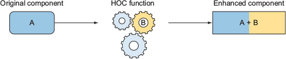

# Higher-Order Components

## What is a Higher-Order Component(HOC)?

A higher-order component is a function that takes a component and returns a new component.



Higher-Order Components (HOCs) are a handy way to reuse logic between components in React. They’re not officially built into React, but they come from how React is designed to work.

```javascript
const composeComponent = (Component) => (props) => <Component {...props} />;
```

Here, this function, `composeComponent`, demonstrates the Higher-Order Component (HOC) pattern, where one component is wrapped or “composed” with additional functionality or behavior. For example:

```javascript
const withLoading =
  (Component) =>
  ({ isLoading, ...props }) => {
    if (isLoading) {
      return <div>Loading...</div>;
    }
    return <Component {...props} />;
  };
```

What’s Happening Here?

- `withLoading` function:

  - Takes a Component as its argument.
  - Returns a new component with props we need.

- Conditional Rendering:
  - If `isLoading` is `true`, the HOC renders a simple Loading... message.
  - Otherwise, it renders the wrapped Component, forwarding all other props with `{...props}`.

Next we have `DataDisplay` component that simply shows some data:

```javascript
const DataDisplay = ({ data }) => <div>Data: {data}</div>;
```

Now we can use the `withLoading` HOC to enhance `DataDisplay` with loading functionality.

```javascript
const DataDisplayWithLoading = withLoading(DataDisplay);
```

Putting it all together:

```javascript
const App = () => {
  const isLoading = true; // Simulate loading state
  const data = "Here is the loaded data!";

  return <DataDisplayWithLoading isLoading={isLoading} data={data} />;
};

export default App;
```

Expected output should be

```text
Loading...
```

## Use Cases for HOC

HOCs are often used to:

1. Inject Props Dynamically: Add extra props to components (e.g., user data, feature flags).
2. Access Global State: Connect components to Redux or another state management library.
3. Conditional Rendering: Control whether a component is displayed based on certain conditions.
4. Add Side Effects: Implement logging or analytics for certain components.

Let's go over some practical examples where HOC shines

### Example 1: `withFeatureFlag`

Here’s a practical example of using a Higher-Order Component (HOC) for feature flags, which allows you to enable or disable features dynamically based on a configuration.

Step 1: Create HOC. This HOC wraps a component and renders it only if the specified feature flag is enabled.

```javascript
const withFeatureFlag =
  (Component, featureFlag) =>
  ({ featureFlags, ...props }) => {
    if (!featureFlags[featureFlag]) {
      return <div>Feature not available</div>;
    }
    return <Component {...props} />;
  };
```

How It Works

- `Component`: The component to be rendered if the feature flag is enabled.
- `featureFlag`: The name of the feature flag to check.
- The HOC checks the `featureFlags` object for the specific `featureFlag`.
- If the flag is disabled (`false` or `undefined`), it renders a fallback message.
- If enabled, it renders the wrapped `Component` with all its `props`.

Step 2: Create a Component

Here’s a simple NewFeature component:

```javascript
const NewFeature = () => <div>Welcome to the new feature!</div>;
```

Step 3: Wrap the Component with the HOC

Use the withFeatureFlag HOC to wrap NewFeature with a feature flag check:

```javascript
const NewFeatureWithFlag = withFeatureFlag(NewFeature, "newFeatureEnabled");
```

Step 4: Use the Enhanced Component

Pass a `featureFlags` object to control the availability of the feature.

```javascript
const App = () => {
  const featureFlags = {
    newFeatureEnabled: true, // Toggle this flag to enable or disable the feature
  };

  return (
    <div>
      <h1>Feature Flags Demo</h1>
      <NewFeatureWithFlag featureFlags={featureFlags} />
    </div>
  );
};

export default App;
```

Expected Behavior

If `featureFlags.newFeatureEnabled` is `true`, the app displays:

```text
Welcome to the new feature!
```

If `featureFlags.newFeatureEnabled` is `false` or not defined, the app displays:

```text
Feature not available
```

Why Use This HOC for Feature Flags?

- Centralized Feature Control: You can manage feature availability dynamically using a featureFlags object, enabling or disabling features without modifying components.
- Reusability: The HOC can be applied to any feature-based component.
- Separation of Concerns: The feature toggle logic is decoupled from the component itself, making the component cleaner and more focused.

Here’s an example of using a Higher-Order Component (HOC) for integrating analytics tracking. This HOC will track component renders and send relevant information to an analytics service.

### Example 2: `withAnalytics`

Step 1: Create HOC. This HOC sends analytics data whenever the component is rendered.

```javascript
const withAnalytics = (Component, eventName) => (props) => {
  // Simulate sending analytics data
  const sendAnalytics = (event) => {
    console.log(`Analytics Event: ${event}`, { props });
    // Example: Replace with a real analytics library call
    // analytics.track(event, props);
  };

  // Send analytics data on render
  sendAnalytics(eventName);

  return <Component {...props} />;
};
```

How It Works

- `Component`: The component to be wrapped.
- `eventName`: The name of the analytics event to track.
- On each render of the wrapped component, the HOC sends an analytics event using the `sendAnalytics` function.
- Replace the `sendAnalytics` function with an actual analytics library call, like Mixpanel, Segment, or Google Analytics.

Step 2: Create a Component

Here’s a simple `ProductPage` component:

```javascript
const ProductPage = ({ productId }) => (
  <div>
    <h1>Product Page</h1>
    <p>Viewing product ID: {productId}</p>
  </div>
);
```

Step 3: Wrap the Component with the HOC

Wrap `ProductPage` with the `withAnalytics` HOC to send an analytics event whenever it is rendered:

```javascript
const TrackedProductPage = withAnalytics(ProductPage, "Product Page Viewed");
```

Step 4: Use the Enhanced Component

Pass props to the enhanced component as usual:

```javascript
const App = () => {
  return (
    <div>
      <h1>Analytics HOC Demo</h1>
      <TrackedProductPage productId="12345" />
    </div>
  );
};

export default App;
```

Expected Behavior

On rendering `TrackedProductPage`, the console logs:

```bash
Analytics Event: Product Page Viewed
{
  props: { productId: "12345" }
}
```

The UI displays:

```bash
Product Page
Viewing product ID: 12345
```

Advanced Example: Track Mount and Unmount Events

You can extend the HOC to track when the component is mounted and unmounted:

```javascript
import React, { useEffect } from "react";

const withAnalytics = (Component, eventName) => (props) => {
  useEffect(() => {
    // Track mount
    console.log(`Analytics Event: ${eventName} Mounted`, { props });

    return () => {
      // Track unmount
      console.log(`Analytics Event: ${eventName} Unmounted`);
    };
  }, []);

  return <Component {...props} />;
};
```

Why Use This HOC for Analytics?

- Centralized Tracking Logic: The HOC abstracts the tracking logic, so components stay focused on rendering.
- Reusable: Easily apply to any component to track different events.
- Extensible: Adapt the `sendAnalytics` function to use any analytics service, such as Google Analytics, Mixpanel, or Amplitude.
- Lifecycle Awareness: Can track render, mount, and unmount events to cover all user interactions.

## HOCs VS Hooks

As React developers, we often face a tough decision when deciding between **Higher-Order Components (HOCs)** and **Hooks** for sharing logic or enhancing components. Both are powerful tools, but each has its strengths and ideal use cases. Making the right choice requires understanding how they differ and the scenarios where one outshines the other.

### Key Differences

| **Aspect**              | **HOCs**                                               | **Hooks**                                                |
| ----------------------- | ------------------------------------------------------ | -------------------------------------------------------- |
| **Syntax**              | Wrap components to inject functionality or logic.      | Use functions directly inside functional components.     |
| **Ease of Use**         | Can lead to "wrapper hell" when nesting multiple HOCs. | Clean and straightforward, especially with simple logic. |
| **Reusability**         | Great for reusing logic across multiple components.    | Equally reusable but often more concise.                 |
| **Lifecycle Awareness** | Works with both class and functional components.       | Only works with functional components.                   |
| **Modernity**           | Older pattern, commonly used in legacy codebases.      | The modern standard for React development.               |

---

### When to Use HOCs

HOCs are ideal when:

1. **You’re Working with Class Components:**

   - If you’re in a legacy codebase that relies heavily on class components, HOCs are often the best choice for logic reuse.

2. **Global State Management with Libraries:**

   - Many libraries, such as `react-redux`’s `connect`, still use HOCs to wrap components with global state.

3. **Cross-Cutting Concerns:**

   - Tasks like authentication, analytics, or feature flags that require wrapping components with additional logic are well-suited for HOCs.

4. **Dynamic Component Modification:**
   - When you need to dynamically modify or replace components at runtime, HOCs can provide the required flexibility.

### When to Use Hooks

Hooks are the go-to choice when:

1. **You’re Working with Functional Components:**

   - Hooks work seamlessly with modern functional components, making them ideal for new projects.

2. **Reusing Logic Without Wrapping:**

   - Hooks allow you to reuse logic without nesting or wrapping components, avoiding "wrapper hell."

3. **Cleaner and More Intuitive Code:**

   - Hooks make it easier to manage state and side effects without needing additional abstractions like HOCs.

4. **Composability:**
   - Custom hooks are composable and can be combined to handle complex logic while maintaining readability.

### Summary: When to Choose What

| **Scenario**                                 | **Use HOCs** | **Use Hooks**                 |
| -------------------------------------------- | ------------ | ----------------------------- |
| **Legacy Codebase with Class Components**    | ✅           | ❌                            |
| **Modern Functional Components**             | ❌           | ✅                            |
| **State Management Libraries (e.g., Redux)** | ✅           | ✅ (with modern libraries)    |
| **Cross-Cutting Concerns (e.g., Auth)**      | ✅           | ✅ (Hooks often cleaner)      |
| **Avoiding Wrapper Hell**                    | ❌           | ✅                            |
| **Complex Component Composition**            | ✅           | ✅ (via composition of hooks) |

## Conclusion

Higher-Order Components (HOCs) remain a powerful and versatile pattern in React development, offering a clean and reusable way to share logic across components. By wrapping components and enhancing their behavior, HOCs enable developers to handle complex scenarios like authentication, feature flags, logging, analytics, and more without duplicating code.

However, as React has evolved, hooks have emerged as a more modern and often preferred alternative, especially for functional components. While HOCs are still invaluable in certain contexts — such as legacy codebases, libraries like Redux, or class component-heavy projects — it’s essential to evaluate whether they are the best fit for your use case.

The key to mastering HOCs lies in understanding their strengths and limitations:

- Strengths: Excellent for code reuse, compositional flexibility, and encapsulating cross-cutting concerns.
- Challenges: Can lead to “wrapper hell” with nested HOCs, increased complexity, and potential prop conflicts.

In modern React applications, the decision to use HOCs should be made carefully, considering the simplicity and power of custom hooks for reusable logic. Ultimately, HOCs remain a valuable tool in a React developer’s toolkit, especially when used thoughtfully and in the right scenarios. By understanding when and how to use HOCs, you can write cleaner, more maintainable, and scalable React applications.
