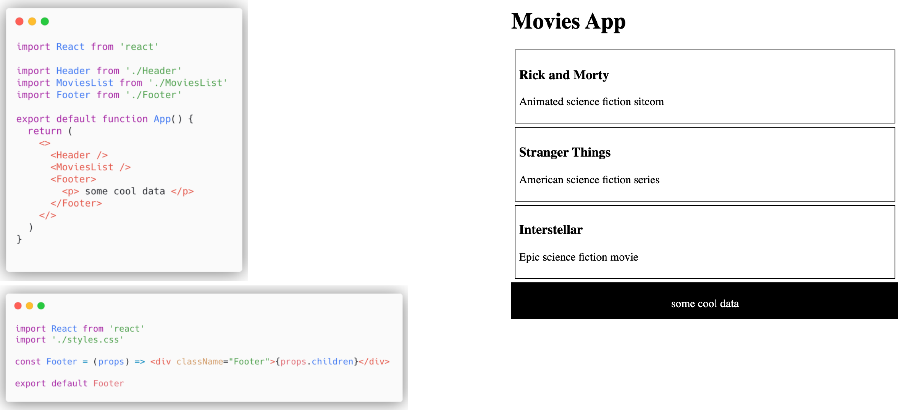

[Back to Contents](../../README.md#module-1)\

# Layout Component

First steps of out application: we have `Header`, we have `MovieList`, and we want to have `Footer`.
This `Footer` is just a layout component.
It takes some props, and then it returns all the children that are within these props.
So we might use it like here: as you can see, no children, no props are passed.
That's why we have this empty footer.
No style at all.

Once we have data being passed as props, you see the difference.
Here we have some styles being applied. Actually it is a benefit of a layout component.
We don't want to think twice about the way it looks.
We just know, we have a footer, and it has some behavior under the hood.
No matter how many props, for example in this case are being passed in this particular layout component, we've already known that we have one element being past here, it will be placed in the center.
Using this approach you can divide your application into several blocks.
For example, I want to have a layout component `Header` to place all the items in the right corner, or I have a sidebar, or I have a something in the center.
No matter how many components you pass, you might talk to them via these `props.children`.

**The benefits of this approach**:

- Better separation of concerns.
  You don't really worry about some components that are going to break UI, because they are really limited to this section like header, footer, right corner.
- Better reusability.
- Easy way to organize UI elements.
- No cross-team dependencies.

There are many cases when some team is working on header, and they are adding an additional components to this header.
And these components are having some styles, and they might break UI.
But once you have this layout component, it is safe place for your component to be placed
