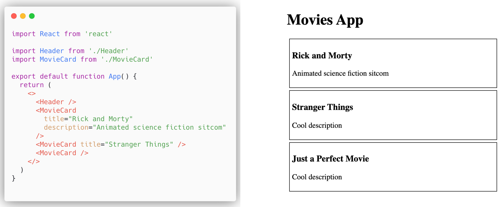
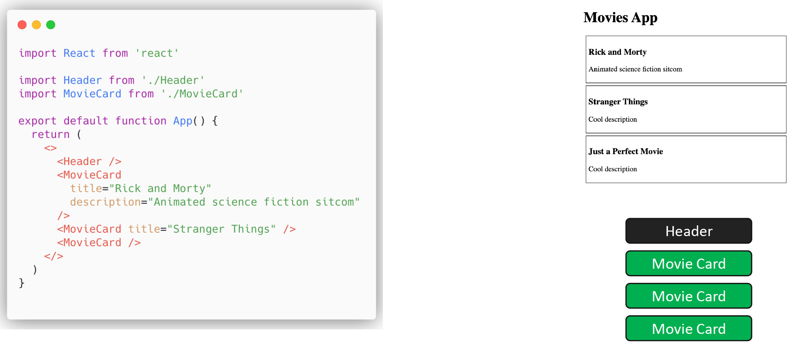
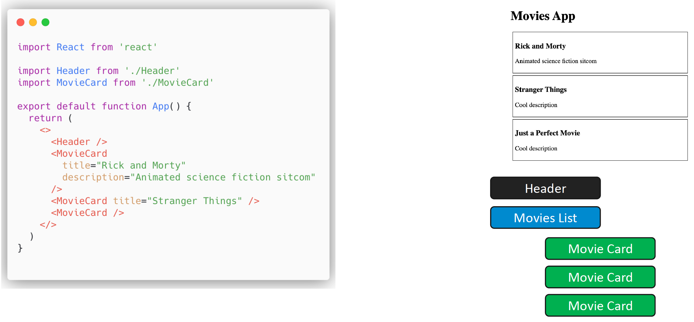
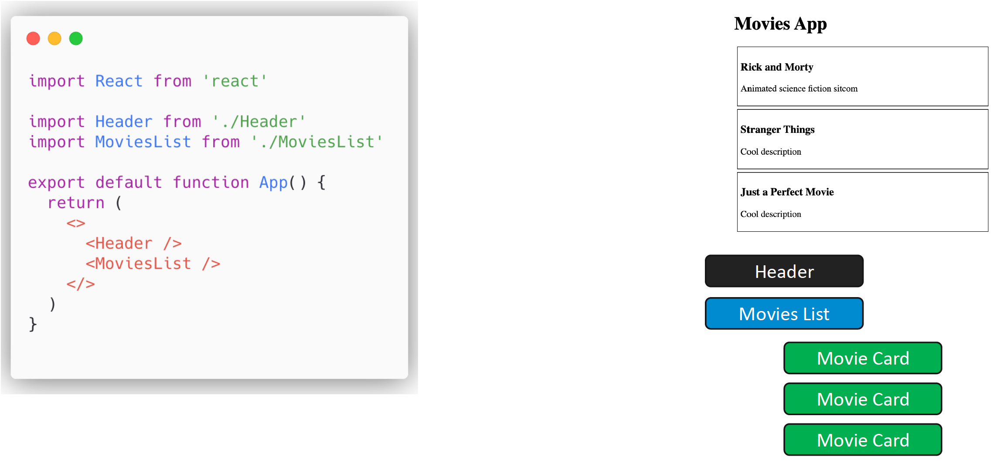
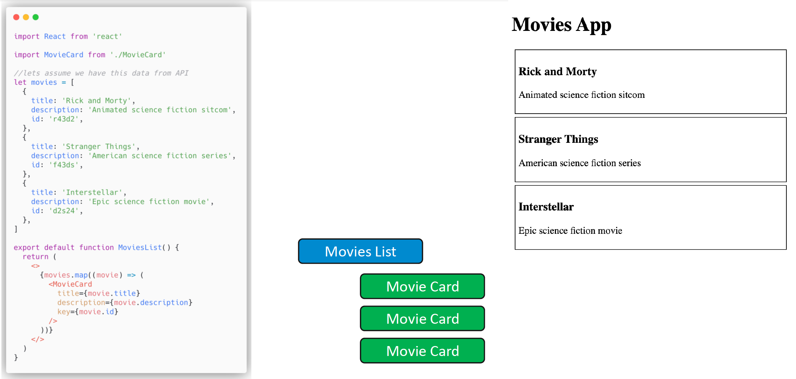
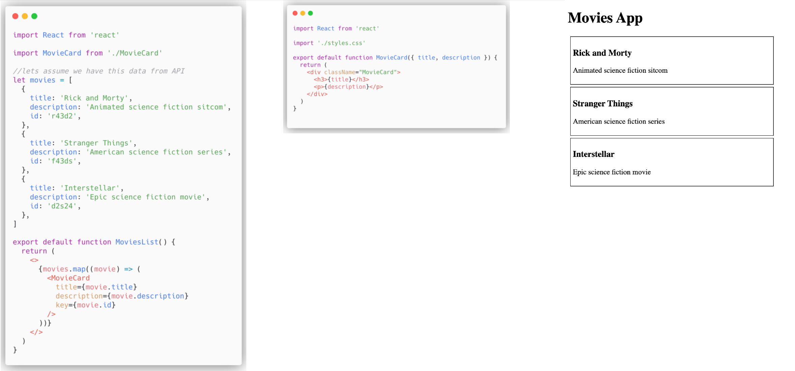
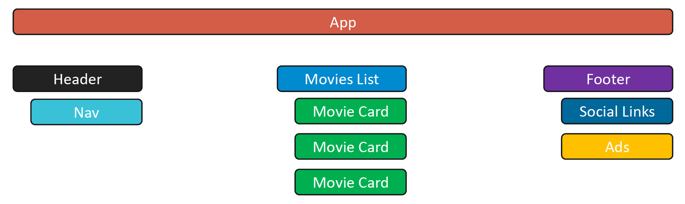

[⬅️ Components](../components.md)  
[Layout Component ➡️](layout-component.md)

[Back to Contents 📑](../../../README.md#module-2)

# Parent and Child

So we have our app, we have some data, the components, and some of them are not unique.
Actually, it goes against React mindset because once you see that something is repeatable, you have to make a component for it, or you have to structure it somehow.
Let's think how we can reorganize this app in a better way.

How about additional component?
It will be a parent for the `MovieCard` components.
Now we have a more reusable, more reactive way approach here.

So let's think about this component `MovieList`, as a parent component, as a really huge component with some business logic, some heavy calculation, some API calls.
Just think, API call was successful, and we are storing this data in this parent component.
Look, here we have `MovieList` parent component, and inside we map our data, and we pass this data to its child as a prop.
And we will have the same output of this code, but we avoided hardcoded data, we use map.

Any React app can be divided via this parent-child relationship.
We have `App`, that is a parent, then 3 children: `Header`, `MovieList`, and `Footer`.
`Header` is a parent as well, and has a child `Nav`.
`MovieList` is a parent, and has children `MovieCards`.
This is a key principle of any React application.
You can easily understand the structure of an application, you can easily modify it, and you can collaborate with your team.
