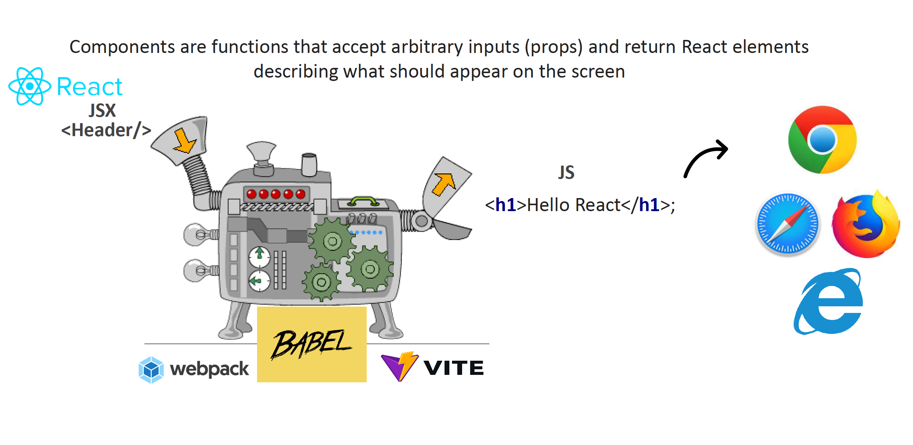
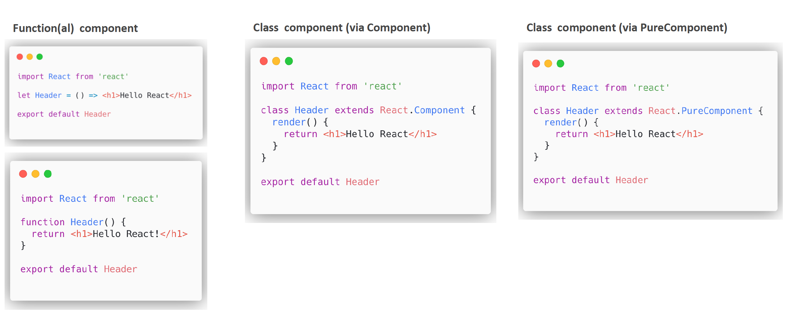
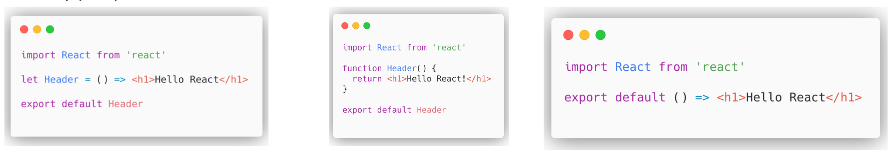
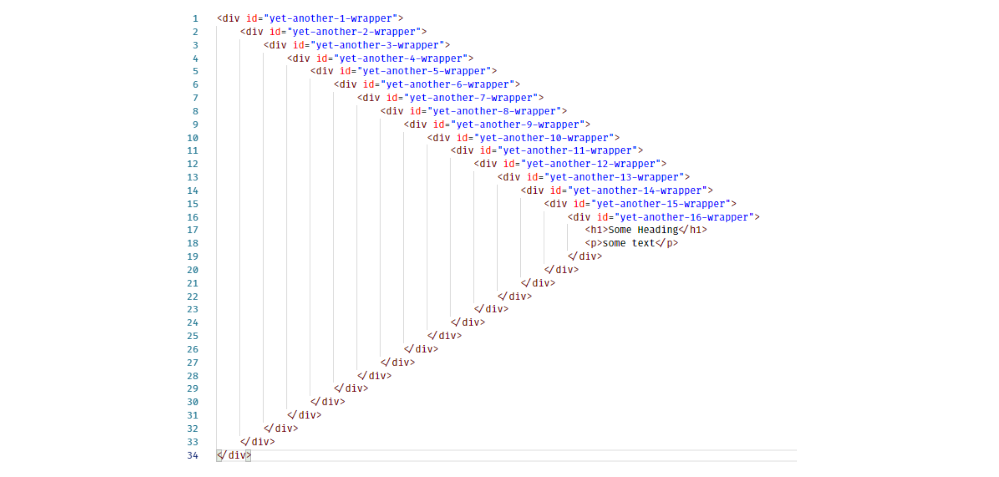
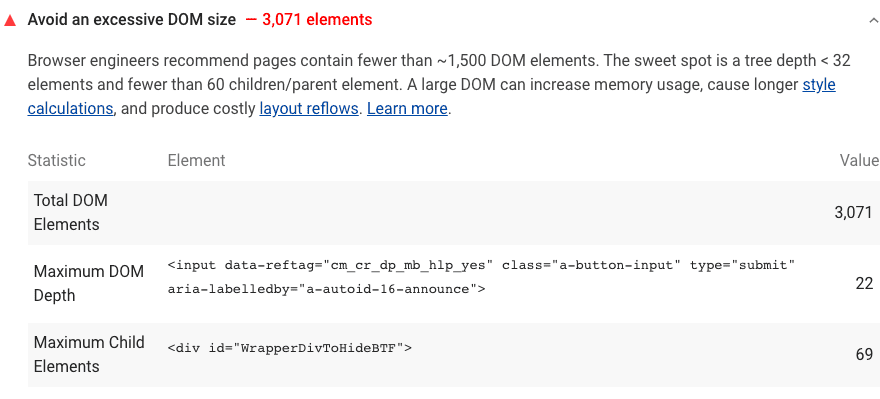
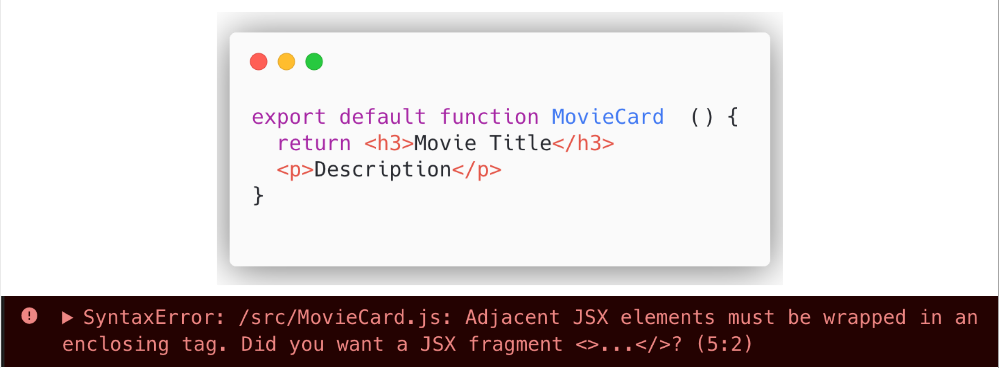
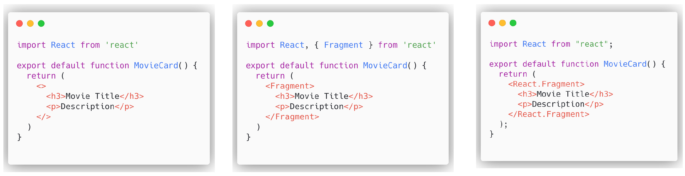
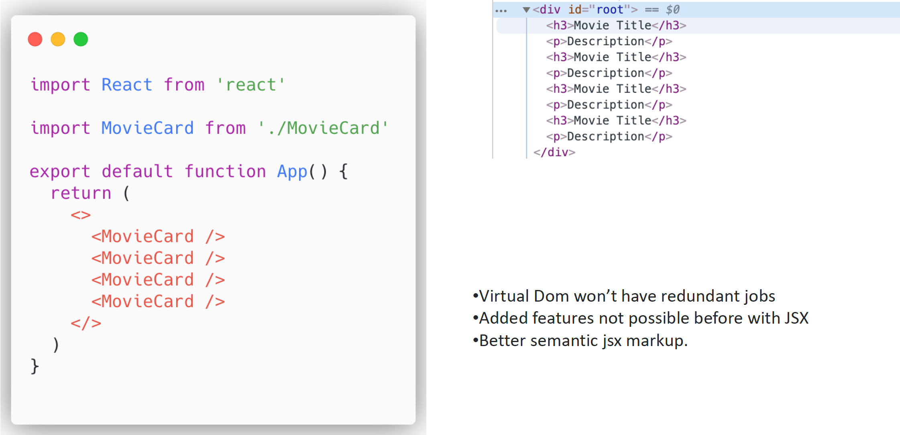

[Back to Contents](../../README.md#module-1)\

# Components

Components are the core concepts of React.
Components are building blocks, bricks of our web application.
Let's have a look at this metaphor and dive into definition.



You see on the picture: we have React, JSX syntax, some transpiler, it transpiles some code to JS, which can be easily understood by all modern browsers (Chrome, Safari, Firefox and Edge).
And let me remind you that basically components in JSX, while we are talking about React library, can be used the following way:

## Components via JSX



So we can have components as a class or a function components.
Here you see the regular function and arrow function component.
And we can use class component via `React.Component` and class component via `React.PureComponent`.
In terms of this particular lecture, we will be focusing more on the function components.
That's the way we can use them:

## Function component



As we see here we have completely the same output from the different inputs.
Let's have a look at almost any modern web application, you might see some components, some building blocks, some common structures.
Let's build our application.

```jsx
import React from "react";

export default function MovieCard() {
  return <h3>Movie Title</h3>;
}
```

So this is a very easy component.
Of course, we want to do something more than just header.
We want to add some description to our movie card.

**Will not work:**

```jsx
export default function MovieCard() {
  return <h3>Movie Title</h3>
  <p>Description</p>
}
```

As you can see, this syntax will not work.
Unfortunately, React does not allow us to perform such an action.
And we have an option, how we can overcome this challenge.

We might use an array.
Instead of one root element, the latest version of React provides this ability to return an array.
However, when we are working with an array in React, we have to provide unique key for each array item. And we have a special warning for our console about it.
So, let's edit:

```jsx
export default function MovieCard() {
  return [
    <h3 key="uniqueKey1">Movie Title</h3>,
    <p key="uniqueKey2">Description</p>,
  ];
}
```

Now our first functional component `MovieCard` returns an array of items with unique keys, and it represents a header and a paragraph.
As you can see, now it hardcoded.
And actually, we have quite a lot of code here to show a very simple UI representation.

How can we modify it?
How can we make it easier to understand and nicer to code?
Actually, we can use a simple `<div>`, that can wrap all these items, and be there one unique root element for this `MovieCard`.

```jsx
export default function MovieCard() {
  return (
    <div>
      <h3>Movie Title</h3>
      <p>Description</p>
    </div>
  );
}
```

Let's move on.
Let's make our application a little bigger, and combine a few `MovieCards` into one `<div>`.

```jsx
import React from "react";
import MovieCard from "./MovieCard";

export default function App() {
  return (
    <div>
      <MovieCard />
      <MovieCard />
      <MovieCard />
      <MovieCard />
    </div>
  );
}
```

We have one root element, and a few components inside this root.
That's not quite good.
Because once we eliminate this `MovieCard` component and use just the tags, that are in each component, we might see that there is a number of empty `<div>`.

```jsx
import React from "react";
// import MovieCard from "./MovieCard";

export default function App() {
  return (
    <div>
      <div>
        <h3>Movie Title</h3>
        <p>Description</p>
      </div>
      <div>
        <h3>Movie Title</h3>
        <p>Description</p>
      </div>
      <div>
        <h3>Movie Title</h3>
        <p>Description</p>
      </div>
      <div>
        <h3>Movie Title</h3>
        <p>Description</p>
      </div>
    </div>
  );
}
```

Right now it is not a big problem: we have a few cards and a few empty `<div>`.
What can be bad here?
That's not best practice to structure your React and any web application.
That's reason why.

## `<div>` hell



Because we actually are having `<div>` hell: we have some elements and a number of `<div>` like callback hell back in the days.
Is it really bad?
Well, a large DOM tree can slow down your performance in multiple ways.
And there are four major drawbacks here:

**Network efficiency and load performance:**

A large DOM tree often includes many nodes that aren't visible when the user first loads the page, which unnecessarily increases data costs for your users and slows down load time.

**Runtime performance:**

As users and scripts interact with your page, the browser must constantly recompute the position and styling of nodes.
A large DOM tree in combination with complicated style rules can severely slow down rendering.

**Memory performance:**

If your JavaScript uses general query selectors such as `document.querySelectorAll('li')`, you may be unknowingly storing references to a very large number of nodes, which can overwhelm the memory capabilities of your users' devices.

**Broken Visual elements:**

Some CSS mechanisms like Flexbox and CSS Grid have a special parent-child relationships, and adding divs in the middle makes it hard to keep the desired layout.

Note from real projects: **Lighthouse check might fail the pipeline**

Lighthouse flags pages with DOM trees that:

- Have more than 1,500 nodes total.
- Have a depth greater than 32 nodes.
- Have a parent node with more than 60 child nodes.



Once you pulled your Pull or Merge Request with this huge number of empty `<div>`, you might break a pipeline.
Lighthouse might break the whole flow and give you an error - just to fix this empty `<div>s`.

## Avoiding unnecessary `<div>s`

So how can we fix it?
Let's go back and see it.

**Will not work:**

```jsx
export default function MovieCard() {
  return <h3>Movie Title</h3>
  <p>Description</p>
}
```

So here we have `MovieCards`, the function components, each returns a header and a paragraph.
And we have to somehow wrap it in the one element.

### Fragments

So what will help us?
Fragments.
Even React helps us in that.



Once we see the warning in the console "JSX elements must be wrapped in an enclosing tag. Did you want a JSX fragment and empty brackets".
That's the hint from React and this is very useful hint.
We might use this short syntax.

**React.Fragment:**

```jsx
import React from "react";

export default function MovieCard() {
  return (
    <>
      <h3>Movie Title</h3>
      <p>Description</p>
    </>
  );
}
```



Using this syntax, you might use `<Fragment>` or `<React.Fragment>`, it gives you the same output as it was before (with and empty `<div>`), but without the `<div>` in the actual DOM.



And how we expect, we can't find it in the real DOM, actually, we have only one root element (one `<div>`) and all these internals of each `MovieCard`, only represented by a header and a paragraph.
That gives us some real benefits, like Virtual DOM won't have redundant jobs, added features not possible before JSX, and better semantic JSX markup.
Really, you don't need to use these empty `<div>s` anymore.
Your app will be extremely performant as it was desired to be.
