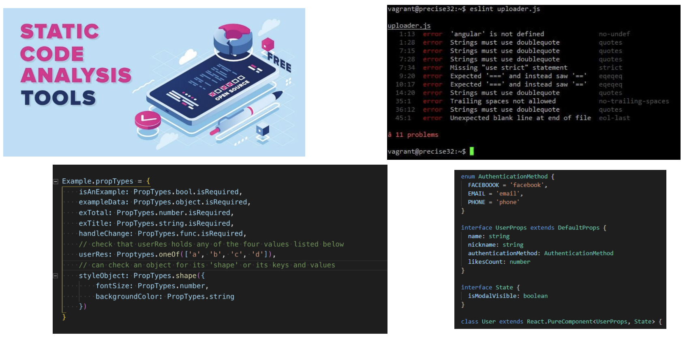

[Testing Pyramid ➡️](testing-pyramid.md)

[Back to Contents 📑](../../README.md#module-2)

# Introduction

What is testing?
Software testing is a kind of functional research process, the purpose of which is to obtain information about the quality of product.
It's also an assessment of the system, which involves finding the difference between what the system should be and what it is.
In a broad sense, testing is one of the quality control techniques which includes a planning, writing test directly, execution, testing and analyzing the results.
This practice also brings big benefits to our development process.
If all is done right, it improves communication between analysts, developers, and testers.
For example, if you want to see the progress of the entire project, this can be easily done by checking the successful or failure test.
Ultimately development speed will increase because well formulated requirements lead to fever rework.
Test also facilitates a more modular architecture subsystem that have clear responsibilities.

It is worth mentioning **static testing analysis**.

Static analysis allows developers to check the code for structural defects.
During static analysis can be found out such problems as variable with undefined value, incompatible interface between models and components, variables that are declared but never used, also the code is unavailable, and security vulnerabilities and syntax violations.
At various libraries, such as ESlint, PropTypes, and TypeScript can help us with this.
