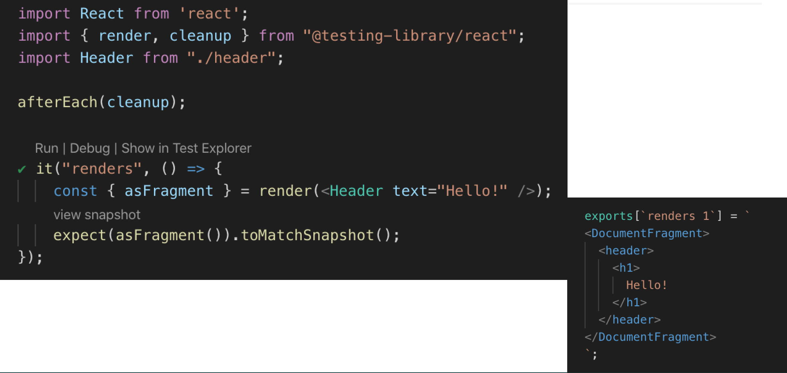

[⬅️ Blackbox and Whitebox Testing](blackbox-and-whitebox-testing.md)  
[React Testing Library ➡️](react-testing-library.md)

[Back to Contents 📑](../../README.md#module-2)

# Jest

**Jest** is a JavaScript testing framework.
It can work with technologies such as TypeScript, Node, React, Angular, Vue and other.
With Jest, you can test with snapshots, they will be allocated next to the test or written directly in the code.
Tests are executed in parallel running in their own threads for maximum performance.
If we add flag coverage, Jest will collect code coverage information from the entire project, including an unverified files.
You can mark everything completely, methods, models and all without much effort.
When a test fails, Jest provide us with a detailed description of the reason for the failure.

## Main methods

First, it is `describe`.

`describe` is description of our test.
This method can group several related test in itself, it can also contain other `describe` methods in itself.

`test` is contained `it` or test methods.
`it` method is just the alias for method `test`.
`it` method consists of the name of the test (it also kind of test documentation), and the callback in which we write the test itself.
Each `test` must contain `expect` method.
`expect` takes some value and returns an object with matchers which we are checking in our test.

## Matchers

This is our helper methods that should compare the values that we passed to expect with the corresponding matcher.
For example, if you see the matcher `toBe(3)`, in this case, we will expect that our result of the test should return 3.
For example, in our second matcher is `toEqual`, we expect that our method will return object, which will consist the field `one` with value 1, and we call this mixture to equal and expect that it will true.
Or for example, if we expect that our method should return null, in this case we call `toBeNull`.
Or if we for example, expect that it should be truthy or falsy, in this case, we use the matchers `toBeTruthy`, `toBeFalsy`.

## Mock and Stubs

In unit testing, we test an individual module in any application.
The relationship between classes will get more complicated.
It will be harder to find the source of the error.
To avoid this we can replace the dependencies with mocks or stubs.
For example, we have some method that checks if data is in the cache, if yes, we take from there, if not, we take from the database.
And we can see, the main difference between stubs and mocks is that in one case we control state, and in other we control behavior.
When we use mocks, we replace the entire model with mock, and stub is a function what always prints the same output, no matter what was input.
Mocks are used to check if the function was called with the correct arguments.
And stabs test that function works with the response.
Stabs are used to check the state of a method.
Mocks are used to regulate behavior.

**Mocks function methods**.

**Timer mocks**.

Suppose we have some asynchronous code and in order not to wait for it to be executed as arise we can wait a long time, we can use mocks for timers.
For example, if we use `jest.useFakeTimers` when starting the test, fake timeout will be triggered.
To make sure that all these timers are running we can simply call `jest.runAllTimers`.
But if you have scripts where the timer sets, a new timer in its own callback, in such cases it is better to use `jest.runOnlyPendingTimers`, otherwise our timer may become recursive and everything will loop.
We can also move in time using `jest.runTimersToTime` where we pass the time in milliseconds, and later we are already doing something with our code after this time.

**Mocks modules**.

We also have the ability to mock various methods and models.
To do this first we need to specify the name of our model in `jest.mock`.
Then to this file we will need to create a mock file where the implementation itself will actually be.
We can also pass the callback, where the implementation itself also will be.
We cannot describe all the methods from this model, but only the one that we need.
This is why this method is convenient.

## Asynchronous code

We have several options to test asynchronous code.
One of them is when our asynchronous method accepts a callback, then we can write a callback function that takes some data.
In addition, we already talked about `test`, and its methods.
In the first argument we accept a string, name of the test, and the second is a callback, that we can use for asynchronous code.
We wrote a callback that accept some data.
And in `expect` we compare this data, and after that, `done` function is called.
We pass this all to our asynchronous method and until `done` method is executed, our test will not be completed successfully.
This is the first option.

The second option is when we can return the promise and call it back.

Let's say we have some kind of fetch data, and then we transfer some data and compare it accordingly.
In doing so, we call `expect.assertion` with 1.
This indicates to us that certain number of statements are called during the test.
This is often useful when testing asynchronous code to ensure that the assertion in callback are actually being called.
Or we can indicate in a different form, we pass our asynchronous method, called `resolve` method.
This method resolves the asynchronous method, and as a result the usual comparison.

Well, and the last variant.

Since everyone already uses ES6 and higher, when it is possible we can use `async/await`.
In this case as you can see on a sequence see on the slide we write `async` before asynchronous code, and will write `await`, and tested already in a similar way.

## Setup and Tear-down

It often happens that one file or component can contain many tests and usually for this we have some common data.
For example, we have some general state, and after the execution of each test it will change, and we want it to be always in the initial value before the execution of each test.
To do this we have appropriate methods that will perform some action before or after each or all test.
For example, when we test components that work with the date and in this case we will need mocks.
Since the date always changes, and if we take date now twice, the result will not be the same.
Therefore, we can take date now in front of all test, and so that is equal to some number.
Then our test will not fail.
As you can see in the example, after each test we clear all timers and reset all mocks.

## Snapshot testing

Here we are already using the React Testing Library, it provides us with a number of methods.
One of them it is `render`.
It actually renders our component, which will pass to it, and it writes the result of variable.
In this case, we got `asFragment` of the variable using destructuring.
On the first run just writes all this to `json`, and on subsequent runs it will simply compare this design with the new one.
If two snapshot are not equal, the test will fail.

## Coverage

When we run coverage we can see statements of our files.
We can see branch and function which will be tested.

Here we can see the coverage of a specific file.

In addition, in the console it just provides its own coverage.
