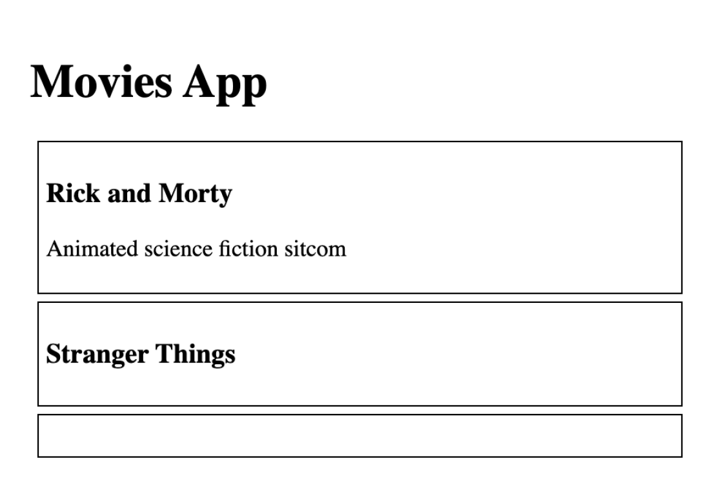
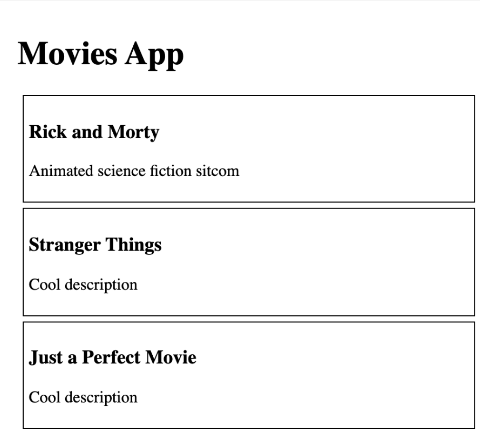

# Default Props

## What is default props?

Default props can be used to define any props that you want to be set for a component, whether or not a value is passed in from the parent component.

## Default Props values

We have an app without any propTypes or TypeScript, and we have issues with empty `<MovieCard />`, and want to figure out what went wrong and where.

```jsx
const MovieCard = ({ title, description }) => (
  <div>
    <h1>{title}</h1>
    <p>{description}</p>
  </div>;
);

const App = () => (
  <div>
    <MovieCard title="Rick and Morty" description="Animated science fiction sitcom" />
    <MovieCard title="Stranger Things" />
    <MovieCard />
  </div>;
);
```


As you can see, we have 3 MovieCards, some of them have a title, a description, some of them are without.
We'll fix it with Default Props.

```jsx
const MovieCard = ({ title = 'Just a Perfect Movie', description = 'Cool description' }) => (
  <div>
    <h1>{title}</h1>
    <p>{description}</p>
  </div>;
);

const App = () => (
  <div>
    <MovieCard title="Rick and Morty" description="Animated science fiction sitcom" />
    <MovieCard title="Stranger Things" />
    <MovieCard />
  </div>;
);
```



This is whole solution.
As you can see in our app, if we have the missing title or description (or both), we don't have these broken UI, our app looks fine.
We can consider this part as a notification area: when you see the default props on your app, probably something went wrong for this part of UI, and you already know where and how to fix it.

## Default Props (deprecated)

It is important to note, that this method of setting default props for functional components is deprecated and will be removed in a future major release, so it’s not advisable to use it as a way of defining default props anymore.

Instead, you should use the ES6 object destructuring syntax, where you can <a href="#default-props-values">destructure the props of a functional component with default values</a>.

```jsx
const MovieCard = ({ title, description }) => (
  <div>
    <h1>{title}</h1>
    <p>{description}</p>
  </div>;
);

MovieCard.defaultProps = {
  title = 'Just a Perfect Movie',
  description = 'Cool description'
}

const App = () => (
  <div>
    <MovieCard title="Rick and Morty" description="Animated science fiction sitcom" />
    <MovieCard title="Stranger Things" />
    <MovieCard />
  </div>;
);
```
