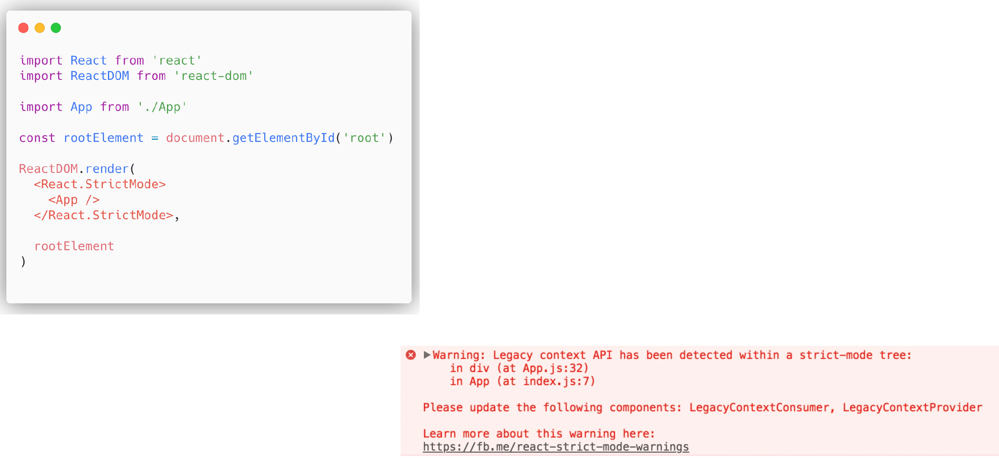

[Back to Contents](../../README.md#module-1)\

# Strict Mode

**StrictMode** is a tool for highlighting potential problems in application.
Like `Fragment`, `StrictMode` does not render any visible UI.
It activates additional checks and warnings for its descendants.

StrictMode checks are run in the development mode only, so they do not impact the production build.

So strict mode currently helps with:

- Identifying components with unsafe life cycles.
- Warning about legacy strings ref API usage.
- Warning about deprecated finedDomNode usage.
- Detecting unexpected side effects.
- Detecting legacy context API.
- Additional functionality will be added with the future releases of React.

And it's really helpful thing.
Because once something in this app somewhere deep in the tree of this application went wrong, we will have this warning, for example in this case: "Legacy context API has been detected", and actually it is extremely useful tool.
Once you have this strict mode, you will have all the possible issues, all the possible warnings, that might crash or might somehow be bad for your application, and you see them beforehand.
