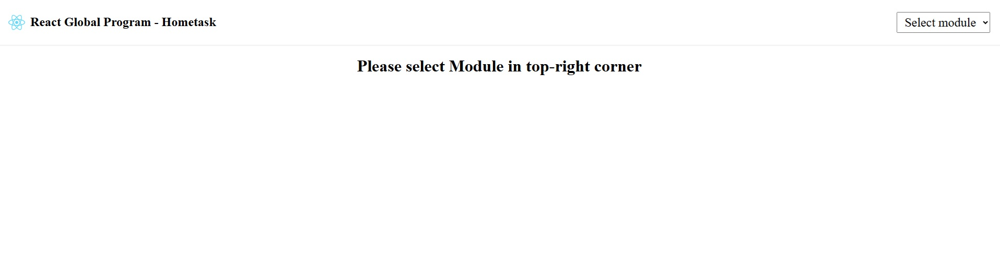
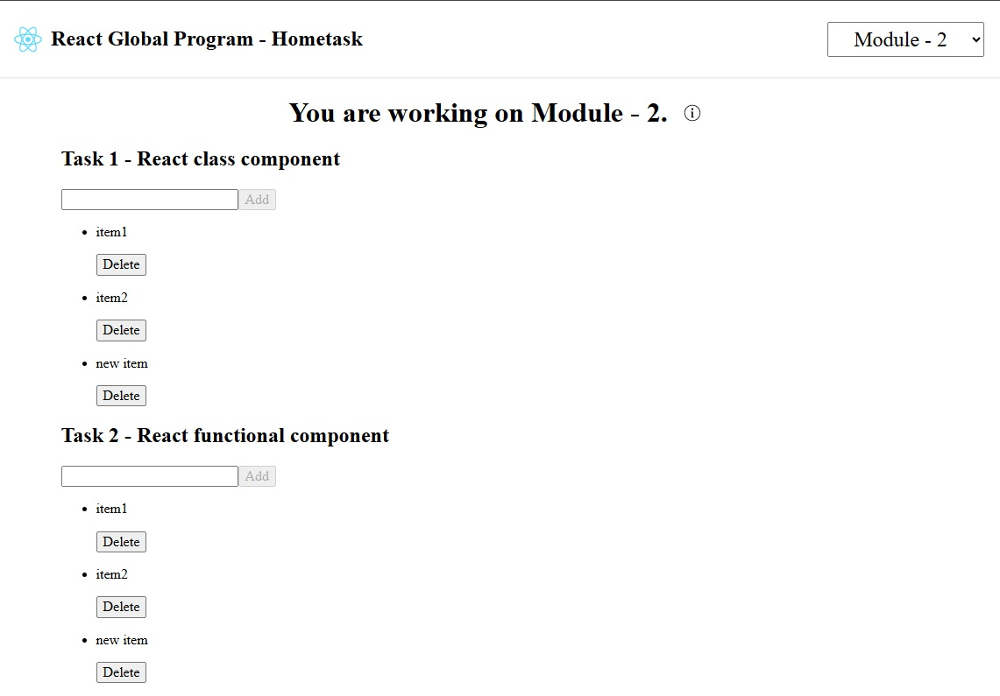
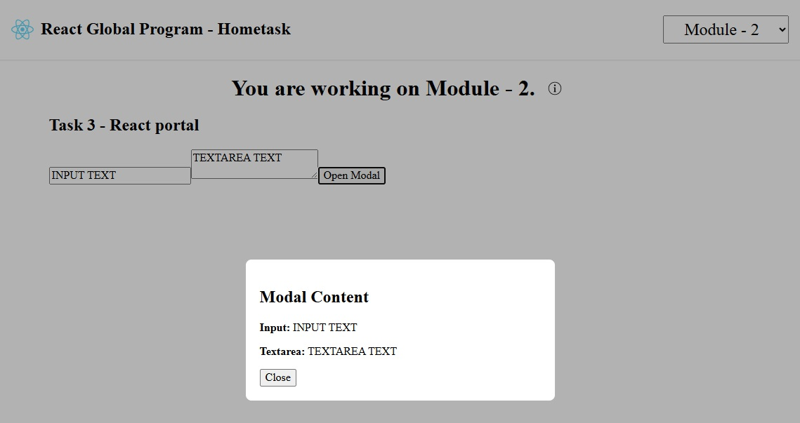

[⬅️ Strict Mode](strict-mode.md)

[Back to Contents 📑](../../README.md#module-2)

## Task #1 Description

In this task, you will create a React **Class** component that render an input, "add" button and list of items from props.
Save items from props to the state. Follow the props and state interface.
You will use a mock array of data provided in the template to build your component.

:::note
In this task, class components are used solely to help you understand how they work.
While it's important to be familiar with them, class components are considered an outdated approach in modern React development.
Always use functional components in real-world projects unless there is a specific reason not to.
:::

## Preperation:
1. Continue to work in the forked `react-global-tasks` repo 
(if you don't have it: go to the Learn React Global Program course Module 2 task and click `Learn` button).
2. Do not add any new dependencies.
3. Run the project
```
npm run dev
```
By default, the project should be run on [localhost:5173](localhost:5173).  
The Home page of task app  


4. Select the needed module in the top right conner dropdown (Module - 2).

6. Go to the folder with Module 2 task template and start work with the task.
```
src\module-2
```

Start work with `src\module-2\AppModule2.tsx` file.


### Requirements

1. **Input**

- add `focused` className to the input on focus event and remove it on blur event.
- clean the input value on keydown `Escape` event.
- add new item to the list on keydown `Enter` event and clear input.

2. **Add button**

- add new item to the list on click event.
- button should be disabled if the input is empty.
- clear the input value after adding new item to the list.

3. **List**

- use `ul` tag for the list.
- use `li` tag for each item.
- render item name in the `p` tag.
- render delete button inside the `li` tag.
- delete item on button click event.

## Task #2 Description

In this task, you will create a React **Functional** component that render an input, add button and list of items from props.
Save items from props to the state. Follow the props and state interface.
You will use a mock array of data provided in the template to build your component.

### Requirements

Use same requirements as in <a href="#requirements">Task #1</a>.

### Expected Output for Tasks 1 & 2


## Task #3 Description

In this task, you will create a React component that render an input, textarea and button that open a modal window.
And Modal component that display the value from input and textarea.

### Requirements

1. **Input & Textarea**

- save value to the state and pass as a prop to the Modal component.

2. **Button**

- open modal window on click event.
- should be disabled if the input and textarea is empty.

3. **Modal**

- use createPortal for the modal.
- should be a layout modal that render children.
- render the value from input and textarea in the modal window.
- render close button inside the modal window.

:::tip
For better UI experience, add `overflow: hidden` to the body on modal open and `overflow: auto` on modal close.
:::

### Expected Output for Tasks 3


## Task #4 Description

In the next task you will need to decompose existing component.
You will find `<InitialComponent />` in the template, decompose component into smaller components.

### Requirements

:::note
You do not need to change markup and login of the component.
:::

Next components should be implemented:

1. **Task4Solution** - root component, place states and main logic of filtering, sorting, adding to cart and toggling of favorites in it.
2. **Header** - place cart button and cart modal.
3. **Input** - input for filtering.
4. **Select** - select for sorting.
5. **Modal** - modal that render cart information.
6. **ProductsList** - list of products.
7. **Product** - product card with product information, add to cart and favorites buttons.


## Local home task check

run command in terminal `npm run test:local:m2`
