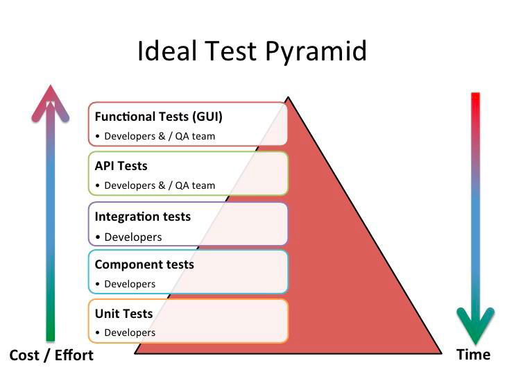

[⬅️ Introduction](introduction.md)  
[Blackbox and Whitebox Testing ➡️](blackbox-and-whitebox-testing.md)

[Back to Contents 📑](../../README.md#module-2)

# Testing pyramid

Test pyramid is kind of abstraction, that means grouping test into different levels.
It also gives an idea of how many tests should be in each of these groups.
The most important thing to remember **two principles**:

- You need to write tests of different levels.
- The higher the level, the fewer the tests.

And let's take a closer look.
At the bottom we see unit testing.
What are **unit tests**?
They make sure that every piece of code developed in the component returns the expected result.
In unit testing, developers only look at the interface, and specification of the component.
Based on pyramid unit test should form the main of automated testing.
Developing and writing unit test in parallel forces developers to think about the problem they are solving, and any edge cases they might face.
Also, tests are detailed and can help accurately determine defect.
The execution time of this test is very fast, since you don't need to rely on any UI or external systems such as a database or API.
They are inexpensive easy to write and easy to maintain.

Next step we have it is **component testing**.
This is independent testing of a component or a separate model.
This is necessary in order to check the expected result in the end.
Typically, component testing is done for the functionality or usability of the component.
For example, we can take testing the usability and accessibility of the UI part, testing page to verify performance, checking the login functionality with valid and invalid user credentials.

Next comes **integration testing**.
This is done to test individual components to see how they work together.
In other words, this is done to test certain models that work fine individually and don't show errors during integration.
Integration tests should be in the middle of the pyramid.
This level is used to test business logic without using the UI part.
These tests are slower, and more complex than unit tests because they may need to access the database or other components.

Next we have **API testing**.
API testing is carried out based on the business logic of the software product.
API testing refers to integration testing, which means that during it you can catch an error in interaction between system models or between systems.
For testing special tools are used where you can send input data in request and check the accuracy of the output data.
One such tool is Postman.

And **End-to-End testing**.
It is a type of testing that tests the graphical user interface of the application being tested.
This testing involves checking screens, using control such as menu, buttons, icons and all types of panels for example, toolbar, menubar, dialog boxes, windows, etc.
The goal of GUI testing is to provide user interface functionality.
End-to-End test should be placed at the top of the pyramid, up to this level most of the code and business logic should be already been tested.
End-to-End tests are written to ensure that the interface itself is working correctly and End-to-End tests are slower and harder to write and maintain.
So keep them to a minimum.
