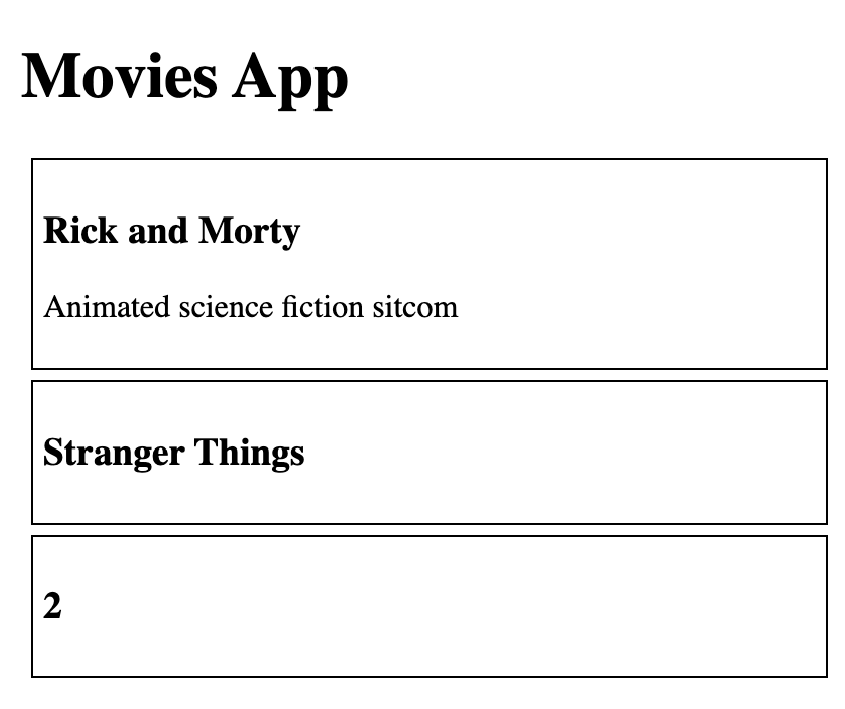
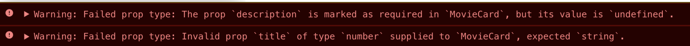

[⬅️ Advanced Styling](../styling/advanced-styling.md)  
[Advanced Type Checking ➡️](advanced-type-checking.md)

[Back to Contents 📑](../../../README.md#module-2)

# Prop Types

## What are PropsTypes?

PropTypes are simply a mechanism that ensures that the passed value is of the correct datatype. This makes sure that we don’t receive an error at the very end of our app by the console which might not be easy to deal with.

Let's check how it works. Here we forget to pass all necessary props, like description, and pass number instead of string for title. How we can fix it?

```jsx
const MovieCard = ({ title, description }) => (
  <div>
    <h1>{title}</h1>
    <p>{description}</p>
  </div>;
);

const App = () => (
  <div>
    <MovieCard title="Rick and Morty" description="Animated science fiction sitcom" />
    <MovieCard title="Stranger Things" />
    <MovieCard title={2} />
  </div>;
);
```



We can fix it with Prop Types.

```http request
npm install --save prop-types
```

:::tip
DO NOT INSTALL `prop-types` in your home task application. All necessary packages are already installed in the template.
:::

We can apply Prop Types to our component.

```jsx
import React from 'react';
import PropTypes from 'prop-types';

const MovieCard = ({ title, description }) => (
  <div>
    <h1>{title}</h1>
    <p>{description}</p>
  </div>;
);

MovieCard.propTypes = {
  title: PropTypes.string.isRequired,
  description: PropTypes.string.isRequired
}

const App = () => (
  <div>
    <MovieCard title="Rick and Morty" description="Animated science fiction sitcom" />
    <MovieCard title="Stranger Things" />
    <MovieCard title={2} />
  </div>;
);
```

We defined that our prop `title` is string and required, and our `description` is required and string as well.
It can be number or boolean, we have a lot of options.
Once we have this `propTypes`, we see the errors on our console.



Let's see an example. We run the application, we use MovieCard somewhere in the application and we end up seeing a warning in our console. If we read through the warning it says - somewhere in the application (and shows you an approximate location), we expect that the description is required but we didn't receive it, also title is supposed to be a string but for some reason, we get a number. So, it helps you to spot problems faster in the development stage.

## PropTypes pros and cons

### Pros

1. Tiny library to type-check your app;
2. Helps with understanding issues at the early stage;
3. Checks JS types, React elements, required props etc;
4. Might be used as documentation tool.

### Cons
1. Will not help in production mode debug;
2. TypeScript provides more features.

## PropTypes validation variations

```js

MyComponent.propTypes = {
  // You can declare that a prop is a specific JS primitive. By default, these
  // are all optional.
  optionalArray: PropTypes.array,
  optionalBigInt: PropTypes.bigint,
  optionalBool: PropTypes.bool,
  optionalFunc: PropTypes.func,
  optionalNumber: PropTypes.number,
  optionalObject: PropTypes.object,
  optionalString: PropTypes.string,
  optionalSymbol: PropTypes.symbol,

  // Anything that can be rendered: numbers, strings, elements or an array
  // (or fragment) containing these types.
  // see https://reactjs.org/docs/rendering-elements.html for more info
  optionalNode: PropTypes.node,

  // A React element (ie. <MyComponent />).
  optionalElement: PropTypes.element,

  // A React element type (eg. MyComponent).
  // a function, string, or "element-like" object (eg. React.Fragment, Suspense, etc.)
  // see https://github.com/facebook/react/blob/HEAD/packages/shared/isValidElementType.js
  optionalElementType: PropTypes.elementType,

  // You can also declare that a prop is an instance of a class. This uses
  // JS's instanceof operator.
  optionalMessage: PropTypes.instanceOf(Message),

  // You can ensure that your prop is limited to specific values by treating
  // it as an enum.
  optionalEnum: PropTypes.oneOf(['News', 'Photos']),

  // An object that could be one of many types
  optionalUnion: PropTypes.oneOfType([
    PropTypes.string,
    PropTypes.number,
    PropTypes.instanceOf(Message)
  ]),

  // An array of a certain type
  optionalArrayOf: PropTypes.arrayOf(PropTypes.number),

  // An object with property values of a certain type
  optionalObjectOf: PropTypes.objectOf(PropTypes.number),

  // You can chain any of the above with `isRequired` to make sure a warning
  // is shown if the prop isn't provided.

  // An object taking on a particular shape
  optionalObjectWithShape: PropTypes.shape({
    optionalProperty: PropTypes.string,
    requiredProperty: PropTypes.number.isRequired
  }),

  // An object with warnings on extra properties
  optionalObjectWithStrictShape: PropTypes.exact({
    optionalProperty: PropTypes.string,
    requiredProperty: PropTypes.number.isRequired
  }),

  requiredFunc: PropTypes.func.isRequired,

  // A value of any data type
  requiredAny: PropTypes.any.isRequired,

  // You can also specify a custom validator. It should return an Error
  // object if the validation fails. Don't `console.warn` or throw, as this
  // won't work inside `oneOfType`.
  customProp: function(props, propName, componentName) {
    if (!/matchme/.test(props[propName])) {
      return new Error(
        'Invalid prop `' + propName + '` supplied to' +
        ' `' + componentName + '`. Validation failed.'
      );
    }
  },

  // You can also supply a custom validator to `arrayOf` and `objectOf`.
  // It should return an Error object if the validation fails. The validator
  // will be called for each key in the array or object. The first two
  // arguments of the validator are the array or object itself, and the
  // current item's key.
  customArrayProp: PropTypes.arrayOf(function(propValue, key, componentName, location, propFullName) {
    if (!/matchme/.test(propValue[key])) {
      return new Error(
        'Invalid prop `' + propFullName + '` supplied to' +
        ' `' + componentName + '`. Validation failed.'
      );
    }
  })
};
```
