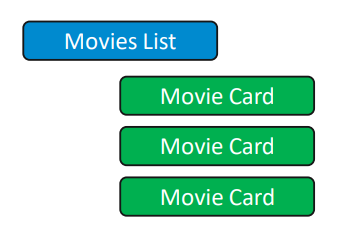
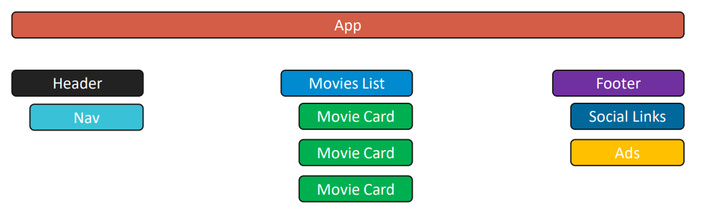
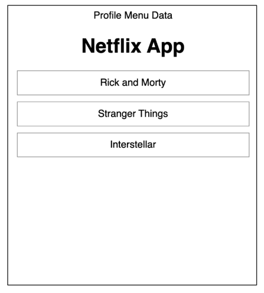
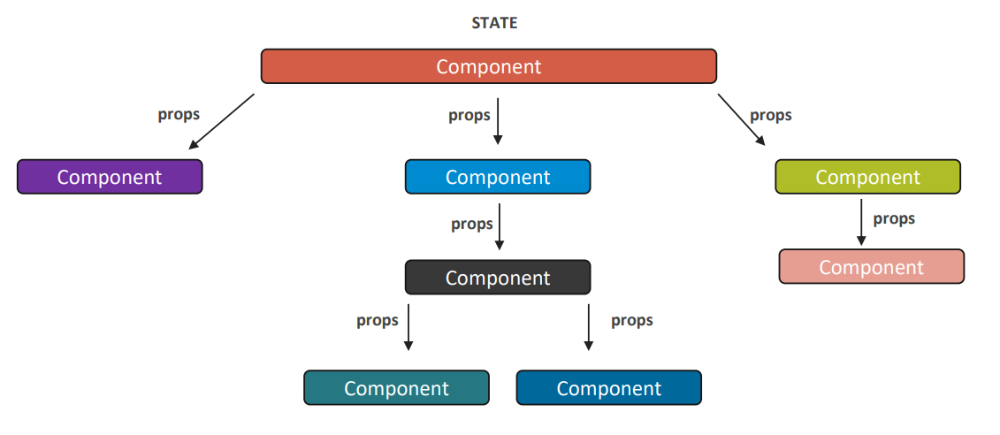
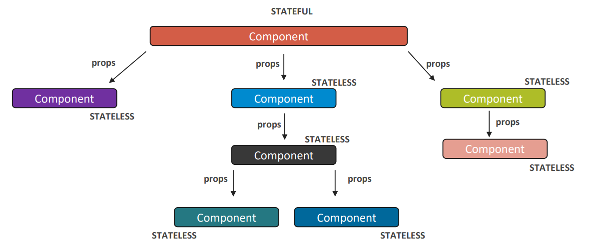

[⬅️ Advanced Type Checking](type-checking/advanced-type-checking.md)  
[Code Splitting ➡️](code-splitting.md)

[Back to Contents 📑](../../README.md#module-3-4)

# State

## What is State?

State of a component is a data that holds some information that may change over the lifetime of the component. We should always try to make our state as simple as possible and minimize the number of stateful components.

Imagine we have a movie list that contains movie cards. Each movie card has some data.



A typical way of designing an application like this is to define `MovieList` component which needs to render some number of movie cards, and each movie card is a repeated component. `MovieList` is just a functional component that returns a list of `MovieCards`.

```jsx
import React from "react";

const movies = [
  { title: "Rick and Morty", description: "Animated science fiction sitcom", id: "uniqueId1" },
  { title: "Stranger Things", description: "American science fiction series", id: "uniqueId2" },
  { title: "Interstellar", description: "Epic science fiction movie", id: "uniqueId3" },
];

const MoviesList = () => movies.map((movie) => 
  <MovieCard title={movie.title} description={movie.description} key={movie.id} />);
```

As you can see we store the movie data just as a plain array inside our component. This is not a good way to do that.

Since the component stays on the page for some time why not just have this component store something during the lifetime and use it?

Let's imagine we have an app structure like shown in the image below.



So, we can define state as an object that holds movies. Movies are just an array of objects that we can change over the time.
We will use React hook `useState` to define state.

```jsx
import React, { useState } from "react";

const moviesMock = [
  { title: "Rick and Morty", description: "Animated science fiction sitcom", id: "uniqueId1" },
  { title: "Stranger Things", description: "American science fiction series", id: "uniqueId2" },
  { title: "Interstellar", description: "Epic science fiction movie", id: "uniqueId3" },
];

const App = () => {
  const [movies, setMovies] = useState(moviesMock);
  const [title, setTitle] = useState("Netflix app");

  const addMovie = (newMovie) => {
    setMovies([...movies, newMovie]);
  };

  return (
    <>
      <Header title={title} />
      <MoviesList movies={movies} addMovie={addMovie} />
    </>
  );
};
```



We end up with the whole bunch of components that have their local states, and they pass some parts of their state to child components.



We are going to the idea of clearly dividing components in our app into stateful and stateless (they are also known as Container and Presentational components, Smart and Dumb components).
The general principle of how we divide them is based on data. Whether the component stores it (stateful) or not (stateless). Stateless (same as stateful) components can be defined as class or functional components. Stateful component is managing data and passing it through props to child components. Stateless components are responsible for rendering that data.



The typical rules of dividing components into stateful/stateless are the following:

| Stateful Components             | Stateless Components                |
| ------------------------------- | ----------------------------------- |
| Knows how everything works      | Knows how to display received data  |
| Containers for other components | Receive and operate only with props |
| Provide application data        |                                     |
| Perform data fetching           |                                     |

Let's see an example. App class component stores all data that we use to render our app (movies array and app information). It decides which component receives what data. So, in this case, `App` component is stateful (smart) component. `Header` and `MoviesList` are stateless (dummy/presentational) components.

Using this approach, your application in the end follows a nice division. Where `App` class component stores all application state and other components are written as stateless functional components which only receive props and handle the way they are displayed to the user. With this approach, we can reuse stateless components.

```jsx
import React, { useState } from "react";

const moviesMock = [
  { title: "Rick and Morty", description: "Animated science fiction sitcom", id: "uniqueId1" },
  { title: "Stranger Things", description: "American science fiction series", id: "uniqueId2" },
  { title: "Interstellar", description: "Epic science fiction movie", id: "uniqueId3" },
];

const Header = ({ title }) => <h1>{title}</h1>;

const MovieCard = ({ title, description }) => (
  <>
    <h3>{title}</h3>
    <p>{description}</p>
  </>
);

const MoviesList = ({ movies, addMovie }) => (
  <>
    {movies.map((movie) => (
      <MovieCard title={movie.title} description={movie.description} key={movie.id} />
    ))}

    <button onClick={() => addMovie({ title: "New movie", description: "New description" })}>Add movie</button>
  </>
);

const App = () => {
  const [movies, setMovies] = useState(moviesMock);
  const [title, setTitle] = useState("Netflix app");

  const addMovie = (newMovie) => {
    setMovies([...movies, newMovie]);
  };

  return (
    <>
      <Header title={title} />
      <MoviesList movies={movies} addMovie={addMovie} />
    </>
  );
};
```

## State vs Props

In React, a component should never change its own props directly. A parent component should change them. State, on the other hand, is the opposite of props: a component keeps track of its own state and can change it at any time.

This table will help you to distinguish props and state.

|                                              | props | state |
| -------------------------------------------- | ----- | ----- |
| Can get initial value from parent component? | Yes   | Yes   |
| Can be changed by parent component?          | Yes   | No    |
| Can set default values inside component?     | Yes   | Yes   |
| Can change inside component?                 | No    | Yes   |
| Can set initial value for child components?  | Yes   | Yes   |

## Benefits of State

- Application become more understandable
- Reduce complexity
- Stateless Components become reusable
- A lot of simple components
