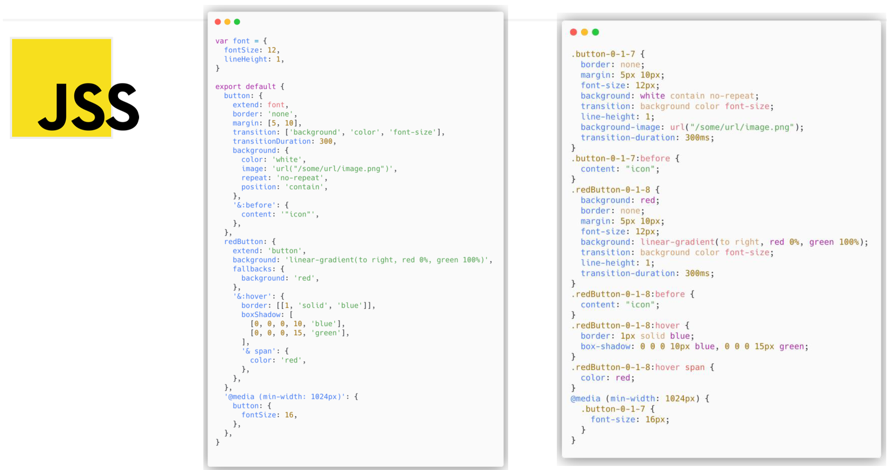
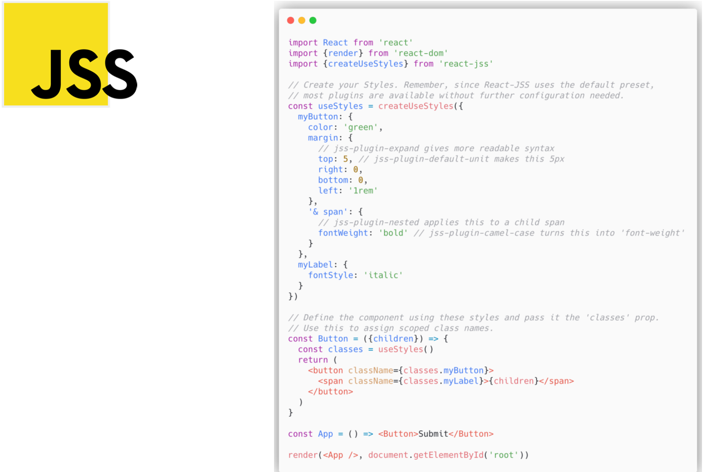
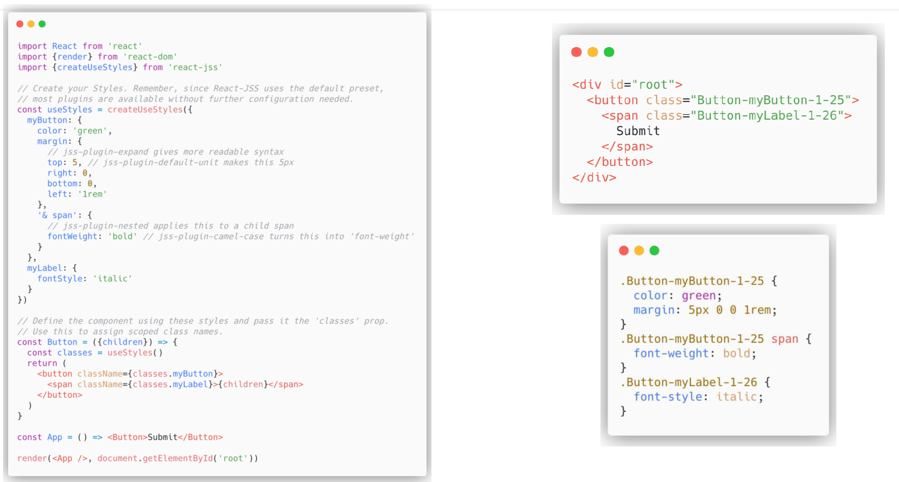
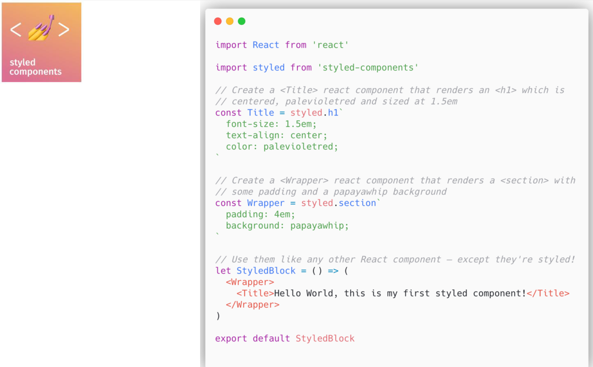
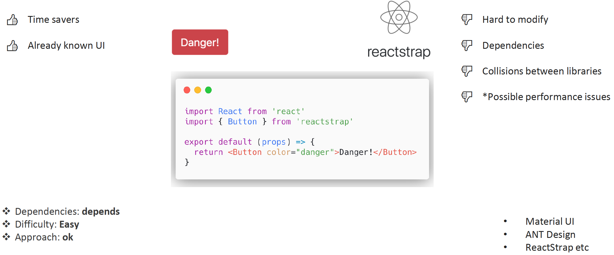

[⬅️ Styling](styling.md)
[Type Checking ➡️](../type-checking/prop-types.md)

[Back to Contents 📑](../../README.md#module-3-4)

# Advanced Styling

Once we have React, we have these possibilities that open source driven development provides us.
We have all options for us via some libraries by some packages, via job done by web community around the world.
It is like the next step in styling of your application.
Let's have a look at these options.

## CSS in JS (JSS)

The first one is CSS in JS or JSS.
Why just not use JSX in terms of markups styles and JS.
Let's consider styles and view CSS as a JavaScript object.
Then, we can use Babel to transform all JavaScript styles into JSS and subsequently into CSS.

Imagine we have this simple component.
One thing it shows is submit button.
`Button` is a regular functional component, and it returns `<button>` and `` inside this `<button>`, and we have some styles, JSS styles in upper part of the image.
As you can see there are a lot of lines of the code, quiet a lot of symbols to write, and things to understand.

Actually, all this JS, JSX code will be transformed through this simple markup, and through this simple styles. Have a look here:

We have very unique classes.
This is the one of the biggest options that CSS plugins provide for us.
We are completely sure that we won't have any name collisions.
But actually we have more.

**CSS in JS provides us many benefits:**

- Real CSS.
- JSS generates actual CSS, not inline styles.
  It supports every existing CSS feature.
  CSS rules are created once and reused across the elements using its class name in contrary to Inline Styles.
  Also, when DOM elements get updated, previously created CSS rules are applied.
- Code reuse.
- Collision-free selectors.
- Critical CSS.
- Plugins.
- JSS generates unique class names by default.
  It allows avoiding the typical CSS problem, where everything is global by default.
  It completely removes the need for naming conventions.
- Using JavaScript as a host language gives us an opportunity to reuse CSS rules in a way that is not possible with regular CSS.
  You can leverage JavaScript modules, variables, functions, math operations and more. If done right, it can still be fully declarative.
- Ease of removal and modification.
- Explicit usage of CSS rules allows you to track them down to the consumer and decide if it can be safely removed or modified.
- Dynamic styles.
- Using JavaScript functions and Observables makes it possible to dynamically generate styles in the browser, giving you an opportunity to access your application state, browser APIs or remote data for styling.
  You can not only define styles once but also update them at any point in time in an efficient way.
- User-controlled animations.
- JSS handles CSS updates so efficiently that you can create complex animations with it.
  Using function values, Observables and combining them with CSS
  transitions will give you maximum performance for user-controlled animations.
  For predefined animations, it is still better to use `@keyframes` and transitions, because they will unblock the JavaScript thread completely.
- To optimize time to first paint, you can use server-side rendering and extract critical CSS.
  You can couple the rendering of CSS with the rendering of HTML so that no unused CSS gets generated.
  It will result in a minimal critical CSS extracted during server-side rendering and allow you to inline it.
- JSS core implements a plugin-based architecture.
  It allows you to create custom plugins which can implement custom syntax or other powerful abilities.
  JSS has many official plugins, which can be installed individually or using a default preset.
  A good example of a community plugin is `jss-rtl`.
- Expressive syntax.
- Thanks to various plugins, JSS allows you to have nesting, global selectors, composition with existing global class names.
  E.g. jss-plugin-expand allows you to express properties like boxshadow even in a more readable way than it is possible with CSS.
  You can also use template strings if you want to copy-paste styles directly from the browser dev tools.
- Full isolation.
- Another useful plugin example is `jss-plugin-isolate`, which allows you to isolate your elements from global cascading rules fully and potentially overwriting unwanted properties.
  Especially useful when creating a widget that is supposed to render inside of a third-party document.

**The React-JSS package provides some additional features:**

- Dynamic Theming - allows context based theme propagation and runtime updates.
- Critical CSS extraction - only CSS from rendered components gets extracted.
- Lazy evaluation - Style Sheets get created when a component gets mounted.
- The static part of a Style Sheet gets shared between all elements.
- Function values and rules are updated automatically with props as an argument.

**And actually we have some cons as well:**

- Overkill for small apps
- Dependencies
- Vendor lock in
- Issues with hooks support
- Issues with TypeScript support

## Styled Components

As you can see, here we have a first component `Title`, which is actually a styles component.
And we have an additional component `Wrapper` that renders sections with some padding, and background.
We can combine them.
As you can see, this option is really nice, and actually here we some mixture of styles, markup, JS, JSX.

**Styled Components provides us some benefits:**

- Automatic critical CSS: styled-components keeps track of which components are rendered on a page and injects their styles and
  nothing else, fully automatically.
  Combined with code splitting, this means your users load the least amount of code necessary.
- No class name bugs: styled-components generates unique class names for your styles.
  You never have to worry about duplication, overlap or misspellings.
- Easier deletion of CSS: it can be hard to know whether a class name is used somewhere in your codebase.
  Styled-components makes it obvious, as every bit of styling is tied to a specific component.
  If the component is unused (which tooling can detect) and gets deleted, all its styles get deleted with it.
- Simple dynamic styling: adapting the styling of a component based on its props or a global theme is simple and intuitive without having to manually manage dozens of classes.
- Painless maintenance: you never have to hunt across different files to find the styling affecting your component, so maintenance is a piece of cake no matter how big your codebase is.
- Automatic vendor prefixing: write your CSS to the current standard and let styled-components handle the rest.
  You get all of these benefits while still writing the CSS you know and love, just bound to individual components.

Styled Components approach has better ecosystem than JSS.

Ecosystem:

- Components.
- Grid Systems.
- Helpers.
- Testing.
- Boilerplates.
- Real Apps (Patreon, Vimeo, Target, InVision, Vogue, etc. ).

Also, they completely are OK with TypeScript.

**And some bad parts:**

- Overkill for small apps
- Dependencies
- Styles and JS are mixed
- Vendor lock in
- Performance issues.
  But the latest version of Styled Component is claimed to be extremely performed.

## React Component Libraries

When you don't have enough time, and you want just some buttons, some already familiar design, you might use this React Component Libraries.
There are really tons of them, like Material UI, ANT Design, ReactStrap...
Make sure that they have quite a number of dependencies.
The general approach is easy enough.

But there are actually some **downsides** here. Once you have all these predefined component libraries, they are hard to modify, have many dependencies, they might have some collisions between libraries, and some of them have performance issues (like ANT Design).
