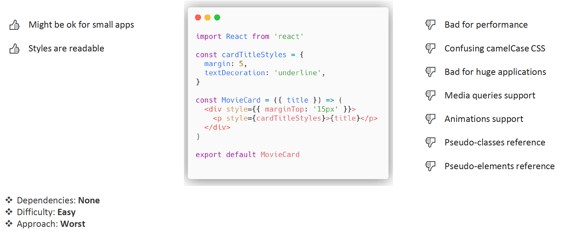
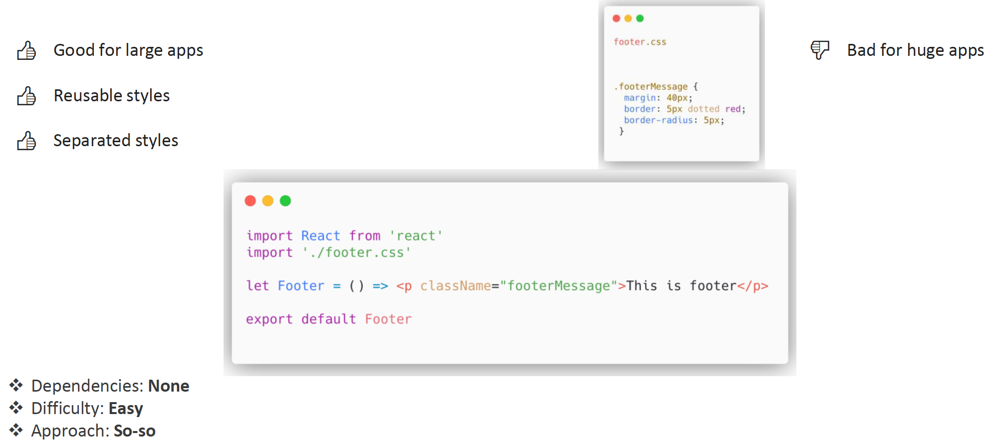
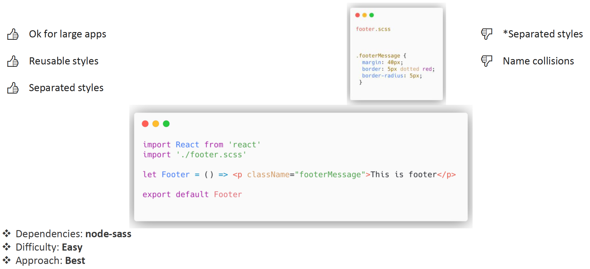
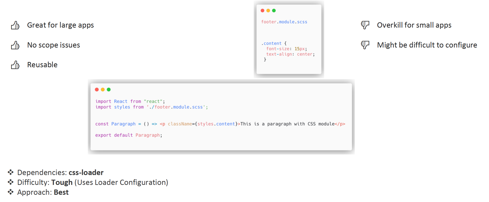
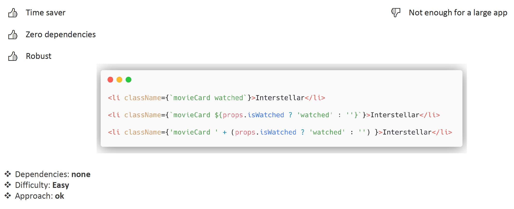

[Advanced Styling ➡️](advanced-styling.md)

[Back to Contents 📑](../../../README.md#module-2)

# Styling

How can we style our components?
Let's go deeper here.
Before we start, there are a few things to consider before styling your application.

## Things to consider

**Global name spacing**.
Make sure that your classes, your IDs, your styles won't overcome, won't remove any styles, won't have any collisions with other styles.
Keep a track on your dependencies.

**Dependencies**.
React is a lightweight framework, and it really needs additional libraries and packages, and once you add more and more dependencies to your project, it becomes slow and have to be rechecked.

**Reusability**.
Just make sure that you can reuse styles, and you can scale an application, and styles as well.

**Dead-code Elimination**.
You don't want to have some styles that are not used anymore.

Just make sure all these things you have to consider before getting started with the style of your application.

So let's move on and think which option will be the best for your application.

## Inline Styles



The first option is regular styling via inline styles.
It might be OK for small applications.
Styles are readable, as you can see, all of them are in line, we have some camel cases, we have zero dependencies.
Difficulty of this approach is really easy.
But in general, this approach is considered to be the worst.
Why?
Because it is really bad for performance.
Also, some developers won't like to have their code to this confusing camel case CSS.
And it is extremely bad for huge application.
And you won't be able to use media queries, animations, pseudo classes and pseudo elements.

## Regular CSS



Another option is Regular CSS, when you have css styles in one file, and the component in the another file.
That's quite OK for large application.
As you can see here, we have reusable styles, and we can separate files as well.
We have zero dependencies here.
It is really easy to use.
But it won't really work for huge applications.
Just make sure to think carefully while using this approach.

## Sass / SCSS



Sass or SCSS.
It is quite OK for large applications.
Here we have reusable styles, we have separated styles, we have one dependency node-sass.
In general, we might have some name collisions, and we might have separated styles.
Some developers like it, some not, but still in terms of general approach, it is one of the best approaches.

## CSS Modules



Probably, this option is better than the previous one.
It is extremely great for large applications.
Here we have no scope issues, files are completely reusable, they will be absolutely unique, we have some dependencies.
In terms of difficulty, to set up this project with CSS modules, you have to set up webpack, and other plugins.
But it's really worth it.
It is considered probably the best approach.
But make sure you set up this correctly.
Of course, for small apps it is just overkill. And some developers don't like to configure the application for CSS modules.
Make sure this approach won't have any scope issues for your classes.

## Styling with Template literals (Template strings)



You might not need any additional tooling for your styles, just basic styling with template literals and template strings with class names will do their job.
It's really time saving option.
Zero dependencies, easy to set up, quiet a robust solution.
Although, not enough for large application.

## Styling with CLSX library

A tiny utility for constructing className strings conditionally.

```http request
npm install --save clsx
```

:::tip
DO NOT INSTALL `clsx` in your home task application. All necessary packages are already installed in the template.
:::

Some usage examples:

```js
import clsx from 'clsx';

// Strings
clsx('foo', true && 'bar', 'baz'); //=> 'foo bar baz'

// Objects
clsx({ foo: true, bar: false, baz:isTrue() }); //=> 'foo baz'
clsx({ foo: true }, { bar: false }, null, { '--foobar':'hello' }); //=> 'foo --foobar'

// Arrays
clsx(['foo', 0, false, 'bar']); //=> 'foo bar'
clsx(['foo'], ['', 0, false, 'bar'], [['baz', [['hello'], 'there']]]); //=> 'foo bar baz hello there'

// classNames hell
clsx('foo', [1 && 'bar', { baz: false, bat: null }, ['hello', ['world']]], 'name'); //=> 'foo bar hello world name'
```
