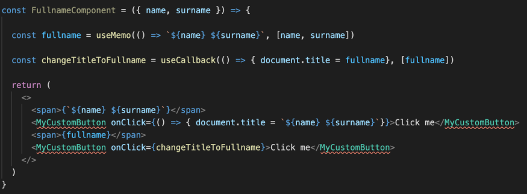
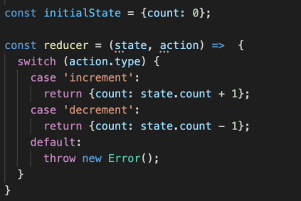
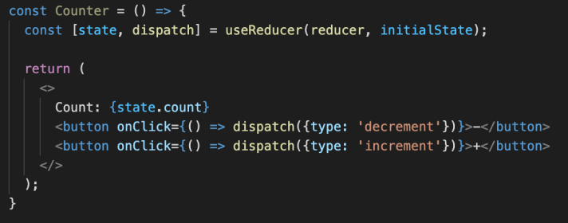

[⬅️ Basic Approach](basic-approach.md)  
[Performance Optimization ➡️](performance-optimization.md)

[Back to Contents 📑](../../README.md#module-5)

# Built-in Hooks

**Basic Hooks:**

- useState
- useEffect
- useContext

**Additional Hooks:**

- useReducer
- useCallback
- useMemo
- useRef
- useImperativeHandle
- useLayoutEffect
- useDebugValue

## useState


#### 🧠 `useState` – Managing Local Component State

The `useState` hook lets you **add local state** to functional components in React. It provides a **stateful value** and a **function to update it**, preserving the state across re-renders.


### 🔧 Syntax

```jsx
const [state, setState] = useState(initialValue);
```

* **`state`** – the current value of the state.
* **`setState`** – a function used to update the state.
* **`initialValue`** – the default value for the state on first render.


### 📘 Example 1: Basic Counter

```jsx
import { useState } from 'react';

function Counter() {
  const [count, setCount] = useState(0);

  return (
    <>
      <p>Count: {count}</p>
      <button onClick={() => setCount(count + 1)}>Increment</button>
    </>
  );
}
```


#### ⚙️ Important Notes

1. State Updates Are Asynchronous

When you call `setState`, the component **does not update immediately**. Instead, React **schedules a re-render**, and the new state will be available on the next render.

```jsx
setCount(count + 1);
console.log(count); // This still logs the old value
```


2. Functional Updates for Correctness

If the new state depends on the **previous state**, use a function instead:

```jsx
setCount(prevCount => prevCount + 1);
```

This ensures correct behavior even if multiple updates are queued.


### 📘 Example 2: Toggling State

```jsx
const [isVisible, setIsVisible] = useState(true);

const toggleVisibility = () => {
  setIsVisible(prev => !prev);
};
```


#### 💡 Initial State Can Be a Function

If calculating the initial value is expensive, pass a function to `useState` to run it only once:

```jsx
const [value, setValue] = useState(() => computeInitialValue());
```


### ✅ Best Practices

* Keep state as simple as possible (use objects or arrays only when needed).
* Use separate state hooks for unrelated state variables.
* Avoid modifying state directly (e.g., do not mutate arrays or objects in-place).
* Use functional updates when relying on previous state.


### ❌ Avoid Direct Mutation

```jsx
// Don't do this:
user.name = 'Alex';
setUser(user); // This won't trigger a re-render

// Do this instead:
setUser(prev => ({ ...prev, name: 'Alex' }));
```


### ✅ Summary

* `useState` allows functional components to hold and update state.
* Returns an array: `[currentValue, updateFunction]`
* State updates are asynchronous and trigger re-renders.
* Use functional updates when depending on previous values.

---


## useEffect


#### `useEffect` – Managing Side Effects in React

The `useEffect` hook lets you perform **side effects** in functional components. It runs after the DOM is updated and is commonly used for:

* Fetching data
* Setting up subscriptions
* Managing timers
* Logging or analytics


### 🔧 Syntax

```jsx
useEffect(callback, dependencies);
```


### 📘 Examples
#### Example 1: `useEffect` Without Dependencies – Runs After Every Render

```jsx
import { useEffect } from 'react';

function App() {
  useEffect(() => {
    console.log('Effect runs after every render');
  });

  return <h1>Hello</h1>;
}
```


#### 📘 Example 2: `useEffect` With Empty Dependencies – Runs Once on Mount

```jsx
import { useEffect } from 'react';

function App() {
  useEffect(() => {
    console.log('Effect runs once after initial render');
  }, []);

  return <h1>Hello</h1>;
}
```


#### 📘 Example 3: `useEffect` With Dependencies – Reacts to Changes

```jsx
import { useEffect, useState } from 'react';

function Counter({ step }) {
  const [count, setCount] = useState(0);

  useEffect(() => {
    console.log(`Effect runs when count or step changes: ${count}, ${step}`);
  }, [count, step]);

  return <button onClick={() => setCount(count + step)}>Increment</button>;
}
```


#### 📘 Example 4: Data Fetching With `useEffect`

One of the most common use cases for `useEffect` is to **fetch data from an API** when the component mounts.

```jsx
import { useEffect, useState } from 'react';

function UsersList() {
  const [users, setUsers] = useState([]);
  const [loading, setLoading] = useState(true);

  useEffect(() => {
    const fetchData = async () => {
      try {
        await fetch(
          'https://jsonplaceholder.typicode.com/users'
        )
          .then((response) => response.json())
          .then((data) => setUsers(response));
      } catch (error) {
        console.error('Error fetching users:', error);
      } finally {
        setLoading(false);
      }
    };

    fetchData();
  }, []); // Empty array = fetch only on mount

  if (loading) {
    return <p>Loading users...</p>;
  }

  return (
    <ul>
      {users.map((user) => (
        <li key={user.id}>{user.name}</li>
      ))}
    </ul>
  );
}
```

#### ✅ Key Notes:

* The `fetch` call happens **only once** after the initial render, because the dependency array is empty.
* The `loading` state is used to show a loading message while data is being fetched.
* Always handle errors when using `fetch`.


#### 📘 Example 5: Cleanup Function

```jsx
useEffect(() => {
  const id = setInterval(() => {
    console.log('Tick...');
  }, 1000);

  return () => {
    clearInterval(id); // Cleanup on unmount
  };
}, []);
```

This simulates `componentWillUnmount` by cleaning up the interval when the component is destroyed.


### ✅ Summary

* `useEffect` runs after render and handles side effects.
* The **dependencies array** controls when it re-runs.
* Return a **cleanup function** to clear timers, subscriptions, etc.
* Great for fetching data, listening to events, or managing timers.

---


## useContext

#### `useContext` – Accessing Context in Functional Components

React's Context API provides a way to pass data through the component tree without having to manually pass props down at every level. The `useContext` hook is the idiomatic way to consume context values in **functional components**.

#### ✅ What `useContext` Does

The `useContext` hook allows a component to **read the current value of a context**.
It takes a **context object** (the one returned from `React.createContext`) as an argument and returns the **current context value**.

```jsx
const value = useContext(MyContext);
```

This value is determined by the closest `<MyContext.Provider>` wrapping the component.

:::note
`useContext` **only gives you access to the value** — it doesn’t give you any setter or update function unless the context itself provides one.
:::


### 🧩 Example: Theme Context

Let's look at a common example — a theme toggle.

#### 1. Creating the Context

```jsx
import { createContext } from 'react';

const ThemeContext = createContext('light'); // default value
```

#### 2. Providing Context Value

```jsx
import { useState } from 'react';

function App() {
  const [theme, setTheme] = useState('light');

  return (
    <ThemeContext.Provider value={theme}>
      <Toolbar />
    </ThemeContext.Provider>
  );
}
```

#### 3. Consuming with `useContext`

```jsx
import { useContext } from 'react';

function Toolbar() {
  const theme = useContext(ThemeContext);

  return (
    <div className={`toolbar ${theme}`}>
      Current theme: {theme}
    </div>
  );
}
```


### 🔁 Rerenders and Performance

When the **context value changes**, all components that use `useContext` **will rerender**, regardless of whether their props or state have changed.
Even using `React.memo()` **won’t prevent** a rerender if the context value has changed.

```jsx
const MemoizedComponent = React.memo(function MyComponent() {
  const theme = useContext(ThemeContext);
  // This component will still rerender when `theme` changes
});
```

> ⚠️ Be cautious when storing frequently-changing values (like object instances or complex state) in context — it can cause excessive rerenders.


### 🛠 Tips for Efficient Context Usage

* **Split contexts**: If you have multiple independent pieces of state, create separate contexts for each to avoid unnecessary rerenders.
* **Use memoized values**: When passing objects/functions as context values, memoize them using `useMemo` or `useCallback`.
* **Avoid deeply nested consumers** when possible — keep components close to their provider for better performance and clarity.


### 💡 Bonus: Context with Setter

To allow updates from child components, include the setter in the context value:

```jsx
const ThemeContext = createContext({
  theme: 'light',
  setTheme: () => {},
});

// Provider
function App() {
  const [theme, setTheme] = useState('light');
  const contextValue = { theme, setTheme };

  return (
    <ThemeContext.Provider value={contextValue}>
      <Toolbar />
    </ThemeContext.Provider>
  );
}

// Consumer
function ThemeToggle() {
  const { theme, setTheme } = useContext(ThemeContext);

  return (
    <button onClick={() => setTheme(theme === 'light' ? 'dark' : 'light')}>
      Switch Theme
    </button>
  );
}
```


### ✅ Summary

* `useContext(Context)` gives you access to the current context value.
* It triggers rerenders when the context value changes — **even inside memoized components**.
* Use it for sharing global data like theme, user info, locale, etc.
* Always structure your context to minimize unnecessary updates for performance.

---


## useRef


### 🎯 `useRef` – Working with Mutable References in React

The `useRef` hook is used in React to create a **mutable reference** that **persists across component renders** but **does not trigger a rerender** when updated.

There are **two common use cases** for `useRef`:

1. **Accessing a DOM element directly**
2. **Storing mutable values** that don’t require triggering a component update


### 🔧 Syntax

```jsx
const myRef = useRef(initialValue);
```

* `initialValue` – the value you want the `.current` property to be initialized with
* The `useRef` hook returns a **ref object**: `{ current: ... }`


### 🧪 Example 1: Referencing a DOM Element

The most common case is accessing DOM nodes directly, similar to how you'd use `document.querySelector`.

```jsx
import { useRef } from 'react';

function InputFocus() {
  const inputRef = useRef(null);

  const handleClick = () => {
    inputRef.current.focus(); // Access the DOM node and focus it
  };

  return (
    <>
      <input ref={inputRef} type="text" placeholder="Click the button to focus me" />
      <button onClick={handleClick}>Focus Input</button>
    </>
  );
}
```

:::tip
📌 Best practice: always initialize the ref with `null` when referring to a DOM element.  
```tsx
const inputRef = useRef<HTMLInputElement | null>(null);
```

<details>
  <summary>Why?</summary>

#### 1. 🧼 It reflects the actual lifecycle behavior

React assigns the DOM element to `.current` **after the render phase**, specifically after the DOM is mounted. Before that point, there’s **no element** yet — so `null` is the correct initial value.


#### 2. 🔒 Prevents accessing `.current` too early

Initializing with `null` makes it clear to readers and TypeScript/linters that the element **might not exist yet**:

```tsx
if (inputRef.current) {
  inputRef.current.focus(); // Safe access
}
```

You are forced to **null-check** before using the ref, which avoids runtime errors like:

> `TypeError: Cannot read properties of null`


#### 3. 🤝 Works well with TypeScript

When using TypeScript, explicitly initializing with `null` makes the type inference predictable and correct:

```tsx
const buttonRef = useRef<HTMLButtonElement | null>(null);
```

This ensures you handle the case where the DOM element doesn’t exist (e.g., on first render or after unmount).


#### 4. 🔧 React may reset `.current` to `null` on unmount

Even if you initialized your ref with something else (like an empty object), React **will set `.current = null`** on unmount. Starting with `null` from the beginning aligns with this behavior and avoids confusion.


#### ❌ Anti-pattern: initializing with an object

```tsx
// Not recommended
const inputRef = useRef({});
```

This hides the fact that `.current` will be a DOM element (or `null`), and can cause errors if accessed incorrectly. It also breaks type safety in TypeScript.


#### ✅ Summary

**Initialize with `null`** when referencing DOM elements using `useRef` because:

* It accurately represents the pre-render state
* It prevents errors from early access
* It works properly with TypeScript
* It follows the lifecycle and unmount behavior of React


</details>
:::


### 🧪 Example 2: Storing a Mutable Value

You can use `useRef` as an **instance-like variable** to store data across renders **without causing rerenders**.

```jsx
function Timer() {
  const renderCount = useRef(0);
  renderCount.current++;

  return <p>Render count: {renderCount.current}</p>;
}
```

Even though `renderCount.current` is incremented, it does **not trigger a rerender** because `useRef` updates do **not cause state changes**.


### ⚙️ Characteristics of `useRef`

| Feature                     | Behavior                                          |
| --------------------------- | ------------------------------------------------- |
| Persists across renders     | ✅ Yes                                             |
| Triggers component rerender | ❌ No                                              |
| Can hold DOM elements       | ✅ Yes                                             |
| Can hold any mutable value  | ✅ Yes                                             |
| Should be initialized with  | `null`, primitive, or object depending on the use |


### 📌 Important Notes

* Avoid reading or writing `.current` during render if it affects visual output — it won’t trigger an update.
* For reactive data, use `useState`. Use `useRef` when you **don’t need reactivity**.
* `useRef` is ideal for:

  * Storing timers (`setTimeout` / `setInterval`)
  * Tracking previous values
  * Managing animations
  * Keeping references between renders


### 🧪 Example 3: Tracking Previous Props or State

```jsx
import { useRef, useEffect } from 'react';

function PreviousValue({ value }) {
  const prevValue = useRef();

  useEffect(() => {
    prevValue.current = value;
  }, [value]);

  return (
    <div>
      Current: {value}, Previous: {prevValue.current}
    </div>
  );
}
```

---

### ✅ Summary

* `useRef` gives you access to **a mutable value** that doesn’t cause rerenders.
* Useful for:

  * **DOM references**
  * **Storing values between renders**
  * **Tracking previous state or props**
* Avoid using it as a replacement for `useState` unless you specifically don’t want rerenders.
* Always initialize your ref with a default value like `null` or an initial object/value.

---

## useCallback, useMemo

Both represent a possibility to create memoized values of some internally used values (useMemo) and callbacks (useCallback).

`useCallback` could be implemented via useMemo, so it’s basically a shortcut. In most cases used for passing callbacks as props to underlying components in order to prevent them from unnecessary re-rendering all the time.

`useMemo` is typically used to avoid unnecessary re-calculations on render phase.



## useReducer

Represents the possibility to deal with complex state management inside the component. Typically, should be avoided in favor of `useState`. One of the core benefits is the ability to run multiple setters during one rendering cycle.

MUST NOT be confused with Redux and other approaches created for a state management. Should be used only for updates on a component level.




[Read more about deference between `useState` and `useReducer`.](https://react.dev/learn/extracting-state-logic-into-a-reducer#comparing-usestate-and-usereducer)
