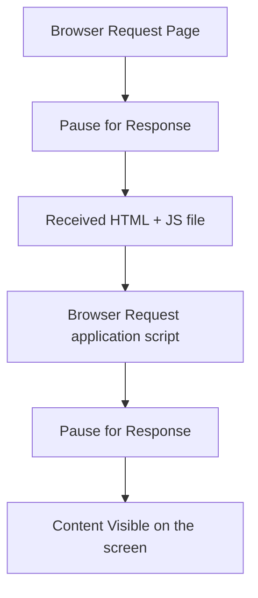
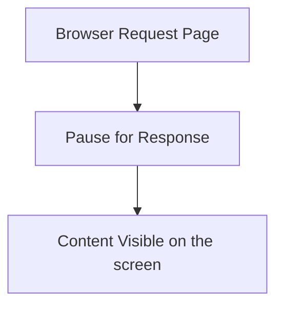

[⬅️ Built-in Hooks](built-in-hooks.md)  
[React Custom Hooks ➡️](custom-hooks.md)

[Back to Contents 📑](../../README.md#module-5)

# Performance Optimization

Now we will discuss several performance optimization techniques useful for React development. You will also learn some tips and

## Immutable data structures

remain fundamental to maintaining predictable state updates and ensuring React's efficient rendering mechanisms. 
React functional components, combined with hooks like useState and useReducer, benefit significantly from immutability as it 
enables precise state comparison during reconciliation (e.g., when React uses Object.is for comparison).

**Why immutability matters:**

*No Side Effects:*  
Immutable updates prevent unintended mutations, ensuring a cleaner and more predictable state management.  


*Simplified State Comparisons:*  
React efficiently determines whether to re-render a component by comparing references (===).


*Improved Debugging:*   
Changes in immutable data structures can be easily tracked over time.  


Example:

```javascript
const [users, setUsers] = useState([]);

const addNewUser = () => {
  setUsers((prevUsers) => [
    ...prevUsers,
    { userName: "robin", email: "robin@email.com" },
  ]);
};
```
Here, the users state is updated immutably by creating a new array with the spread operator.

:::tip
For immutable updates:

Arrays: Use `[...array]` or array.concat.  
Objects: Use `{ ...object }` or libraries like Immer
:::

## React.Memo

`React.memo` is a higher-order component that optimizes functional components by memoizing their output. 
It prevents unnecessary re-renders by performing a shallow comparison of props. 
If the props remain unchanged, React skips rendering the component.

Example:

```javascript
const UserProfile = React.memo(({ user }) => {
  console.log("Rendering UserProfile");
  
  return <div>{user.name}</div>;
});
```

In this example, `UserProfile` only re-renders if the user prop reference changes.

**When to Use React.memo**  
✅Pure Components: *Components that always render the same output for the same props are ideal candidates for React.memo.*


✅Frequent Re-renders: *Use React.memo to optimize components that are part of a frequently re-rendered subtree.*


**Limitations of React.memo**  
❎Shallow Comparison: **React.memo performs a shallow comparison of props. For nested objects or arrays, use 
libraries like Immer or immutable.js to simplify state updates and comparisons.*


❎Overhead: *Avoid overusing React.memo for components that already render infrequently, 
as the performance gain may be negligible or even detrimental due to the cost of memoization.*


**Custom Comparison with React.memo**   
You can provide a custom comparison function to React.memo for more granular control over re-renders:

```javascript
const UserProfile = React.memo(
  ({ user }) => {
    return <div>{user.name}</div>;
  },

  (prevProps, nextProps) => {
    return prevProps.user.id === nextProps.user.id;
  }
);
```
In this case, the component will only re-render if the `user.id` changes.

## React.Fragments
Use `React.Fragments` to Avoid Additional HTML Element Wrappers.  

The `React.Fragment` component lets you return multiple elements in a `render()` method without creating an additional DOM element:

```javascript
  return (
    <React.Fragment>
      Some text.
      <h2>A heading</h2>
    </React.Fragment>
  );
```

You can also use it with the shorthand <></> syntax:
```javascript
  return (
    <>
      Some text.
      <h2>A heading</h2>
    </>
  );
```

## Inline Function Definition
In React, defining functions directly inside the render method (or within JSX in functional components) **can lead 
to unnecessary performance costs**. Each time a component re-renders, a new instance of the inline function is created.   


This results in:

❗Prop Diff Failure: *Inline functions create new object references every time, causing React's shallow comparison 
(used in React.memo) to detect differences, even when the actual logic is unchanged.*  


❗Garbage Collection Overhead: *Each render generates a new function instance, adding pressure on the garbage collector.*


❗Unintended Side Effects: *If child components rely on useEffect or React.memo, frequent re-renders may occur unnecessarily.*


Example of Inefficient Inline Functions

```javascript
const CommentList = ({ comments }) => {
  const [selectedCommentId, setSelectedCommentId] = useState(null);

  return (
    <>
      {comments.map((comment) => (
        <Comment
          key={comment.id}
          comment={comment}
          onClick={() => setSelectedCommentId(comment.commentId)} // Inline function
        />
      ))}
    </>
  );
};
```
In this example, the inline arrow function `onClick={() => setSelectedCommentId(comment.commentId)}` will be re-created on every render, 
causing React to consider the 'onClick' prop as a "new" prop and potentially triggering unnecessary re-renders of Comment.

**Optimized Approach: Extracting Functions**  
Instead of using inline functions, define the function outside the JSX:

```javascript
const CommentList = ({ comments }) => {
  const [selectedCommentId, setSelectedCommentId] = useState(null);

  const handleCommentClick = useCallback((commentId) => {
    setSelectedCommentId(commentId);
  }, []);

  return (
    <>
      {comments.map((comment) => (
        <Comment
          key={comment.id}
          comment={comment}
          onClick={() => handleCommentClick(comment.commentId)} // Avoids unnecessary re-creation
        />
      ))}
    </>
  );
};
```
Here:

`useCallback` ensures that `handleCommentClick` retains its reference across renders, preventing unnecessary re-renders in child components.
Passing `handleCommentClick` instead of an inline function improves performance when `Comment` is wrapped in `React.memo`.

## Throttling and Debouncing 

In modern web applications, user interactions such as scrolling, typing, resizing, and mouse movements can 
trigger events at high frequencies. When these events invoke expensive operations like DOM manipulation, 
API calls, or heavy computations, the performance of the application can degrade significantly. 
This not only leads to poor user experience but can also crash the application in extreme cases.

To manage these scenarios efficiently, we can use throttling and debouncing—two essential techniques for controlling 
the rate at which event handlers execute without modifying the event listeners themselves.
### Throttling

In a nutshell, throttling means delaying function execution. 
So instead of executing the event handler/function immediately, you’ll be adding a few milliseconds of delay when an event is triggered.
This can be used when implementing infinite scrolling, for example. 
Rather than fetching the next result set as the user is scrolling, you can delay the XHR call.

Another good example of this is Ajax-based instant search. 
You might not want to hit the server for every key press, 
so it’s better to throttle until the input field is dormant for a few milliseconds.

**It’s useful for scenarios where frequent executions of an event handler can degrade performance, such as:**  

✅Infinite scrolling: *Fetching the next batch of data when a user scrolls.*  
✅Resize events: *Adjusting layouts on window resize.*  
✅Scroll events: *Tracking user scrolling for analytics or UI updates.*    

Implementation in Functional Components  
*Using the `lodash.throttle` utility, we can throttle event handlers in functional components.*

```javascript
import { throttle } from "lodash";

const InfiniteScroll = ({ fetchMoreData }) => {
  const handleScroll = throttle(() => {
    if (window.innerHeight + document.documentElement.scrollTop >= document.documentElement.offsetHeight) {
      fetchMoreData();
    }
  }, 500); // Delay in milliseconds

  useEffect(() => {
    window.addEventListener("scroll", handleScroll);
    
    return () => {
      window.removeEventListener("scroll", handleScroll);
    };
  }, [handleScroll]);

  return <div>Scroll to load more...</div>;
};
```
Here:

The throttle function ensures that `handleScroll` executes at most once every 500 milliseconds.  
The cleanup function removes the event listener when the component unmounts, preventing memory leaks.

### Debouncing
Debouncing delays the execution of a function until a specified amount of time has passed since the last time it was invoked. 
This is useful when you want to wait for user input to "settle" before performing a costly operation, such as:  

✅Search functionality: *Avoid making API calls for every keystroke in a search box.*  


✅Auto-saving: *Delay save operations until the user has finished typing.*  


Implementation in Functional Components.  
*You can use `lodash.debounce` for debouncing:*

```javascript
import { debounce } from "lodash";
import { useState, useMemo } from "react";

const SearchComments = () => {
  const [searchQuery, setSearchQuery] = useState("");

  const handleSearch = useMemo(
    () =>
      debounce((query) => {
        console.log("Searching for:", query);
        // Make an API call or process the search query here
      }, 1000),
    []
  );

  const handleChange = (e) => {
    setSearchQuery(e.target.value);
    handleSearch(e.target.value);
  };

  return (
    <div>
      <h1>Search Comments</h1>
      <input
        type="text"
        value={searchQuery}
        onChange={handleChange}
        placeholder="Search..."
      />
    </div>
  );
};
```
Here:  
`useMemo` ensures the debounced function retains its reference between renders.  
`handleChange` updates the local state immediately but delays invoking handleSearch until the user stops typing.  


**Key Differences Between Throttling and Debouncing**
| Feature            | Throttling                                      | Debouncing                                 |
|--------------------|-------------------------------------------------|-------------------------------------------|
| **Execution Timing** | Executes at regular intervals during rapid events. | Executes only after the event stops.       |
| **Use Case**        | Useful for continuous events (scroll, resize). | Useful for burst events (typing, button clicks). |
| **Example**         | Infinite scrolling, analytics on scroll.       | Search bar, auto-save.                    |


### Modern Best Practices
🌟Prefer Libraries: *Use well-tested libraries like lodash or date-fns instead of writing custom throttle/debounce logic.*  


🌟Cleanup: *Always remove event listeners in useEffect cleanup to prevent memory leaks.*


🌟`useMemo` for Function Reference: *Memoize throttled or debounced functions to maintain a stable reference between renders, avoiding unnecessary reinitializations.*

By incorporating throttling and debouncing, you can ensure that your React functional components remain performant and responsive in real-world scenarios.

## Keys for map
You should **avoid Using Index as a Key for map.** 

In React, the key prop is crucial for identifying which items have changed, 
been added, or removed in a list. It helps React optimize the rendering process by efficiently 
updating only the affected elements in the DOM. However, using the index of an array as the key is often discouraged, 
as it can lead to subtle bugs and performance issues in dynamic lists.

**Why Using Index as Key Can Be Problematic**.  
Consider the following example:
```js
{
  comments.map((comment, index) => (
    <Comment
      {...comment}
      key={index} />
    )
  )
}
```

When you use the index as the key:

❗**Incorrect DOM Updates:** *If the list is updated (e.g., an item is added, removed, or reordered), React might incorrectly associate existing DOM elements with the wrong data because the keys no longer uniquely identify the items.*


❗**Re-rendering Issues:** *React uses the key to determine which items have changed. If the index is reused, React may not re-render components that should have been updated.*


❗**Impacts Stateful Components:** *For components with internal state, using the index as a key can cause unexpected behaviors, as React might reuse the same DOM nodes across different items.*

**Best Practices for Choosing Keys**  


💡Use Unique Identifiers.  
*If your data has a unique attribute (e.g., an id), always use it as the key:*

```javascript
{
  comments.map((comment) => (
    <Comment
      {...comment}
      key={comment.id} />
    )
  )
}
```
This ensures that React can uniquely identify each item in the list.

💡Generate Unique Keys When Necessary.  
*If your data doesn't have unique properties, you can use libraries like uuid or shortid to generate unique keys dynamically:*

```javascript
import { v4 as uuidv4 } from 'uuid';

{
  comments.map((comment) => (
    <Comment
      {...comment}
      key={uuidv4()} />
    )
  )
}
```
:::note
Use dynamic keys with caution, as generating a new key on every render can prevent React from properly optimizing rendering.
:::

💡Immutable Lists.  
*If your list is static (i.e., it won't change or be reordered), it’s acceptable to use the index as the key. This applies in scenarios where:*

 - The list is never reordered.
 - The items are static and don't change.
 - The list is immutable.


Example:

```javascript
{
  staticList.map((item, index) => (
    <StaticItem
      {...item}
      key={index} />
    )
  )
}
```
However, these cases are rare in most real-world applications, so consider alternatives first.

**Final Thoughts** 
Using appropriate keys is essential for React's reconciliation algorithm to work effectively. 
While using indexes as keys might seem convenient, it can lead to subtle bugs and performance degradation, especially in dynamic lists. 
Always aim to use a unique identifier for the key prop, as this ensures React updates the DOM correctly and efficiently.

If your data source lacks a unique identifier, consider generating one before rendering. 
This small optimization can save significant debugging time and improve the performance and reliability of your application.

## Spreading props on DOM elements

You should avoid spreading properties into a DOM element as it adds unknown HTML attribute, which is unnecessary and a bad practice.

```javascript
const CommentsText = (props) => {
  return <div {...props}>{props.text}</div>;
};
```

Instead of spreading props, you can set specific attributes:

```javascript
const CommentsText = (props) => {
  return <div specificAttr={props.specificAttr}>{props.text}</div>;
};
```


## CSS Animations Instead of JS Animations

Animations are inevitable for a fluid and pleasurable user experience. There are many ways to implement web animations. Generally speaking, we can create animations three ways:

🌟CSS transitions  
🌟CSS animations   
🌟JavaScript


Which one we choose depends on the type of animation we want to add.

**When to use CSS-based animation:**

✅To add "one-shot" transitions, like toggling UI elements state.  
✅For smaller, self-contained states for UI elements. For example showing a tooltip or adding a hovering effect for the menu item, etc.

**When to use JavaScript-based animations:**

✅When you want to have advanced effects, for example bouncing, stop, pause, rewind, slow down or reverse.  
✅When you need significant control over the animation.  
✅When you need to trigger the animation, like mouseover, click, etc.  
✅When using requestAnimationFrame for visual changes.  
  

Let’s say, for example, you wanted to animate a 4-state div on mouseover. 
The four stages of div changes the background color from red to blue, blue to green, green to yellow, 
before rotating 90 degrees. In this case, you would need to use a combination of 
JavaScript animation and CSS transition to provide better control of the action and state changes.

## Consider Server-side Rendering

One of the main benefits of server-side rendering is a better experience for user, as they will receive viewable content faster than they would with a client-side rendered application.

In recent years, companies like Walmart and Airbnb have adopted SSR to deliver performant user experience with React. However, rendering a large data-intensive application on the server can quickly become a performance bottleneck.

Server-side rendering provides performance benefit and consistent SEO performance. Now If you inspect React app page source without server-side rendering, it will look like this:

```html
<!DOCTYPE html>
<html lang="en">
  <head>
    <meta charset="utf-8" />
    <link rel="shortcut icon" href="/favicon.ico" />
    <title>React App</title>
  </head>
  <body>
    <div id="root"></div>
    <script src="/app.js"></script>
  </body>
</html>
```

The browser will also fetch the `app.js` bundle, which contains the application code and render the full page after a second or two.




We can see that there are two round-trips in CSR before it reaches the server and the user can see the content. Now, if the app contains an API-driven data rendering, then there would be one more pause in the flow.

Let’s consider the same app with server-side rendering enabled:


We see that only one trip to the server happens before the users get their content. So what exactly happens on server? When the browser requests a page, the server loads React in the memory and fetches the data required to render the app. After that, the server sends generated HTML to the browser, which is immediately shown to the user.

Here are some popular solutions that provides SSR for React apps:

- Next.js
- Gatsby
