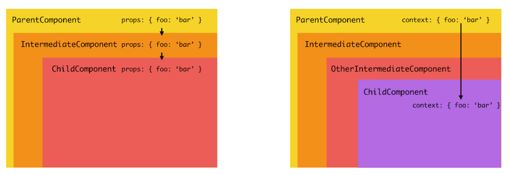

# React Context API

When building React applications, managing state and sharing data between components is a crucial concern. While props are the primary way to pass data in React, passing them through multiple levels of components (known as "prop drilling") can make code harder to maintain and understand. React's Context API provides a solution by enabling shared state without explicit prop passing.



## Understanding Context and When to Use It

Context provides a way to share values between components without passing props through every level of the tree. Think of it as a pipe that can carry data directly from a provider to any consumer component, regardless of how deeply nested it is.

### Good Use Cases for Context

- Theme and styling
- User preferences and settings
- Authentication state
- Feature flags and toggles

### When Not to Use Context

1. **High-Frequency Updates**

   - Real-time data updates
   - Animation states
   - Form field values

   Consider state management libraries or local state instead.

2. **Complex State Logic**

   - Multiple related state values
   - Complex state transitions
   - The need to fire side effects or async operations based on state changes

   Redux or other state management libraries might be better.

3. **Server State**

   - API data caching
   - Data fetching states
   - Real-time server updates

   You can use [TanStack Query](https://tanstack.com/query/latest).  

4. **Performance-Critical Updates**

   - Large lists or tables
   - Real-time charts
   - Frequent UI updates

   Consider more granular state management approaches.

## Building a Theme Provider with Context

The ThemeProvider component below demonstrates common patterns and best practices for building a Context provider in React.

```javascript
// ThemeContext.js
import { createContext, useContext, useState, useMemo, useCallback } from "react";

const ThemeContext = createContext(null);

export function ThemeProvider({ children }) {
  const [theme, setTheme] = useState("light");

  const toggleTheme = useCallback(() => {
    setTheme((current) => (current === "light" ? "dark" : "light"));
  }, []);

  const themeColors = {
    light: {
      background: "#ffffff",
      text: "#000000",
    },
    dark: {
      background: "#000000",
      text: "#ffffff",
    },
  };

  const currentColors = themeColors[theme];

  const value = useMemo(
    () => ({
      theme,
      toggleTheme,
      colors: currentColors,
      isDark: theme === "dark",
    }),
    [theme, toggleTheme, currentColors],
  );

  return <ThemeContext.Provider value={value}>{children}</ThemeContext.Provider>;
}

export function useTheme() {
  const context = useContext(ThemeContext);
  if (context === null) {
    throw new Error("useTheme must be used within a ThemeProvider");
  }
  return context;
}
```

The ThemeProvider component follows several important patterns for building robust Context providers:

1. **State Management** - Uses `useState` to manage the current theme
2. **Memoized Functions** - Uses `useCallback` to prevent unnecessary re-renders when passing functions to child components
3. **Encapsulated Logic** - Encapsulates theme logic in a provider component
4. **Derived Values** - Computes theme colors based on the current theme state
5. **Single Value Object** - Groups related values and functions into one object for the context
6. **Custom Hook** - Provides a type-safe way to consume the context with built-in error checking

## Using the Theme Provider

Components can now easily access and modify the theme using the `useTheme` hook:

```javascript
function ThemedButton() {
  const { colors, toggleTheme, isDark } = useTheme();

  return (
    <button
      onClick={toggleTheme}
      style={{
        background: colors.background,
        color: colors.text,
      }}
    >
      Switch to {isDark ? "light" : "dark"} theme
    </button>
  );
}
```

This component demonstrates clean consumption of context values and proper interaction with the encapsulated theme logic.

## Performance Considerations

When using Context, keep these performance optimization strategies in mind:

1. **Split Contexts by Domain**

```javascript
// Instead of one large context with frequent updates
const AppContext = createContext({ user, theme, notifications }); // ❌

// Split into focused contexts based on update frequency and usage
const UserContext = createContext(null); // ✅ Updates on auth changes
const ThemeContext = createContext(null); // ✅ Updates rarely
const NotifContext = createContext(null); // ✅ Updates frequently
```

2. **Memoize Context Values**

Remember that when a context value changes, all components consuming that context will re-render, regardless of which specific values they use. This makes context splitting and value memoization crucial for maintaining good performance.

## Next Steps

After mastering Context API basics, explore these advanced topics:

- Context with TypeScript for type safety
- Integration with other hooks like useReducer
- Testing components that use Context
- State management patterns for larger applications

## Additional Resources

- [React Official Context Documentation](https://react.dev/learn/passing-data-deeply-with-context#using-and-providing-context-from-the-same-component)
- [`useContext` Documentation](https://react.dev/reference/react/useContext)
- [React TypeScript Cheatsheet - Context](https://react-typescript-cheatsheet.netlify.app/docs/basic/getting-started/context/)
- [Kent C. Dodds - How to use React Context effectively](https://kentcdodds.com/blog/how-to-use-react-context-effectively)
