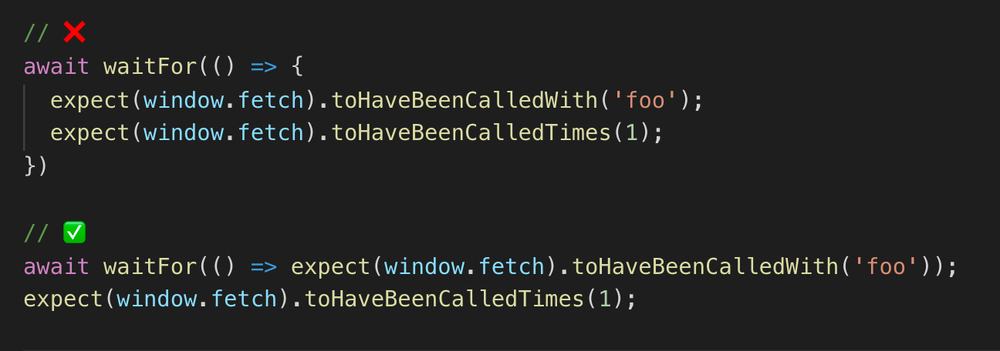

# Best Practices

When using Enzyme you might see code like this with `wrapper`.
Now we don't need this anymore.
We can use destruction to get what we need from `render`.

Sometimes we need to clear some data after each test.
At that moment, it supports by all major testing frameworks, and you don't need to worry about it.

The advantages of using `screen`, that you no longer need to keep the destruction of the `render`.
We can use `screen` for querying and debugging.

Next is using the matchers.
For example, `toBeDisabled` comes from `jest-dom`.
It is highly recommended to use `jest-dom`.

`userEvent` package is based on `fireEvent`, but it provides several methods that look more like user interaction.
In our example `fireEvent.change` calls only one event `change`, when `userEvent.type` raises `keydown`, `keypress`, `keyup` for each character.
This is much closer to real user interaction.
So we have to use `userEvent` over `fireEvent` whenever it is possible.

By placing one assertion in there, we can wait for UI to transition to the state what we want to assert.
And also crash faster if one of the session fails.
So we have to insert only one statement into a callback.

`waitFor` has an indefinite amount of time between the performance action and transmission of statement.
Because of this, the callback can be called an indefinite number of times.
This means you side effect can happen multiple times.
This also means you can not use snapshot assertion in `waitFor`.
If you really want to use a snapshot approval, just wait for a specific approval, and after that you can take a snapshot.
So we need to put side effect outside of `waitFor` and reserve callbacks for assertion only.
