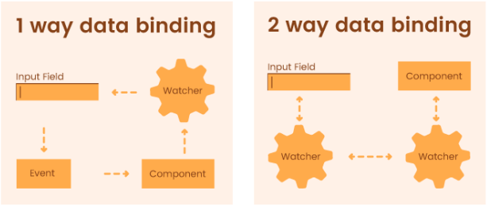

[Formik ➡️](formik.md)  

[Back to Contents 📑](../../README.md#module-7)

# Overview

Forms are used to interact with our website and we are responsible for handling that interaction.

## Two-way vs One-way Data Binding

All libraries and implementations of form handling rely on two ways of data binding that is existent in web development.

**Two-way data binding** helps users to exchange data from the component to view and from view to the component.
It will help users to establish communication bi-directionally.  
**One-way data binding** is unidirectional. You can only bind the data from component to the view or from view to the
component.



In React we can have something called a controlled component and uncontrolled component.
The uncontrolled component relies on the browser to handle all interactions (data binding) with the form by default, or we can take all the control from the browser and use controlled components to manage interactions with form elements implementing data binding by ourself.

## Controlled Components

Controlled forms in React work by storing the values of form inputs (like text fields) in the component's state. Here's how it works:

**State Storage:** Each input's value is saved in the state. This means that the value of the input is always in sync with the state.

**Re-rendering:** Whenever the state changes, the input's value is updated automatically. So, if another function changes the state, the input will show the new value right away.

**Persistence:** Even if the form inputs are not rendered (for example, if they are hidden), their values are still kept in the state.

**Flexibility:** Controlled inputs give you more control over the form. You can:

- Validate inputs as the user types (like checking if a password is strong enough).
- Modify the input values programmatically (like adding hyphens to a phone number as the user types).

Below are the key concepts of controlled forms:

**State Management:** In a controlled form, each form element's value is tied to the component's state. This means you need to create state variables for each input field. For example, if you have a form with a name and email field, you would have two state variables: name and email.

**Input Elements:** The value attribute of each input element is set to the corresponding state variable. This makes the input a "controlled" component because its value is controlled by the state.This ensures that the displayed value of the input always matches the state.

**Event Handling:** You use event handlers like onChange to update the state whenever the user types into the input. This keeps the state in sync with the input's value. For example, when the user types into the name input, the handleChange function updates the name state variable.

By example we can write a form as a controlled component that logs the name when it is submitted:

```jsx
import React, { useState } from "react";

function MyForm() {
  const [formData, setFormData] = useState({
    name: "",
    email: "",
    age: "",
  });

  const handleChange = (event) => {
    const { name, value } = event.target;
    setFormData({
      ...formData,
      [name]: value,
    });
  };

  const handleSubmit = (event) => {
    event.preventDefault();
    // Simple validation
    if (!formData.name || !formData.email || !formData.age) {
      alert("All fields are required!");
      return;
    }
    alert(`Submitted data: ${JSON.stringify(formData)}`);
  };

  return (
    <form onSubmit={handleSubmit}>
      <label>
        Name:
        <input type="text" name="name" value={formData.name} onChange={handleChange} />
      </label>
      <br />
      <label>
        Email:
        <input type="email" name="email" value={formData.email} onChange={handleChange} />
      </label>
      <br />
      <label>
        Age:
        <input type="number" name="age" value={formData.age} onChange={handleChange} />
      </label>
      <br />
      <button type="submit">Submit</button>
    </form>
  );
}
export default MyForm;
```

We use `useState` to create a formData state object that holds the values for name, email, and age.
The `handleChange` function dynamically updates the state based on the input's name attribute. This allows us to use a single handler for all inputs.
The `handleSubmit` function prevents the default form submission behavior and performs simple validation to check if all fields are filled. If validation passes, it alerts the submitted data.

**Benefits of Controlled Forms:**

- The state is the single source of truth for the form data, making it easier to manage and debug.
- You can easily add validation logic within the event handlers.
- Controlled forms make it easier to handle dynamic forms where the number of inputs can change.

## Uncontrolled Components

Uncontrolled inputs in React don't store their values in the component's state. Instead, they use the browser's built-in form handling, just like plain HTML forms. Here's how it works:

**Browser Manages Values:** The browser keeps track of the input values, not React. This means you don't need to update the state every time the input changes.

**Form Submission:** When you submit the form, React handles the form submission event. You can then get the input values directly from the form elements.

**Closer to Plain HTML:** This approach is similar to how forms work in plain HTML without JavaScript. The form data is managed by the browser, and you use JavaScript to handle the form submission.

By example we can imagine you have a form with a name and email field. Instead of using state, you use refs to get the values when the form is submitted::

```jsx
import React, { useRef } from "react";

function MyUncontrolledForm() {
  const nameRef = useRef(null);
  const emailRef = useRef(null);

  const handleSubmit = (event) => {
    event.preventDefault();
    const name = nameRef.current.value;
    const email = emailRef.current.value;
    alert(`Submitted name: ${name}, email: ${email}`);
  };

  return (
    <form onSubmit={handleSubmit}>
      <label>
        Name:
        <input type="text" ref={nameRef} />
      </label>
      <br />
      <label>
        Email:
        <input type="email" ref={emailRef} />
      </label>
      <br />
      <button type="submit">Submit</button>
    </form>
  );
}

export default MyUncontrolledForm;
```

We use `useRef` to create references to the input elements. This allows us to access their values directly from the DOM.
The `handleSubmit` function prevents the default form submission behavior and retrieves the input values using the refs.
The input values are managed by the browser, not by React state. This makes the form handling similar to plain HTML forms.

**Benefits of Uncontrolled Forms:**

- Uncontrolled forms can be simpler to set up because you don't need to manage state for each input.
- You can directly interact with the DOM elements, which can be useful in certain scenarios.

The React documentation states that we need to go along the lines with React itself, which is to use the controlled components all the time, but you can use uncontrolled components when you have really big form and you don't really want to handle all those interactions with controlled components.
