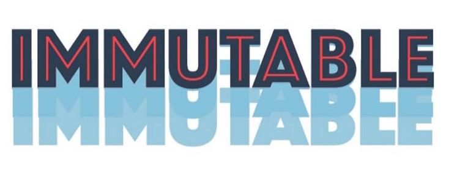

# Popular Libraries

## Flow


[Flow](https://flow.org/) is a static type checker for your JavaScript code. It does a lot of work to make you more productive. Making you code faster, smarter, more confidently, and to a bigger scale.

Flow checks your code for errors through static type annotations. These types allow you to tell Flow how you want your code to work, and Flow will make sure it does work that way.

```javascript
// @flow
function square(n: number): number {
  return n * n;
}

square("2"); // Error!
```

Here are the pros and cons of using Flow:

Pros:

- On-time detection of bugs/errors
- It communicates the purpose of the function
- It scales down complex error handling
- It Distinguishes between data and behavior
- Wipes out runtime type errors
- Domain modeling tool

Cons:

- It may confuse the budding developers
- Demands lots of time and practice
- It gives developers a deceitful sense of security

When should you use Flow?

- When your project is big and complex
- When a huge team is responsible for the task
- When you might require to refactor the program in the long run
- When your team is familiar with statically typed language

## Immutable.js



Immutable data cannot be changed once created, leading to much simpler application development, no defensive copying, and enabling advanced memoization and change detection techniques with simple logic. Persistent data presents a mutative API which does not update the data in-place, but instead always yields new updated data.

[Immutable.js](https://immutable-js.com/) provides many Persistent Immutable data structures including: `List`, `Stack`, `Map`, `OrderedMap`, `Set`, `OrderedSet` and `Record`.

These data structures are highly efficient on modern JavaScript VMs by using structural sharing via hash maps tries and vector tries as popularized by Clojure and Scala, minimizing the need to copy or cache data.

Immutable.js also provides a lazy `Seq`, allowing efficient chaining of collection methods like `map` and `filter` without creating intermediate representations. Create some `Seq` with `Range` and `Repeat`.

Install immutable using npm:

```sh
npm install immutable
```

Then require it into any module:

```javascript
const { Map } = require("immutable");
const map1 = Map({ a: 1, b: 2, c: 3 });
const map2 = map1.set("b", 50);
map1.get("b") + " vs. " + map2.get("b"); // 2 vs. 50
```

**Considerations**  
While Immutable.js offers many benefits, there are some trade-offs:

❗Learning Curve: *Developers unfamiliar with functional programming or immutable data structures may find it challenging initially.*  
❗Performance Overhead: *While operations are optimized, the library adds some overhead compared to plain JavaScript objects.*  
❗Library Size: *Immutable.js can add to the bundle size. Alternatives like immer.js provide immutability with a smaller footprint.*  

**Conclusion**  
Immutable.js is a powerful library for ensuring immutability in React applications. 
It improves performance, simplifies state updates, and prevents bugs caused by 
unintended mutations. While it may not be necessary for all projects, it shines 
in applications with complex state requirements or when working in large teams.

## Reactstrap


[Reactstrap](https://github.com/reactstrap/reactstrap) is a React component library for Bootstrap.

To install Reactstrap:

```sh
npm install reactstrap react react-dom
```

Then add Bootstrap to your application:

```sh
npm install --save bootstrap
```

```javascript
import "bootstrap/dist/css/bootstrap.min.css";
```

Unlike some component libraries, Reactstrap does not embed its own styles, and instead depends on the Bootstrap CSS framework for its styles and theme. This allows you to have consistent styles across your React-based components and static parts of your site, and allows you to include your own custom Bootstrap theme when needed.

Unlike using Bootstrap in HTML, Reactstrap exports all the correct Bootstrap classes automatically, and don't need to use or include Bootstrap's JavaScript files or add data attributes to trigger functionality. Instead, components are defined in React-friendly components with appropriate props for you to control.

So instead of:

```html
<!-- HTML -->
<div class="modal" tabindex="-1">
  <div class="modal-dialog">
    <div class="modal-content">
      <div class="modal-header">
        <h5 class="modal-title">Modal title</h5>
        <button
          type="button"
          class="btn-close"
          data-bs-dismiss="modal"
          aria-label="Close"
        ></button>
      </div>
      <div class="modal-body">
        <p>Modal body text goes here.</p>
      </div>
    </div>
  </div>
</div>
```

You can use:

```javascript
// React
import { Modal, ModalBody, ModalHeader } from 'reactstrap';
...
<Modal isOpen={open} toggle={() => setOpen(false)}>
  <ModalHeader>
    Modal title
  </ModalHeader>
  <ModalBody>
    Modal body text goes here.
  </ModalBody>
</Modal>
```

## JSS


[JSS](https://cssinjs.org/) is an authoring tool for CSS which allows you to use JavaScript to describe styles in a declarative, conflict-free and reusable way. It can compile in the browser, server-side or at build time in Node.

JSS itself is framework agnostic. It consists of multiple packages: the core, plugins, framework integrations and others. Its features are:

**Real CSS**

JSS generates actual CSS, not Inline Styles. It supports every existing CSS feature. CSS rules are created once and reused across the elements using its class name in contrary to Inline Styles. Also, when DOM elements get updated, previously created CSS rules are applied.

**Collision-free selectors**

JSS generates unique class names by default. It allows avoiding the typical CSS problem, where everything is global by default. It completely removes the need for naming conventions.

**Code reuse**

Using JavaScript as a host language gives us an opportunity to reuse CSS rules in a way that is not possible with regular CSS. You can leverage JavaScript modules, variables, functions, math operations and more. If done right, it can still be fully declarative.

**Ease of removal and modification**

Explicit usage of CSS rules allows you to track them down to the consumer and decide if it can be safely removed or modified.

**Dynamic styles**

Using JavaScript functions and Observables makes it possible to dynamically generate styles in the browser, 
giving you an opportunity to access your application state, 
browser APIs or remote data for styling. You can not only define styles once but also update them at any point in 
time in an efficient way.

**User-controlled animations**

JSS handles CSS updates so efficiently that you can create complex animations with it. Using function values, Observables and combining them with CSS transitions will give you maximum performance for user-controlled animations. For predefined animations, it is still better to use @keyframes and transitions, because they will unblock the JavaScript thread completely.

**Critical CSS**

To optimize time to first paint, you can use server-side rendering and extract critical CSS. You can couple the rendering of CSS with the rendering of HTML so that no unused CSS gets generated. It will result in a minimal critical CSS extracted during server-side rendering and allow you to inline it.

**Plugins**

JSS core implements a plugin-based architecture. 
It allows you to create custom plugins which can implement custom syntax or other powerful abilities. 
JSS has many official plugins, which can be installed individually or using a default preset. 
A good example of a community plugin is jss-rtl.

**Expressive syntax**

Thanks to various plugins, JSS allows you to have nesting, global selectors, composition with existing global class names. 
E.g. `jss-plugin-expand` allows you to express properties like `box-shadow` even in a more readable way than it is
possible with CSS. You can also use template strings if you want to copy-paste styles directly from the browser dev tools.

**Full isolation**

Another useful plugin example is jss-plugin-isolate, which allows you to isolate your elements from 
global cascading rules fully and potentially overwriting unwanted properties. 
Especially useful when creating a widget that is supposed to render inside of a third-party document.

**React integration**

The React-JSS package provides some additional features:

- Dynamic Theming - allows context based theme propagation and runtime updates.
- Critical CSS extraction - only CSS from rendered components gets extracted.
- Lazy evaluation - Style Sheets get created when a component gets mounted.
- The static part of a Style Sheet gets shared between all elements.
- Function values and rules are updated automatically with props as an argument.
  React-JSS example:

```javascript
import React from "react";
import { render } from "react-dom";
import { createUseStyles } from "react-jss";

// Create your Styles. Remember, since React-JSS uses the default preset,
// most plugins are available without further configuration needed.
const useStyles = createUseStyles({
  myButton: {
    color: "green",
    margin: {
      // jss-expand gives more readable syntax
      top: 5, // jss-default-unit makes this 5px
      right: 0,
      bottom: 0,
      left: "1rem",
    },
    "& span": {
      // jss-nested applies this to a child span
      fontWeight: "bold", // jss-camel-case turns this into 'font-weight'
    },
  },
  myLabel: {
    fontStyle: "italic",
  },
});

const Button = ({ children }) => {
  const classes = useStyles();
  return (
    <button className={classes.myButton}>
      <span className={classes.myLabel}>{children}</span>
    </button>
  );
};

const App = () => <Button>Submit</Button>;

render(<App />, document.getElementById("root"));
```
