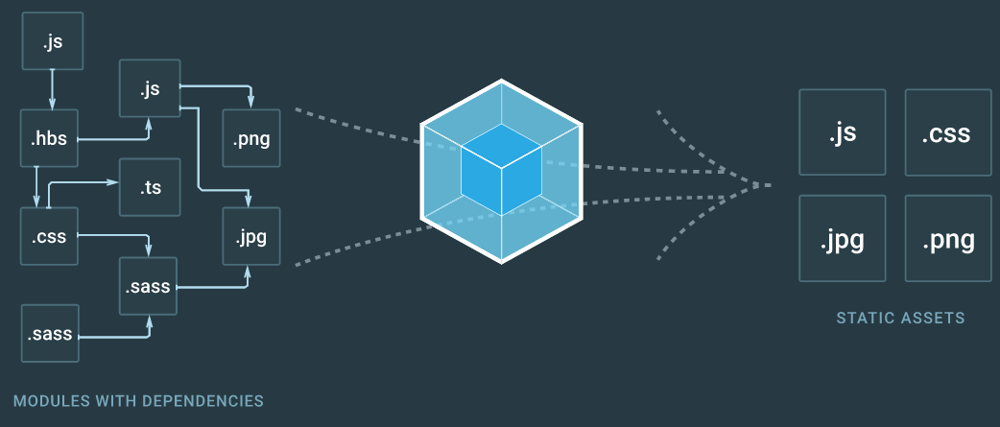
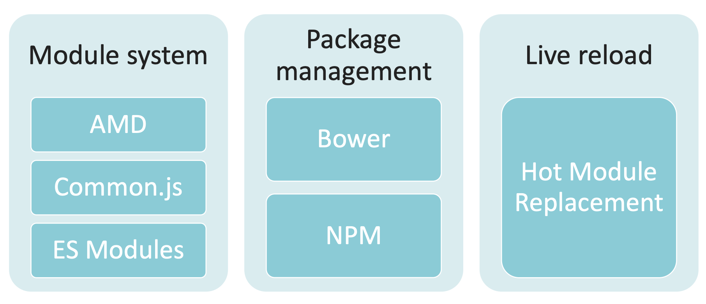
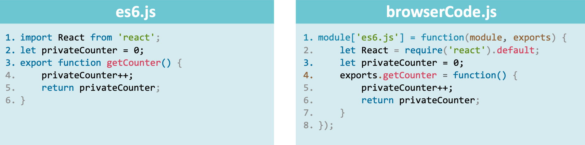
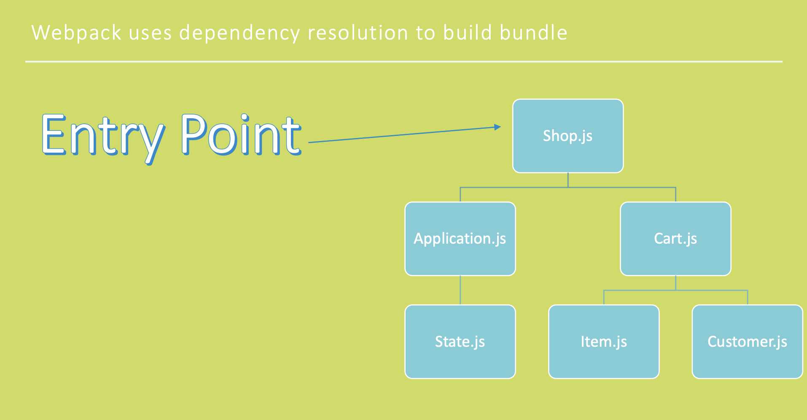

[Config File ➡️](config-file.md)  

[Back to Contents 📑](../../README.md#module-8)

# Overview

Managing the number of script tags that need to include in every HTML that you have on your website is a nightmare.
So some engineers came up with a way of bundling together.
Instead of having all files, which are not crossing each other way, they will bundle programmatically into one piece of code.
This is the basic idea behind the creation of webpack.

Before webpack, the whole idea of the automation process of bundling files was a number of steps you need to do to achieve the goal.
And we ended up with something like Grunt or GULP in our projects, which are just the task runners.
So we just define the tasks that need to be done one by one.
It could be cumbersome.
And webpack is an evolution of these technologies.


**The laconical representation of webpack:**



Imagine you have a collection of files, including modules with dependencies, imports, and exports. These files are processed by Webpack to transform them into assets ready to be shipped to a static server—such as images, fonts, JavaScript, and HTML.

At its core, Webpack operates based on a configuration file. This configuration outlines the entire transformation process:
- **What to transform**: The files and modules to process.
- **Where to start**: The entry point for the application.
- **How to proceed**: The rules and loaders that define the transformation steps.
- **Where to store the results**: The output directory for the final bundled files.
- **Order of operations**: The sequence in which transformations should occur.

Webpack works via a command-line interface, consuming the configuration file to automate these tasks. The result is a streamlined set of static assets, optimized and ready for deployment.

This is the basic idea behind Webpack — taking your modular code and dependencies and turning them into a cohesive, deployable product.

## Set Up

Steps to Set Up Webpack in a React Project.  

**Install Dependencies:** You'll need Webpack, Webpack CLI, Babel, and other necessary loaders and plugins.
You can install them using npm or yarn:
```sh
npm install --save-dev webpack webpack-cli babel-loader @babel/core @babel/preset-env @babel/preset-react html-webpack-plugin
```
```sh
yarn add webpack webpack-cli @babel/core babel-loader @babel/preset-env @babel/preset-react html-webpack-plugin --dev
```
**Create Configuration File:**  Create a webpack.config.js file in the root of your project and add the configuration.

**Update Scripts:** Update the scripts section in your `package.json` to include Webpack commands:
```js
"scripts": {
  "start": "webpack serve --mode development",
  "build": "webpack --mode production"
}
```
**Run Webpack:**  Use npm/yarn start to run the development server and npm run build or yarn build to create a production build.

## Features



Webpack offers a range of powerful features that make it a popular choice for bundling JavaScript applications, especially in complex projects like those built with React.

- **Module Bundling** - Webpack can bundle various modules (JavaScript, CSS, images, etc.) into a single file or smaller chunks, which helps in managing dependencies and optimizing load times.
- **Code Splitting** - This feature allows you to split your code into smaller chunks, which can be loaded on demand. This improves the performance of your application by reducing the initial load time.
- **Loaders** - Loaders enable Webpack to process different types of files and convert them into valid modules. For example, babel-loader transpiles modern JavaScript and JSX, while css-loader and style-loader handle CSS files.
- **Plugins** - Plugins extend Webpack's capabilities by performing a wide range of tasks, such as optimizing bundles, managing assets, and injecting environment variables. Common plugins include HtmlWebpackPlugin and MiniCssExtractPlugin.
- **Hot Module Replacement (HMR)** - HMR allows you to update modules in the browser at runtime without a full page reload. This is particularly useful for development, as it speeds up the development process and preserves the application state.
- **Tree Shaking** - This optimization technique removes unused code from your final bundle, reducing the size of the output files and improving load times.
- **Asset Management** - Webpack can manage and optimize assets like images, fonts, and stylesheets. It can also handle asset versioning and caching.
- **Development Server** - The Webpack Dev Server provides a simple web server with live reloading capabilities, making it easier to develop and test your application locally.
- **Configuration Flexibility** -Webpack's configuration is highly flexible and can be customized to fit the needs of any project. You can define multiple entry points, output configurations, and use various loaders and plugins.
- **Performance Optimization** - Webpack includes several built-in optimizations for production builds, such as minification, compression, and scope hoisting, which help improve the performance of your application.

**Modules in modern JS:**



Modules as a pattern, as a way of organizing code, is one of the main things webpack introduces to the game.
Now we have a big project with lots of directories or folders, lots of files.
We import them, export them, do everything we need to do, and webpack handles the bundling.
In the browser, it is ending up with several files that are bundled together, minified, transformed, etc.
All because of the magic of webpack.



For transforming the files of your project into a bundle version, webpack needs to know where to start, how it needs to bundle the whole thing, go through the tree structure of the project with all the imports and exports, and end up with a single file.
