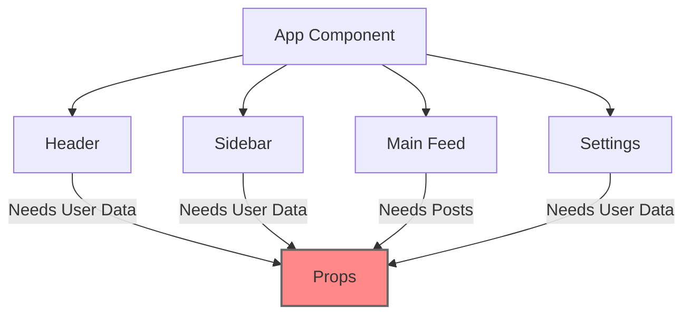
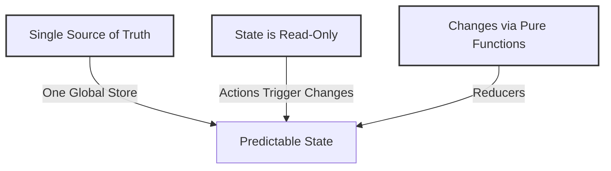
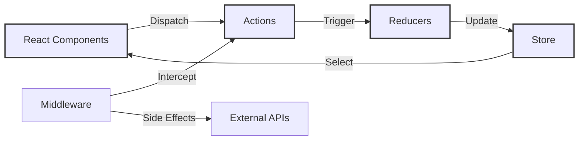

[⬅️ React Context](context.md)  
[Redux Toolkit ➡️](redux-toolkit.md)  

[Back to Contents 📑](../../README.md#module-additional)

import Tabs from '@theme/Tabs';
import TabItem from '@theme/TabItem';

:::warning
In this topic, we will explore the core concepts and features of React Redux.
While some of the information covered may not fully align with the modern Redux Toolkit approach,
understanding these foundational concepts is essential for working effectively with Redux and comprehending
how state management has evolved over time.
:::
## The Challenge

Imagine building a social media dashboard: user profiles displayed in multiple components, posts synchronized across views, real-time notifications updating the UI. How do you manage all this data efficiently?



> 🔑 **Key Challenge**: As applications grow, managing state across components becomes increasingly complex.

## Traditional Solutions

### Lifting State Up

```typescript
// App.tsx - All state lives here
interface AppState {
  user: User;
  posts: Post[];
  notifications: Notification[];
}

function App() {
  const [user, setUser] = useState<User | null>(null);
  const [posts, setPosts] = useState<Post[]>([]);
  const [notifications, setNotifications] = useState<Notification[]>([]);

  return (
    <>
      <Header user={user} notifications={notifications} />
      <Sidebar user={user} />
      <MainFeed posts={posts} />
      <Settings user={user} onUpdateUser={setUser} />
    </>
  );
}
```

**Problems with this approach:**

- Props must pass through intermediate components (prop drilling)
- Components become tightly coupled
- Hard to track state changes
- Difficult to maintain as the app grows

> ⚠️ **Common Pitfall**: Excessive prop drilling makes code harder to maintain and can lead to unnecessary re-renders.

### Context API

```typescript
// UserContext.tsx
const UserContext = createContext<User | null>(null);

function UserProvider({ children }) {
  const [user, setUser] = useState<User | null>(null);

  return (
    <UserContext.Provider value={user}>
      {children}
    </UserContext.Provider>
  );
}

// Multiple contexts for different data types
const PostsContext = createContext<Post[]>([]);
const NotificationsContext = createContext<Notification[]>([]);
```

**Limitations of Context:**

- Performance issues with frequent updates
- Complex setup with multiple contexts
- Difficult to handle derived state
- No built-in state management patterns

> 📝 **Note**: Context is great for static or rarely changing data, but it's not optimized for high-frequency updates.

**The Need for a Better Solution**

When your application faces these challenges:

1. Multiple components need access to the same data
2. State updates need to be synchronized across the UI
3. Complex data flows between components
4. Need for predictable state updates
5. Performance optimization requirements

This is where Redux comes in, offering:

- Single source of truth for application state
- Predictable state updates through pure functions
- Developer tools for debugging and time-travel
- Middleware for handling side effects
- Performance optimization capabilities

> 🎯 **Learning Path**: In the following sections, we'll explore how Redux addresses these challenges through its core concepts and patterns.

## Redux Core Principles

Redux is built on three fundamental principles that make state management predictable and traceable.



### 1. Single Source of Truth

The entire application state lives in one central store. This means:

- All components read data from the same place
- No synchronization needed between multiple sources
- Easier debugging and state inspection

```typescript
// Example of a centralized store structure
interface RootState {
  user: {
    data: User | null;
    isAuthenticated: boolean;
    preferences: UserPreferences;
  };
  posts: {
    items: Post[];
    loading: boolean;
    error: string | null;
  };
  ui: {
    theme: "light" | "dark";
    sidebar: {
      isOpen: boolean;
      width: number;
    };
  };
}
```

> 🔑 **Key Concept**: Think of the Redux store as a single JavaScript object that contains all your application's state.

### 2. State is Read-Only

State can only be modified by dispatching actions:

- Actions are plain objects describing what happened
- Components don't modify state directly
- All state updates are centralized and trackable

```typescript
// Example of strictly defined actions
const TODO_ACTIONS = {
  ADD_TODO: "todos/ADD_TODO",
  TOGGLE_TODO: "todos/TOGGLE_TODO",
  REMOVE_TODO: "todos/REMOVE_TODO",
} as const;

interface AddTodoAction {
  type: typeof TODO_ACTIONS.ADD_TODO;
  payload: {
    id: string;
    text: string;
  };
}

interface ToggleTodoAction {
  type: typeof TODO_ACTIONS.TOGGLE_TODO;
  payload: string; // todo id
}

type TodoActions = AddTodoAction | ToggleTodoAction;
```

> ⚠️ **Common Mistake**: Never modify state directly in reducers or components. Always create new state objects.

### 3. Changes via Pure Functions

Reducers are pure functions that take the previous state and an action to produce new state:

- Predictable output for the same input
- No side effects
- Easy to test and debug

```typescript
// Example of a pure reducer function
function todoReducer(state: Todo[] = [], action: TodoActions): Todo[] {
  switch (action.type) {
    case TODO_ACTIONS.ADD_TODO:
      return [
        ...state,
        {
          id: action.payload.id,
          text: action.payload.text,
          completed: false,
        },
      ];

    case TODO_ACTIONS.TOGGLE_TODO:
      return state.map((todo) => (todo.id === action.payload ? { ...todo, completed: !todo.completed } : todo));

    default:
      return state;
  }
}
```

> 📝 **Note**: Pure functions are deterministic - they always produce the same output for the same input.

## When to Choose Redux

The following section contains some opinionated statements that may spark debate in the developer community.

✅ **Perfect Use Cases**

 1. Complex Data Flows

```typescript
// Example of complex data interaction
interface OrderState {
  items: OrderItem[];
  customer: Customer;
  shipping: ShippingDetails;
  billing: BillingDetails;
  status: OrderStatus;
}

// Multiple components need this data
function OrderSummary() {
  /* ... */
}
function ShippingForm() {
  /* ... */
}
function PaymentProcessor() {
  /* ... */
}
function OrderConfirmation() {
  /* ... */
}
```

2. Team Development

- Standardized data flow patterns
- Clear separation of concerns
- Predictable state updates
- Strong TypeScript integration

3. Developer Experience

- Powerful debugging capabilities with Redux DevTools
- Time-travel debugging
- Action logging
- State inspection
- Predictable state updates through pure functions

❌ **When to Skip Redux**

1. Simple Applications

For simple forms and basic UI interactions, React's built-in useState hook provides sufficient state management capabilities without the overhead of Redux. A basic form with a few fields can be easily managed with local component state, making Redux unnecessary in such scenarios.

2. Small Team/Solo Projects

- Quick iterations needed
- Limited state sharing
- Simple data flow

3. Prototypes and MVPs

- Rapid development priority
- Requirements likely to change
- No complex state interactions

> 🎯 **Decision Point**: Choose Redux when you need predictable state management, powerful debugging tools, and standardized patterns for team development. Don't choose it solely for performance reasons - React's built-in solutions might be more appropriate for simpler use cases.

## Installing React Redux

You can install React Redux by running the following command:

```bash
npm i react-redux
```

[//]: # (:::warning)

[//]: # (Do not install additional libraries for your Home Task, you already have all needed dependencies in the template.)

[//]: # (:::)

## Redux Building Blocks

Redux implements a unidirectional data flow pattern where actions trigger state changes through reducers, and components react to these changes through selectors. This architecture ensures predictable state updates and makes it easier to track how data changes flow through your application.



### Store
*The Single Source of Truth*

The Redux store serves as a centralized container that holds your application's state tree. Unlike local component state, which is distributed across different components, Redux maintains all state in one place. This centralization makes it easier to track state changes, implement features like undo/redo, and debug your application. The store is immutable - you never modify it directly, but instead dispatch actions that describe what changes should occur.

Creating a store involves combining your reducers and setting up any middleware you need. The store provides three essential methods:

- `getState()`: Returns the current state tree
- `dispatch(action)`: Triggers state updates
- `subscribe(listener)`: Registers callbacks for state changes

```typescript
// store/index.ts
import { createStore, combineReducers } from "redux";
import { usersReducer } from "./users/reducer";
import { postsReducer } from "./posts/reducer";

// Combine multiple reducers into a single root reducer
const rootReducer = combineReducers({
  users: usersReducer,
  posts: postsReducer,
});

// Create the store with the root reducer
const store = createStore(rootReducer);

// Export type-safe hooks
export type RootState = ReturnType<typeof rootReducer>;
export type AppDispatch = typeof store.dispatch;

export default store;
```

Connect `store` to the application
```ts
// main.ts
import { createRoot } from 'react-dom/client';
import { Provider } from 'react-redux';
import { BrowserRouter } from 'react-router-dom';
import store from './store';
import App from './App.tsx';
import './index.css';

createRoot(document.getElementById('root')!).render(
  <BrowserRouter>
    <Provider store={store}>
      <App />
    </Provider>
  </BrowserRouter>
);
```

### Actions
*Describing State Changes*

Actions are plain JavaScript objects that serve as messages in your Redux application. They must have a `type` property describing what happened and can optionally include additional data (payload). Actions are the only way to trigger state changes in Redux - this constraint ensures that all state updates follow the same predictable pattern.

Think of actions as receipts documenting what happened in your application. When a user clicks a button, submits a form, or when an API request completes, you dispatch an action to record that event. This makes debugging easier because you can log actions to see exactly what happened and when.

```typescript
// users/types.ts
export const USER_ACTIONS = {
  SET_CURRENT_USER: "users/setCurrentUser",
  UPDATE_USER_PROFILE: "users/updateUserProfile",
  DELETE_USER: "users/deleteUser",
} as const;

// Define strongly-typed action interfaces
interface SetCurrentUserAction {
  type: typeof USER_ACTIONS.SET_CURRENT_USER;
  payload: User;
}

interface UpdateUserProfileAction {
  type: typeof USER_ACTIONS.UPDATE_USER_PROFILE;
  payload: {
    userId: string;
    updates: Partial<UserProfile>;
  };
}

// Union type of all user actions
export type UserActionTypes = SetCurrentUserAction | UpdateUserProfileAction;

// users/actions.ts
export const userActions = {
  setCurrentUser: (user: User): SetCurrentUserAction => ({
    type: USER_ACTIONS.SET_CURRENT_USER,
    payload: user,
  }),

  updateUserProfile: (userId: string, updates: Partial<UserProfile>): UpdateUserProfileAction => ({
    type: USER_ACTIONS.UPDATE_USER_PROFILE,
    payload: { userId, updates },
  }),
};
```

### Reducers
*Pure Functions for State Updates*

Reducers are pure functions that specify how the application's state changes in response to actions. They take the current state and an action as arguments and return a new state object. The key principle here is immutability - reducers must never modify the existing state, but instead create new objects that reflect the desired changes.

Think of reducers as event handlers for your state. Just as you might update a form's state when a user types, reducers update your Redux state when actions are dispatched. The difference is that reducers must be pure functions - they should be predictable and side-effect free.

```typescript
// users/reducer.ts
interface UsersState {
  currentUser: User | null;
  profiles: Record<string, UserProfile>;
  loading: boolean;
  error: string | null;
}

const initialState: UsersState = {
  currentUser: null,
  profiles: {},
  loading: false,
  error: null,
};

export function usersReducer(state = initialState, action: UserActionTypes): UsersState {
  switch (action.type) {
    case USER_ACTIONS.SET_CURRENT_USER:
      return {
        ...state,
        currentUser: action.payload,
        error: null,
      };

    case USER_ACTIONS.UPDATE_USER_PROFILE:
      const { userId, updates } = action.payload;
      return {
        ...state,
        profiles: {
          ...state.profiles,
          [userId]: {
            ...state.profiles[userId],
            ...updates,
          },
        },
      };

    default:
      return state;
  }
}

// Create type-safe selectors
export const selectCurrentUser = (state: RootState) => state.users.currentUser;

export const selectUserProfile = (state: RootState, userId: string) => state.users.profiles[userId];
```

### Middleware
*Extending Redux Capabilities*

Middleware provides a way to intercept actions before they reach the reducers, enabling additional functionality like logging, crash reporting, handling asynchronous operations, or routing. Middleware forms a pipeline that actions flow through, and each middleware can inspect, modify, delay, or cancel actions.

The most common use case for middleware is handling asynchronous operations like API calls. Since reducers must be pure functions, we need middleware to handle side effects. Redux Thunk is the most widely used middleware for this purpose.

```typescript
// store/middleware/logger.ts
import { Middleware } from "redux";

export const loggerMiddleware: Middleware = (store) => (next) => (action) => {
  console.log("Dispatching:", action);
  const result = next(action);
  console.log("Next State:", store.getState());
  return result;
};

// store/middleware/api.ts
import { Middleware } from "redux";

export const apiMiddleware: Middleware = (store) => (next) => async (action) => {
  if (!action.api) return next(action);

  const { api, types, ...rest } = action;
  const [REQUEST, SUCCESS, FAILURE] = types;

  store.dispatch({ type: REQUEST });

  try {
    const response = await api();
    return store.dispatch({
      type: SUCCESS,
      payload: response.data,
      ...rest,
    });
  } catch (error) {
    return store.dispatch({
      type: FAILURE,
      error: true,
      payload: error.message,
      ...rest,
    });
  }
};

// Configure store with middleware
import { createStore, applyMiddleware } from "redux";
import thunk from "redux-thunk";
import { loggerMiddleware } from "./middleware/logger";
import { apiMiddleware } from "./middleware/api";

const store = createStore(rootReducer, applyMiddleware(thunk, apiMiddleware, loggerMiddleware));
```

**Redux Thunk and Async Actions**

Redux Thunk allows you to write action creators that return a function instead of an action object. These thunk functions receive `dispatch` and `getState` as arguments, enabling you to perform async operations and dispatch multiple actions.

```typescript
// users/thunks.ts
import { AppDispatch, RootState } from "../store";
import { userActions } from "./actions";
import { api } from "../services/api";

// Define thunk action creator
export const fetchUserProfile = (userId: string) => {
  // Return thunk function
  return async (dispatch: AppDispatch, getState: () => RootState) => {
    try {
      dispatch({ type: "users/fetchProfileRequest" });

      const profile = await api.users.getProfile(userId);

      dispatch(userActions.updateUserProfile(userId, profile));

      return profile;
    } catch (error) {
      dispatch({
        type: "users/fetchProfileFailure",
        payload: error.message,
      });
      throw error;
    }
  };
};
```

## Connecting Redux with Components (Hooks)

The `react-redux` library provides hooks and components for connecting your Redux store to React components.
The primary tools are the `useSelector` hook for reading state and the `useDispatch` hook for dispatching actions.

To ensure type safety throughout your application, it's crucial to create typed versions of
these hooks using your store's types:

```typescript
// store/hooks.ts
import {
  TypedUseSelectorHook,
  useDispatch,
  useSelector
} from 'react-redux';
import type { RootState, AppDispatch } from './store';

// Create pre-typed versions of useDispatch and useSelector
export const useAppDispatch: () => AppDispatch = useDispatch;
export const useAppSelector: TypedUseSelectorHook<RootState> = useSelector;
```
Example usage in a component:
```typescript
// UserProfile.tsx

import { useAppSelector, useAppDispatch } from '../store/hooks';
import { selectUserProfile, fetchUserProfile } from '../users';

function UserProfile({ userId }: { userId: string }) {
  const dispatch = useAppDispatch();

  // Type-safe selector usage
  const profile = useAppSelector(state =>
    selectUserProfile(state, userId)
  );

  const loading = useAppSelector(state =>
    state.users.loading
  );

  useEffect(() => {
    // Type-safe dispatch of thunk
    dispatch(fetchUserProfile(userId));
  }, [dispatch, userId]);

  if (loading) return <div>Loading...</div>;
  if (!profile) return <div>User not found</div>;

  return (
    <div>
      <h1>{profile.name}</h1>
      <p>{profile.email}</p>
    </div>
  );
}
```

<details>
  <summary>Why did we create pre-typed versions of useDispatch and useSelector?</summary>
  <Tabs>
    <TabItem value="Ensuring Type Safety"  default>
      By default, `useDispatch` and `useSelector` are untyped or have generic types.

      If you don’t pre-type them, you need to manually cast types every time you use them, which can lead to errors and extra code.
    </TabItem>

    <TabItem value='Avoiding Repetitive Type Assertions' >
      Without pre-typed versions:
      ```ts
        import { useDispatch, useSelector } from "react-redux";
        import type { RootState, AppDispatch } from "../store";

        const dispatch = useDispatch<AppDispatch>(); // Manually typing
        const movies = useSelector((state: RootState) => state.movies);
      ```
        * Every time you use useDispatch, you must specify AppDispatch.
        * Every time you use useSelector, you must manually type RootState.


      With pre-typed hooks:
      ```ts
        import { useAppDispatch, useAppSelector } from "../hooks";

        const dispatch = useAppDispatch(); // No need to specify AppDispatch
        const movies = useAppSelector((state) => state.movies); // RootState is inferred
      ```
        * This avoids redundant type declarations and makes the code cleaner.
    </TabItem>

    <TabItem value="Benefits of Pre-Typed Hooks">
    ✅ Prevents Mistakes: TypeScript enforces correct action types and state structure.

    ✅ Less Boilerplate: No need to manually specify types in every component.

    ✅ Improves Developer Experience: Autocompletion and IntelliSense work smoothly.

    ✅ Better Maintainability: If the store shape changes, TypeScript will detect errors early.
    </TabItem>
  </Tabs>
</details>

These building blocks approach creates a solid foundation for your Redux application.
Each piece has a specific role:

- The store holds your state
- Actions describe what happened
- Reducers specify how state updates
- Middleware handles side effects
- React components connect to the store through hooks

Understanding how these pieces fit together is crucial for building maintainable Redux applications.

## BONUS
### Redux Pitfalls and Anti-patterns

**State Management Anti-patterns**

Understanding what not to do is just as important as knowing best practices. Here are the most common pitfalls and anti-patterns to avoid when working with Redux.

1. Mutation of State Objects

Redux requires immutable state updates. Mutating state directly can lead to bugs that are hard to track.

```typescript
// ❌ WRONG: Mutating state directly
const todosReducer = (state = initialState, action) => {
  switch (action.type) {
    case "ADD_TODO":
      state.todos.push(action.payload); // Mutation!
      return state;

    case "UPDATE_TODO":
      state.todos[action.payload.id].completed = true; // Mutation!
      return state;
  }
};

// ✅ CORRECT: Creating new state objects
const todosReducer = (state = initialState, action) => {
  switch (action.type) {
    case "ADD_TODO":
      return {
        ...state,
        todos: [...state.todos, action.payload],
      };

    case "UPDATE_TODO":
      return {
        ...state,
        todos: state.todos.map((todo) => (todo.id === action.payload.id ? { ...todo, completed: true } : todo)),
      };
  }
};
```

2. Storing Derived Data

Avoid storing data that can be computed from existing state.

```typescript
// ❌ WRONG: Storing derived data
interface TodosState {
  items: Todo[];
  completedCount: number; // Derived data
  activeCount: number; // Derived data
  totalCount: number; // Derived data
}

// ✅ CORRECT: Use selectors for derived data
interface TodosState {
  items: Todo[];
}

// Create memoized selectors
const selectCompletedCount = createSelector([(state: RootState) => state.todos.items], (todos) => todos.filter((todo) => todo.completed).length);

const selectActiveCount = createSelector([(state: RootState) => state.todos.items], (todos) => todos.filter((todo) => !todo.completed).length);
```

**Component Integration Anti-patterns**

1. Overusing useSelector

```typescript
// ❌ WRONG: Multiple fine-grained selectors causing unnecessary rerenders
function TodoItem({ id }: { id: string }) {
  const text = useSelector((state: RootState) => state.todos.items[id].text);
  const completed = useSelector((state: RootState) => state.todos.items[id].completed);
  const createdAt = useSelector((state: RootState) => state.todos.items[id].createdAt);

  // Component rerenders when any of these values change
}

// ✅ CORRECT: Single selector returning needed data
function TodoItem({ id }: { id: string }) {
  const todo = useSelector((state: RootState) => state.todos.items[id]);
  const { text, completed, createdAt } = todo;
}

// ✅ EVEN BETTER: Memoized selector for complex data
const selectTodoWithMeta = createSelector([(state: RootState) => state.todos.items[id], (state: RootState) => state.users.byId], (todo, users) => ({
  ...todo,
  author: users[todo.authorId],
}));
```

2. Props vs State Confusion

```typescript
// ❌ WRONG: Duplicating props in local state
function UserProfile({ userId }: { userId: string }) {
  const [localUser, setLocalUser] = useState<User | null>(null);
  const user = useSelector((state: RootState) =>
    selectUserById(state, userId)
  );

  useEffect(() => {
    setLocalUser(user); // Unnecessary state duplication
  }, [user]);
}

// ✅ CORRECT: Use Redux state directly
function UserProfile({ userId }: { userId: string }) {
  const user = useSelector((state: RootState) =>
    selectUserById(state, userId)
  );

  if (!user) return <div>Loading...</div>;

  return <div>{user.name}</div>;
}
```

**Action Handling Anti-patterns**

1. Async Logic in Reducers

```typescript
// ❌ WRONG: Async operations in reducer
const userReducer = (state = initialState, action) => {
  switch (action.type) {
    case "FETCH_USER":
      fetch("/api/user").then(/* ... */); // Never do this!
      return state;
  }
};

// ✅ CORRECT: Use middleware for async operations
const fetchUser =
  (userId: string): AppThunk =>
  async (dispatch) => {
    dispatch(fetchUserRequest());
    try {
      const response = await api.getUser(userId);
      dispatch(fetchUserSuccess(response.data));
    } catch (error) {
      dispatch(fetchUserFailure(error.message));
    }
  };
```

2. Non-Serializable State

```typescript
// ❌ WRONG: Storing non-serializable values
const reducer = (state = initialState, action) => {
  switch (action.type) {
    case "SET_DATE":
      return {
        ...state,
        currentDate: new Date(), // Non-serializable!
        formattedDate: moment(), // Non-serializable!
        handler: () => {}, // Non-serializable!
      };
  }
};

// ✅ CORRECT: Store serializable values
const reducer = (state = initialState, action) => {
  switch (action.type) {
    case "SET_DATE":
      return {
        ...state,
        currentDate: Date.now(), // Timestamp is serializable
        dateString: new Date().toISOString(), // String is serializable
      };
  }
};
```

**Performance Anti-patterns**

1. Unnecessary Object Creation in Selectors

```typescript
// ❌ POTENTIALLY PROBLEMATIC: Creating new objects on every selector call
// This can cause performance issues if the selector is called frequently
// or if the component using it re-renders often
const selectUserWithComputedData = (state: RootState) => ({
  ...state.users.currentUser,
  permissions: state.users.permissions,
  fullName: `${state.users.currentUser.firstName} ${state.users.currentUser.lastName}`,
  totalPosts: state.posts.filter((post) => post.userId === state.users.currentUser.id).length,
});

// ✅ BETTER: Memoized selector for computed data
// Use memoization when the computation is expensive or when
// the selector creates new objects that might trigger unnecessary re-renders
const selectUserWithComputedData = createSelector([(state: RootState) => state.users.currentUser, (state: RootState) => state.users.permissions, (state: RootState) => state.posts], (user, permissions, posts) => ({
  ...user,
  permissions,
  fullName: `${user.firstName} ${user.lastName}`,
  totalPosts: posts.filter((post) => post.userId === user.id).length,
}));

// ✅ ALSO FINE: Simple selector for basic state access
// For simple state access, regular selectors are perfectly acceptable
const selectUserName = (state: RootState) => state.users.currentUser.name;
```

> 📝 **Note**: Not all selectors need memoization. Use `createSelector` when:
>
> - The selector performs expensive computations
> - The selector creates new objects that might cause unnecessary re-renders
> - The selector is used frequently in your application

Remember:

- Always create new state objects instead of mutating existing ones
- Keep state serializable
- Use middleware for side effects
- Normalize your state structure
- Memoize selectors for derived data
- Dispatch actions from event handlers or useEffect, not during render
- Keep state structure flat and consistent

Following these guidelines will help you avoid common pitfalls and write more maintainable Redux code.

### Essential Redux Resources and Next Steps

As you continue your Redux journey, here are key resources and areas to explore:

**Official Documentation and Guides**

*Core Documentation:*

- [Redux Fundamentals](https://redux.js.org/tutorials/fundamentals/part-1-overview) - Deep dive into Redux concepts
- [Redux Essentials](https://redux.js.org/tutorials/essentials/part-1-overview-concepts) - Modern Redux with Redux Toolkit
- [TypeScript Quick Start](https://redux-toolkit.js.org/tutorials/typescript) - Using Redux with TypeScript

*Best Practices and Patterns:*

- [Redux Style Guide](https://redux.js.org/style-guide/) - Official recommendations for writing Redux code
- [Usage with TypeScript](https://redux.js.org/recipes/usage-with-typescript) - Type-safe Redux patterns
- [Computing Derived Data](https://redux.js.org/recipes/computing-derived-data) - Efficient state derivation patterns

**Development Tools**

*Redux DevTools is essential for debugging and development:*

- [Redux DevTools Extension](https://github.com/reduxjs/redux-devtools) - Browser extension for Redux debugging
- [Remote Redux DevTools](https://github.com/zalmoxisus/remote-redux-devtools) - Debug Redux in different environments

**Common Patterns and Solutions**

*Key patterns to study:*

1. Data Normalization:

   - [Normalizing State Shape](https://redux.js.org/recipes/structuring-reducers/normalizing-state-shape)
   - [Redux Toolkit's `createEntityAdapter`](https://redux-toolkit.js.org/api/createEntityAdapter)

2. Side Effects Management:

   - [Redux Thunk patterns](https://redux.js.org/tutorials/fundamentals/part-6-async-logic)
   - [Redux Saga patterns](https://redux-saga.js.org/docs/introduction/BeginnerTutorial)

3. Performance Optimization:
   - [Reselect library](https://github.com/reduxjs/reselect)
   - [Redux Performance](https://redux.js.org/style-guide/style-guide#priority-a-rules-essential)

**Example Applications**

*Study these real-world examples:*

- [Redux Real World Example](https://github.com/reduxjs/redux/tree/master/examples/real-world)
- [Redux Shopping Cart](https://github.com/reduxjs/redux/tree/master/examples/shopping-cart)
- [TypeScript Redux Example](https://github.com/reduxjs/redux/tree/master/examples/typescript)

**Community Resources**

*Valuable community content:*

- [Mark Erikson's Blog](https://blog.isquaredsoftware.com/series/practical-redux/) - Practical Redux tutorials
- [Redux FAQ](https://redux.js.org/faq) - Common questions and answers
- [Awesome Redux](https://github.com/xgrommx/awesome-redux) - Curated list of Redux resources

**Testing Resources**

*Learn Redux testing practices:*

- [Testing Redux Applications](https://redux.js.org/recipes/writing-tests)
- [Redux Mock Store](https://github.com/reduxjs/redux-mock-store)
- [Jest and Redux](https://redux.js.org/recipes/writing-tests#connected-components)

**Remember:**

- Focus on understanding core concepts before diving into complex patterns
- Practice with small examples before implementing in large applications
- Use TypeScript for better development experience
- Follow the official style guide for consistent code
- Leverage development tools for debugging and optimization
